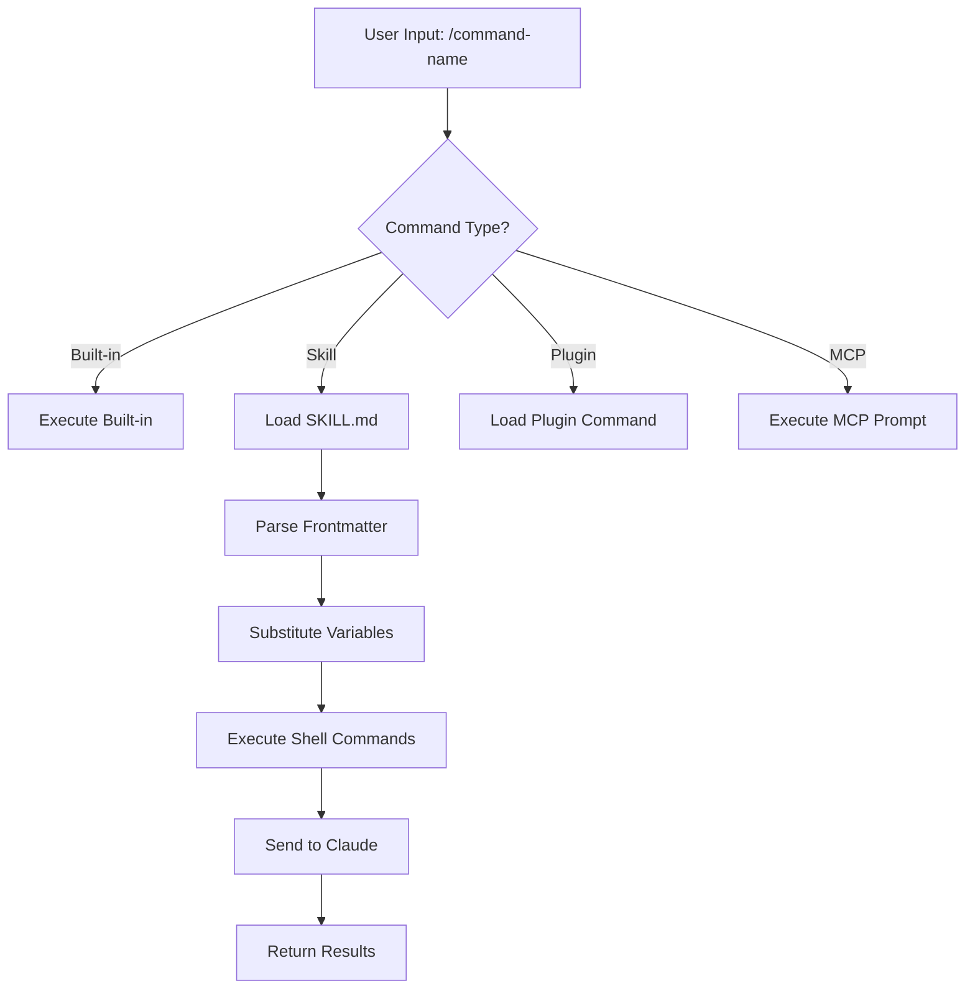
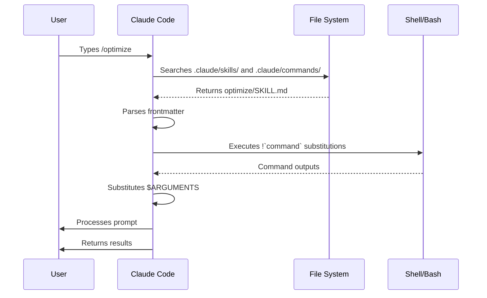

<picture>
  <source media="(prefers-color-scheme: dark)" srcset="../../resources/logos/claude-howto-logo-dark.svg">
  
</picture>

# Slash Commands

## 概览

Slash command 是你在交互式会话中用来控制 Claude 行为的快捷方式，主要分为几类：

- **内置命令**：由 Claude Code 提供（`/help`、`/clear`、`/model`）
- **Skills**：用户自定义的命令，以 `SKILL.md` 文件形式创建（`/optimize`、`/pr`）
- **插件命令**：来自已安装插件的命令（`/frontend-design:frontend-design`）
- **MCP prompts**：来自 MCP server 的命令（`/mcp__github__list_prs`）

> **注意**：自定义 slash command 已经合并进 Skills。`.claude/commands/` 中的文件仍然可用，但现在更推荐使用 Skills（`.claude/skills/`）。两者都会创建 `/command-name` 形式的快捷命令。完整参考请见 [Skills 指南](../03-skills/README.md)。

## 内置命令速查

内置命令是常用操作的快捷方式。目前共有 **60+ 个内置命令**和 **5 个内置 Skills**。在 Claude Code 中输入 `/` 查看完整列表，或在 `/` 后继续键入任意字母进行筛选。

| 命令 | 作用 |
|---------|---------|
| `/add-dir <path>` | 添加工作目录 |
| `/agents` | 管理 agent 配置 |
| `/branch [name]` | 将当前对话分支到新会话（别名：`/fork`）。注意：`/fork` 在 v2.1.77 中更名为 `/branch` |
| `/btw <question>` | 在 Claude 处理主任务时提出一个临时的旁支问题；不会污染主对话上下文 |
| `/cd <path>` | 将会话切换到新的工作目录，且不会破坏 prompt cache（v2.1.169 新增） |
| `/chrome` | 配置 Chrome 浏览器集成 |
| `/clear` | 清空对话（别名：`/reset`、`/new`） |
| `/color [color\|default]` | 设置提示栏颜色。不带参数的 `/color` 会随机选取一个会话颜色（v2.1.128+）；传入颜色名或十六进制值可显式设置。 |
| `/compact [instructions]` | 压缩对话，可附带聚焦指令 |
| `/config` | 打开设置（别名：`/settings`） |
| `/context` | 用彩色网格可视化上下文占用 |
| `/copy [N]` | 将 assistant 回复复制到剪贴板；`w` 会写入文件 |
| `/cost` | `/usage` 的键入快捷别名 —— 打开成本标签页（v2.1.118+） |
| `/desktop` | 继续在桌面应用中处理（别名：`/app`） |
| `/diff` | 查看未提交更改的交互式 diff |
| `/doctor` | 诊断安装健康状态 —— 在 Claude 响应时也可打开；显示状态图标；按 `f` 可自动修复问题（v2.1.116 增强；v2.1.178 将布局刷新为图标更清晰的扁平树状结构） |
| `/effort [low\|medium\|high\|xhigh\|max\|auto]` | 通过交互式方向键滑块设置推理强度。级别：`low` → `medium` → `high` → `xhigh`（v2.1.111 新增）→ `max`。在 Opus 4.8 上默认为 `high`（Opus 4.7 上为 `xhigh`）；`xhigh` 需要 Opus 4.8 或 4.7；`max` 可用于 Opus 4.8/4.7/4.6 和 Sonnet 4.6。菜单还提供 `ultracode`（它不是模型推理强度级别 —— 它发送 `xhigh` 并让 Claude 编排动态工作流；仅在当前会话有效） |
| `/exit` | 退出 REPL（别名：`/quit`） |
| `/export [filename]` | 将当前对话导出为文件或剪贴板内容 |
| `/usage-credits` | 配置额外用量以应对速率限制（v2.1.144 中从 `/extra-usage` 更名而来；`/extra-usage` 仍作为别名可用） |
| `/fast [on\|off]` | 切换快速模式 |
| `/feedback` | 提交反馈（别名：`/bug`）。自 v2.1.141 起，可附带近期会话（最近 24 小时或 7 天），使跨越多个会话的报告包含上下文。自 v2.1.178 起，`/bug` 必须先填写描述才能提交。 |
| `/focus` | 切换聚焦视图（v2.1.110 新增；取代用于切换聚焦的 `Ctrl+O`） |
| `/goal <statement>` | 注册一个会话级别的完成条件；Claude 会持续工作直到目标达成。`/goal clear` 可移除它。活动目标会显示在状态栏中，并附带一个实时浮层面板，显示已用时间、轮次和 token 使用量（v2.1.139 新增）。 |
| `/help` | 显示帮助 |
| `/hooks` | 查看 hook 配置 |
| `/ide` | 管理 IDE 集成 |
| `/init` | 初始化 `CLAUDE.md`。设置 `CLAUDE_CODE_NEW_INIT=1` 可启用交互式流程 |
| `/insights` | 生成会话分析报告 |
| `/install-github-app` | 配置 GitHub Actions app |
| `/install-slack-app` | 安装 Slack app |
| `/keybindings` | 打开快捷键配置 |
| `/less-permission-prompts` | 分析近期的 Bash/MCP 工具调用，并向 `.claude/settings.json` 添加一个按优先级排序的允许列表，以减少权限提示（v2.1.111 新增） |
| `/login` | 切换 Anthropic 账号 |
| `/logout` | 退出当前 Anthropic 账号 |
| `/mcp` | 管理 MCP servers 和 OAuth |
| `/memory` | 编辑 `CLAUDE.md`，切换自动记忆 |
| `/mobile` | 生成移动端 App 扫码二维码（别名：`/ios`、`/android`） |
| `/model [model]` | 选择模型，并可用左右箭头调整推理强度。自 v2.1.153 起，所选模型会**保存为新会话的默认值**（与 IDE 一致）；选择后按 `s` 仅应用于当前会话。（快捷键 `modelPicker:setAsDefault` 已更名为 `modelPicker:thisSessionOnly`；原来的 `d` 操作现为 `s`。） |
| `/passes` | 分享一周免费 Claude Code 使用权 |
| `/permissions` | 查看或更新权限（别名：`/allowed-tools`） |
| `/plan [description]` | 进入规划模式 |
| `/plugin` | 管理插件 |
| `/proactive` | `/loop` 的别名（v2.1.105 新增） |
| `/powerup` | 通过带动画演示的交互式课程发现功能 |
| `/privacy-settings` | 隐私设置（仅 Pro/Max） |
| `/release-notes` | 查看更新日志 |
| `/recap` | 返回会话时显示会话回顾/摘要（v2.1.108 新增） |
| `/reload-plugins` | 重新加载当前活动的插件 |
| `/reload-skills` | 无需重启会话即可重新扫描 skill 目录（v2.1.152 新增） |
| `/remote-control` | 从 claude.ai 进行远程控制（别名：`/rc`） |
| `/remote-env` | 配置默认远程环境 |
| `/rename [name]` | 重命名会话 |
| `/resume [session]` | 恢复对话（别名：`/continue`） |
| `/review <pr>` | 审查 GitHub PR。自 v2.1.186 起，它运行在与 `/code-review medium` 相同的审查引擎上。使用 `/code-review` 审查本地工作 diff |
| `/rewind` | 回退对话和/或代码（别名：`/checkpoint`） |
| `/sandbox` | 切换沙盒模式 |
| `/schedule [description]` | 创建/管理云端定时任务 |
| `/scroll-speed <+N\|-N>` | 调整 TUI 实时预览面板的鼠标滚轮滚动速度，并带实时预览。按机器持久化到 `~/.claude/preferences.json`（v2.1.139 新增）。 |
| `/security-review` | 分析分支中的安全漏洞 |
| `/skills` | 列出可用 Skills |
| `/stats` | `/usage` 的键入快捷别名 —— 打开统计标签页（每日使用量、会话、连续天数）（v2.1.118+） |
| `/stickers` | 订购 Claude Code 贴纸 |
| `/status` | 显示版本、模型、账号 |
| `/statusline` | 配置状态栏 |
| `/tasks` | 列出/管理后台任务 |
| `/team-onboarding` | 从项目的 Claude Code 配置生成一份团队成员上手指南（v2.1.101 新增） |
| `/terminal-setup` | 配置终端快捷键 |
| `/theme` | 打开主题选择器/管理自定义主题（v2.1.118）。通过 `~/.claude/themes/<name>.json` 中的 JSON 定义自定义主题 |
| `/tui` | 切换全屏 TUI（文本用户界面）模式，渲染无闪烁（v2.1.110 新增） |
| `/ultraplan <prompt>` | 在 ultraplan 会话中起草计划，并在浏览器中审查 |
| `/ultrareview` | 基于云端的多 agent 分析的全面代码审查（v2.1.111 新增） |
| `/undo` | `/rewind` 的别名（v2.1.108 新增） |
| `/upgrade` | 打开升级到更高套餐档位的页面 |
| `/usage` | 标准用量仪表盘（v2.1.118）—— 整合套餐用量限制、速率限制、成本和每日会话统计。`/cost` 和 `/stats` 是打开特定标签页的键入快捷别名 |
| `/voice` | 切换按住说话语音输入 |
| `/workflows` | 查看正在运行和已完成的动态工作流运行（v2.1.154 新增）。参见 [动态工作流](../09-advanced-features/README.md#dynamic-workflows) |

> **为什么 `/cd` 很重要：** 切换目录过去会丢失缓存热度（让下一轮更慢、更贵）；`/cd` 在切换时保留 prompt cache。

### 内置 Skills

以下 Skills 随 Claude Code 一起提供，调用方式和 slash command 一样：

| Skill | 作用 |
|-------|---------|
| `/batch <instruction>` | 使用 worktree 编排大规模并行修改 |
| `/claude-api` | 为项目所用语言加载 Claude API 参考 |
| `/debug [description]` | 启用调试日志 |
| `/loop [interval] <prompt>` | 按固定间隔重复运行提示词 |
| `/code-review [effort]` | 以选定的推理强度审查当前 diff 的正确性 bug（例如 `/code-review high`）。最初在 v2.1.146 中吸收了 `/simplify`，但 `/simplify` 在 v2.1.154 中又作为独立命令回归 |
| `/simplify` | 运行仅做清理的审查（复用 / 简化 / 效率 / 抽象层次）并应用修复；它**不**查找 bug —— 那请用 `/code-review`。它曾短暂作为 `/code-review --fix` 的别名（v2.1.152），自 v2.1.154 起变为仅做清理 |

### 已弃用命令

| 命令 | 状态 |
|---------|--------|
| `/output-style` | 自 v2.1.73 起弃用 |
| `/fork` | 已重命名为 `/branch`（别名仍可用，v2.1.77） |
| `/pr-comments` | 在 v2.1.91 中移除 —— 请直接让 Claude 查看 PR 评论 |
| `/vim` | 在 v2.1.92 中移除 —— 改用 /config → Editor mode |

### 最近变化

- `/fork` 更名为 `/branch`，并保留 `/fork` 作为别名（v2.1.77）
- `/output-style` 已弃用（v2.1.73）
- `/review <pr>` 现在使用与 `/code-review medium` 相同的审查引擎（v2.1.186）
- 新增 `/effort` 命令；`max` 级别可用于 Opus 4.6+（最初仅限 Opus 4.6）
- 新增 `/voice` 命令，用于按住说话语音输入
- 新增 `/schedule` 命令，用于创建/管理定时任务
- 新增 `/color` 命令，用于自定义提示栏
- /pr-comments 在 v2.1.91 中移除 —— 请直接让 Claude 查看 PR 评论
- /vim 在 v2.1.92 中移除 —— 改用 /config → Editor mode
- 新增 /ultraplan，用于基于浏览器的计划审查和执行
- 新增 /powerup，用于交互式功能课程
- 新增 /sandbox，用于切换沙盒模式
- `/model` 选择器现在显示人类可读的标签（例如 “Sonnet 4.6”），而非原始模型 ID
- `/resume` 支持 `/continue` 别名
- MCP prompts 可作为 `/mcp__<server>__<prompt>` 命令使用（参见 [MCP Prompts 作为命令](#mcp-prompts-作为命令)）
- 新增 `/team-onboarding`，用于自动生成团队成员上手指南（v2.1.101）
- 新增 `/tui` 命令，用于无闪烁的全屏 TUI 渲染（v2.1.110）
- 新增 `/focus` 命令，用于切换聚焦视图；`Ctrl+O` 现在只切换详细记录（v2.1.110）
- 新增 `/recap` 命令，用于手动触发会话上下文回顾（v2.1.108）
- 新增 `/undo`，作为 `/rewind` 的别名（v2.1.108）
- 新增 `/proactive`，作为 `/loop` 的别名（v2.1.105）
- `/effort` 获得了交互式方向键滑块，以及介于 `high` 和 `max` 之间的新 `xhigh` 级别；Opus 4.7 套餐的默认推理强度提升为 `xhigh`（v2.1.111）。在 Opus 4.8 上默认为 `high`（v2.1.154）
- 新增 `/ultrareview`，用于基于云端的全面多 agent 代码审查（v2.1.111）
- 新增 `/less-permission-prompts`，用于分析 Bash/MCP 工具调用，并通过 `.claude/settings.json` 中的允许列表减少权限提示（v2.1.111）
- 对于 Opus 4.7 上的 Max 订阅者，Auto 模式不再需要 `--enable-auto-mode` 标志（v2.1.112）
- 新增 `/goal` —— 会话级别的完成条件，Claude 会跨多轮朝它工作；实时浮层显示已用时间、轮次和 token 使用量（v2.1.139）
- 新增 `/scroll-speed` —— 调整 TUI 实时预览面板的鼠标滚轮滚动速度；按机器持久化（v2.1.139）
- 新增 `/reload-skills` —— 无需重启会话即可重新扫描 skill 目录（v2.1.152）
- `/model` 现在会将所选模型保存为新会话的默认值；按 `s` 仅应用于当前会话（快捷键 `modelPicker:setAsDefault` → `modelPicker:thisSessionOnly`）（v2.1.153）
- 新增 `/workflows` —— 查看正在运行和已完成的动态工作流运行（v2.1.154）
- `/simplify` 作为一个独立的、仅做清理的审查命令回归（复用 / 简化 / 效率 / 抽象层次），与 `/code-review` 的 bug 查找分离（v2.1.154）

### `/goal` —— 会话级别的完成条件

> **v2.1.139 新增**

使用 `/goal` 为当前会话注册一个完成条件。Claude 会跨多轮朝它工作，浮层面板会显示已用时间、轮次和已用 token。用 `/goal clear` 清除它。在交互模式、`claude -p` 和远程控制中均可用。

```
User: /goal Migrate the payments service from REST to gRPC and get the integration tests passing.
Claude: Goal registered. I'll work toward this until you clear it.
[Goal panel: ⏱ 0s · turns 0 · tokens 0]

User: start by listing the REST endpoints
Claude: [does the work, panel updates]
```

### `/team-onboarding` —— 团队成员上手指南

> **v2.1.101 新增**

使用 `/team-onboarding` 从你项目的本地 Claude Code 使用情况生成一份团队成员上手指南。该命令会检查你的 `CLAUDE.md`、已安装的 skills、subagents、hooks 和近期工作流，然后生成一份帮助新开发者快速上手的入门文档。

它是一个内置命令 —— 无需安装任何东西。

**用法：**

```bash
claude /team-onboarding
```

生成的指南会总结：

- 来自 [`CLAUDE.md`](../02-memory/README.md) 的项目目的和关键约定
- 可用的 [skills](../03-skills/README.md) 及其何时被自动调用
- 已配置的 [subagents](../04-subagents/README.md) 及其职责
- 在常见事件上运行的 [Hooks](../06-hooks/README.md)
- 新人应该了解的常见工作流

**可用性：** 随 Claude Code v2.1.101（2026 年 4 月 11 日）发布。

## 自定义命令（现已归入 Skills）

自定义 slash command 已经**合并到 Skills**。两种方式都可以通过 `/command-name` 调用：

| 方式 | 位置 | 状态 |
|----------|----------|--------|
| **Skills（推荐）** | `.claude/skills/<name>/SKILL.md` | 当前标准 |
| **旧式命令** | `.claude/commands/<name>.md` | 仍可使用 |

如果 skill 和 command 同名，**skill 优先**。例如同时存在 `.claude/commands/review.md` 和 `.claude/skills/review/SKILL.md` 时，会使用 skill 版本。

### 迁移路径

你现有的 `.claude/commands/` 文件可以继续直接使用，无需任何更改。若要迁移到 Skills：

**迁移前（Command）：**
```
.claude/commands/optimize.md
```

**迁移后（Skill）：**
```
.claude/skills/optimize/SKILL.md
```

### 为什么用 Skills

相比旧式命令，Skills 提供了额外功能：

- **目录结构**：可以把脚本、模板和参考文件打包在一起
- **自动调用**：相关场景下 Claude 可以自动触发 skill
- **调用控制**：可以决定由用户、Claude 或两者共同调用
- **Subagent 执行**：使用 `context: fork` 在隔离上下文中运行 skill
- **渐进披露**：只在需要时加载额外文件

### 把自定义命令做成 Skill

创建一个包含 `SKILL.md` 文件的目录：

```bash
mkdir -p .claude/skills/my-command
```

**文件：** `.claude/skills/my-command/SKILL.md`

```yaml
---
name: my-command
description: What this command does and when to use it
---

# My Command

Instructions for Claude to follow when this command is invoked.

1. First step
2. Second step
3. Third step
```

### Frontmatter 参考

| 字段 | 作用 | 默认值 |
|-------|---------|---------|
| `name` | 命令名（会变成 `/name`） | 目录名 |
| `description` | 简短说明（帮助 Claude 判断何时使用） | 第一段 |
| `argument-hint` | 自动补全时显示的预期参数 | 无 |
| `allowed-tools` | 命令可无权限使用的工具 | 继承 |
| `model` | 指定要使用的模型 | 继承 |
| `disable-model-invocation` | 若为 `true`，只有用户能调用（Claude 不能） | `false` |
| `user-invocable` | 若为 `false`，不会出现在 `/` 菜单中 | `true` |
| `context` | 设为 `fork` 时，在隔离 subagent 中运行 | 无 |
| `agent` | 使用 `context: fork` 时的 agent 类型 | `general-purpose` |
| `hooks` | Skill 范围内的 hooks（PreToolUse、PostToolUse、Stop） | 无 |

### 参数

命令可以接收参数：

**使用 `$ARGUMENTS` 接收全部参数：**

```yaml
---
name: fix-issue
description: Fix a GitHub issue by number
---

Fix issue #$ARGUMENTS following our coding standards
```

用法：`/fix-issue 123` → `$ARGUMENTS` 会变成 “123”

**使用 `$0`、`$1` 等接收单个参数：**

```yaml
---
name: review-pr
description: Review a PR with priority
---

Review PR #$0 with priority $1
```

用法：`/review-pr 456 high` → `$0`="456"，`$1`="high"

### 用 Shell 命令注入动态上下文

在 prompt 发送前，可用 `` !`command` `` 先执行 bash 命令：

```yaml
---
name: commit
description: Create a git commit with context
allowed-tools: Bash(git *)
---

## Context

- Current git status: !`git status`
- Current git diff: !`git diff HEAD`
- Current branch: !`git branch --show-current`
- Recent commits: !`git log --oneline -5`

## Your task

Based on the above changes, create a single git commit.
```

### 文件引用

使用 `@` 引用文件内容：

```markdown
Review the implementation in @src/utils/helpers.js
Compare @src/old-version.js with @src/new-version.js
```

## 插件命令

插件可以提供自定义命令：

```
/plugin-name:command-name
```

如果没有命名冲突，也可以直接使用 `/command-name`。

**示例：**
```bash
/frontend-design:frontend-design
/commit-commands:commit
```

## MCP Prompts 作为命令

MCP servers 可以把 prompt 暴露成 slash command：

```
/mcp__<server-name>__<prompt-name> [arguments]
```

**示例：**
```bash
/mcp__github__list_prs
/mcp__github__pr_review 456
/mcp__jira__create_issue "Bug title" high
```

### MCP 权限语法

在权限中控制 MCP server 访问：

- `mcp__github` - 访问整个 GitHub MCP server
- `mcp__github__*` - 通配符访问全部工具
- `mcp__github__get_issue` - 访问某个特定工具

## 命令架构



## 命令生命周期



## 本文件夹中的可用命令

这些示例命令可以作为 skill 或旧式命令安装。

### 1. `/optimize` - 代码优化

分析代码的性能问题、内存泄漏和优化机会。

**用法：**
```
/optimize
[Paste your code]
```

### 2. `/pr` - Pull Request 准备

引导你完成 PR 准备清单，包括 lint、测试和提交格式整理。

**用法：**
```
/pr
```

**截图：**


### 3. `/generate-api-docs` - API 文档生成器

从源码生成完整的 API 文档。

**用法：**
```
/generate-api-docs
```

### 4. `/commit` - 带上下文的 Git Commit

基于仓库中的动态上下文创建 git commit。

**用法：**
```
/commit [optional message]
```

### 5. `/push-all` - 暂存、提交并推送

暂存所有改动，创建提交，并带安全检查地推送到远端。

**用法：**
```
/push-all
```

**安全检查：**
- 密钥：`.env*`、`*.key`、`*.pem`、`credentials.json`
- API Keys：识别真实 key 与占位符
- 大文件：未使用 Git LFS 且 `>10MB`
- 构建产物：`node_modules/`、`dist/`、`__pycache__/`

### 6. `/doc-refactor` - 文档重构

重组项目文档，让结构更清晰、可访问性更好。

**用法：**
```
/doc-refactor
```

### 7. `/setup-ci-cd` - CI/CD 流水线配置

实现 pre-commit hooks 和 GitHub Actions 质量保障流程。

**用法：**
```
/setup-ci-cd
```

### 8. `/unit-test-expand` - 测试覆盖率扩展

针对未测试的分支和边界情况，提升测试覆盖率。

**用法：**
```
/unit-test-expand
```

## 安装

### 作为 Skills（推荐）

复制到你的 skills 目录：

```bash
# Create skills directory
mkdir -p .claude/skills

# For each command file, create a skill directory
for cmd in optimize pr commit; do
  mkdir -p .claude/skills/$cmd
  cp 01-slash-commands/$cmd.md .claude/skills/$cmd/SKILL.md
done
```

### 作为旧式命令

复制到你的 commands 目录：

```bash
# Project-wide (team)
mkdir -p .claude/commands
cp 01-slash-commands/*.md .claude/commands/

# Personal use
mkdir -p ~/.claude/commands
cp 01-slash-commands/*.md ~/.claude/commands/
```

## 创建你自己的命令

### Skill 模板（推荐）

创建 `.claude/skills/my-command/SKILL.md`：

```yaml
---
name: my-command
description: What this command does. Use when [trigger conditions].
argument-hint: [optional-args]
allowed-tools: Bash(npm *), Read, Grep
---

# Command Title

## Context

- Current branch: !`git branch --show-current`
- Related files: @package.json

## Instructions

1. First step
2. Second step with argument: $ARGUMENTS
3. Third step

## Output Format

- How to format the response
- What to include
```

### 仅用户可调用的命令（无自动触发）

对于带副作用、Claude 不应自动触发的命令：

```yaml
---
name: deploy
description: Deploy to production
disable-model-invocation: true
allowed-tools: Bash(npm *), Bash(git *)
---

Deploy the application to production:

1. Run tests
2. Build application
3. Push to deployment target
4. Verify deployment
```

## 最佳实践

| 应该做 | 不要做 |
|------|---------|
| 使用清晰、以动作为导向的命名 | 为一次性任务创建命令 |
| 在 `description` 中写清触发条件 | 在命令里构建复杂逻辑 |
| 保持命令聚焦于单一任务 | 硬编码敏感信息 |
| 有副作用时使用 `disable-model-invocation` | 跳过 description 字段 |
| 用 `!` 前缀注入动态上下文 | 假设 Claude 知道当前状态 |
| 把相关文件组织进 skill 目录 | 把所有内容都塞进一个文件 |

## 故障排查

### 找不到命令

**解决办法：**
- 检查文件是否位于 `.claude/skills/<name>/SKILL.md` 或 `.claude/commands/<name>.md`
- 确认 frontmatter 中的 `name` 字段与预期命令名一致
- 重启 Claude Code 会话
- 运行 `/help` 查看可用命令

### 命令没有按预期执行

**解决办法：**
- 补充更具体的指令
- 在 skill 文件中加入示例
- 如果使用 bash 命令，检查 `allowed-tools`
- 先用简单输入测试

### Skill 与 Command 冲突

如果同名同时存在，**skill 优先**。删除其中一个或重命名即可。

## 相关指南

- **[Skills](../03-skills/README.md)** - 完整的 Skills 参考（自动调用的能力）
- **[Memory](../02-memory/README.md)** - 带 CLAUDE.md 的持久上下文
- **[Subagents](../04-subagents/README.md)** - 委派式 AI agents
- **[Plugins](../07-plugins/README.md)** - 打包好的命令集合
- **[Hooks](../06-hooks/README.md)** - 事件驱动自动化

## 更多资源

- [官方交互模式文档](https://code.claude.com/docs/en/interactive-mode) - 内置命令参考
- [官方 Skills 文档](https://code.claude.com/docs/en/skills) - 完整 Skills 参考
- [CLI Reference](https://code.claude.com/docs/en/cli-reference) - 命令行选项

---

**最后更新**: 2026 年 6 月 24 日
**Claude Code 版本**: 2.1.187
**来源**:
- https://code.claude.com/docs/en/slash-commands
- https://code.claude.com/docs/en/interactive-mode
- https://code.claude.com/docs/en/changelog
- https://code.claude.com/docs/en/commands
- https://code.claude.com/docs/en/model-config
- https://github.com/anthropics/claude-code/blob/main/CHANGELOG.md
- https://docs.anthropic.com/en/docs/claude-code/slash-commands
- https://github.com/anthropics/claude-code/releases/tag/v2.1.139
- https://github.com/anthropics/claude-code/releases/tag/v2.1.144
- https://github.com/anthropics/claude-code/releases/tag/v2.1.152
- https://github.com/anthropics/claude-code/releases/tag/v2.1.153
- https://github.com/anthropics/claude-code/releases/tag/v2.1.154
**兼容模型**: Claude Sonnet 4.6, Claude Opus 4.8, Claude Haiku 4.5

*Claude How To 指南系列的一部分*
