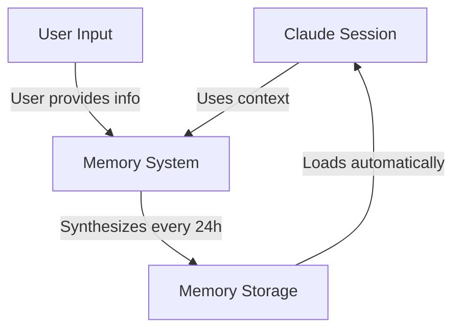
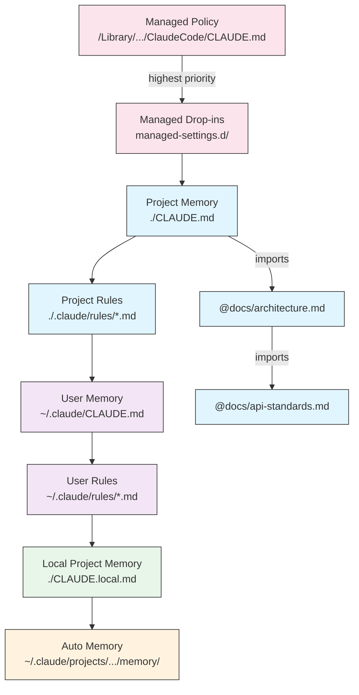
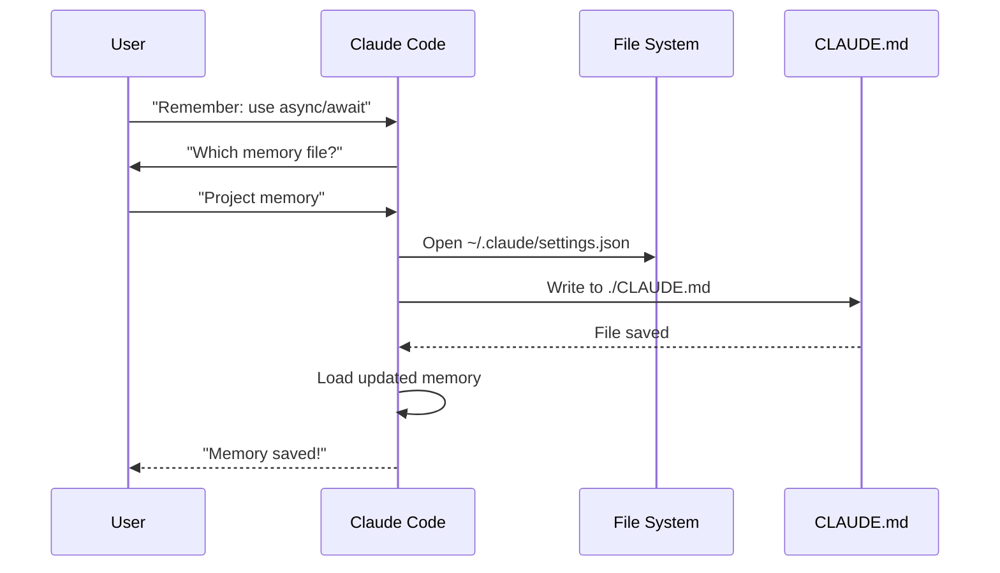
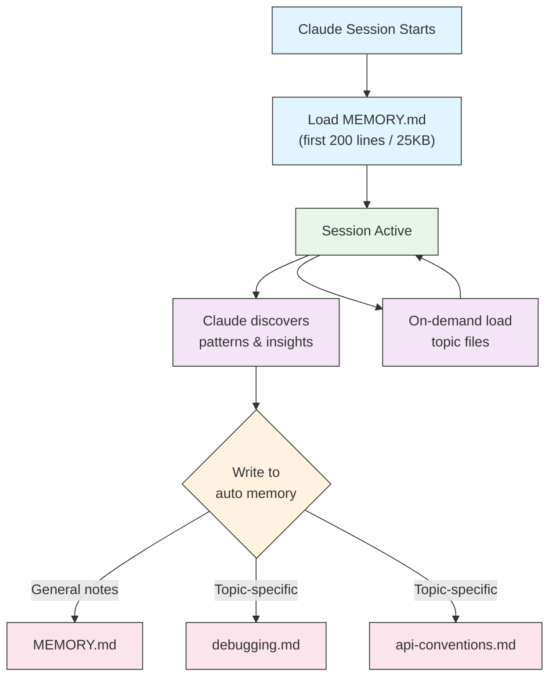

<picture>
  <source media="(prefers-color-scheme: dark)" srcset="../../resources/logos/claude-howto-logo-dark.svg">
  
</picture>

# Memory 指南

Memory 让 Claude 能够在不同会话和对话之间保留上下文。它有两种形式：claude.ai 中的自动综合，以及 Claude Code 中基于文件系统的 CLAUDE.md。

## 概览

Claude Code 中的 Memory 提供可在多个会话和对话之间延续的持久上下文。与临时的上下文窗口不同，memory 文件让你能够：

- 在团队内共享项目标准
- 存储个人开发偏好
- 维护特定目录的规则和配置
- 导入外部文档
- 把 memory 作为项目的一部分纳入版本控制

Memory 系统在多个层级上运作，从全局个人偏好一直到特定的子目录，让你能够对 Claude 记住什么、以及如何运用这些知识进行细粒度的控制。

## Memory 命令速查

| 命令 | 作用 | 用法 | 何时使用 |
|------|------|------|----------|
| `/init` | 初始化项目 memory | `/init` | 开始新项目、首次设置 CLAUDE.md |
| `/memory` | 在编辑器中编辑 memory 文件 | `/memory` | 大量更新、重新组织、审阅内容 |
| `#` 前缀 | ~~快速添加单行 memory~~ **已停用** | — | 改用 `/memory` 或以对话方式提出 |
| `@path/to/file` | 导入外部内容 | `@README.md` 或 `@docs/api.md` | 在 CLAUDE.md 中引用已有文档 |

## 快速上手：初始化 Memory

### `/init` 命令

`/init` 命令是在 Claude Code 中设置项目 memory 最快的方式。它会用基础的项目文档初始化一个 CLAUDE.md 文件。

**用法：**

```bash
/init
```

**它的作用：**

- 在你的项目中创建一个新的 CLAUDE.md 文件（通常位于 `./CLAUDE.md` 或 `./.claude/CLAUDE.md`）
- 建立项目约定和指南
- 为跨会话的上下文持久化打下基础
- 提供一个用于记录项目标准的模板结构

**增强交互模式：** 设置 `CLAUDE_CODE_NEW_INIT=1` 可启用一个多阶段的交互流程，逐步引导你完成项目设置：

```bash
CLAUDE_CODE_NEW_INIT=1 claude
/init
```

**何时使用 `/init`：**

- 用 Claude Code 开始一个新项目
- 建立团队编码标准和约定
- 创建关于代码库结构的文档
- 为协作开发设置 memory 层级

**示例工作流：**

```markdown
# In your project directory
/init

# Claude creates CLAUDE.md with structure like:
# Project Configuration
## Project Overview
- Name: Your Project
- Tech Stack: [Your technologies]
- Team Size: [Number of developers]

## Development Standards
- Code style preferences
- Testing requirements
- Git workflow conventions
```

### 快速更新 Memory

> **注意**：用于行内 memory 的 `#` 快捷方式已停用。请使用 `/memory` 直接编辑 memory 文件，或以对话方式让 Claude 记住某件事（例如，"记住我们在这个项目里始终使用 TypeScript 严格模式"）。

向 memory 添加信息的推荐方式有：

**方式 1：使用 `/memory` 命令**

```bash
/memory
```

在系统编辑器中打开你的 memory 文件以便直接编辑。

**方式 2：以对话方式提出**

```
Remember that we always use TypeScript strict mode in this project.
Please add to memory: prefer async/await over promise chains.
```

Claude 会根据你的请求更新合适的 CLAUDE.md 文件。

**历史参考**（已不再可用）：

`#` 前缀快捷方式曾经允许行内添加规则：

```markdown
# Always use TypeScript strict mode in this project  ← no longer works
```

如果你曾依赖这种模式，请改用 `/memory` 命令或对话式请求。

### `/memory` 命令

`/memory` 命令让你在 Claude Code 会话中直接访问并编辑 CLAUDE.md memory 文件。它会在系统编辑器中打开你的 memory 文件，以便进行全面编辑。

**用法：**

```bash
/memory
```

**它的作用：**

- 在系统的默认编辑器中打开你的 memory 文件
- 允许你进行大量的添加、修改和重新组织
- 提供对层级中所有 memory 文件的直接访问
- 让你能够管理跨会话的持久上下文

**何时使用 `/memory`：**

- 审阅已有的 memory 内容
- 对项目标准进行大量更新
- 重新组织 memory 结构
- 添加详细的文档或指南
- 随着项目演进而维护和更新 memory

**对比：`/memory` 与 `/init`**

| 方面 | `/memory` | `/init` |
|------|-----------|---------|
| **目的** | 编辑已有的 memory 文件 | 初始化新的 CLAUDE.md |
| **何时使用** | 更新/修改项目上下文 | 开始新项目 |
| **操作** | 打开编辑器进行修改 | 生成起始模板 |
| **工作流** | 持续维护 | 一次性设置 |

**示例工作流：**

```markdown
# Open memory for editing
/memory

# Claude presents options:
# 1. Managed Policy Memory
# 2. Project Memory (./CLAUDE.md)
# 3. User Memory (~/.claude/CLAUDE.md)
# 4. Local Project Memory

# Choose option 2 (Project Memory)
# Your default editor opens with ./CLAUDE.md content

# Make changes, save, and close editor
# Claude automatically reloads the updated memory
```

**使用 Memory 导入：**

CLAUDE.md 文件支持 `@path/to/file` 语法来引入外部内容：

```markdown
# Project Documentation
See @README.md for project overview
See @package.json for available npm commands
See @docs/architecture.md for system design

# Import from home directory using absolute path
@~/.claude/my-project-instructions.md
```

**导入特性：**

- 同时支持相对路径和绝对路径（例如 `@docs/api.md` 或 `@~/.claude/my-project-instructions.md`）
- 支持递归导入，最大深度为 5
- 首次从外部位置导入会触发一个用于安全确认的审批对话框
- 导入指令不会在 markdown 代码片段或代码块内被求值（因此在示例中记录它们是安全的）
- 通过引用已有文档来帮助避免重复
- 自动把被引用的内容纳入 Claude 的上下文

## Memory 架构

Claude Code 中的 Memory 遵循一个层级化系统，不同的作用域服务于不同的目的：



## Claude Code 中的 Memory 层级

Claude Code 使用一个多层级的层次化 memory 系统。Memory 文件会在 Claude Code 启动时自动加载，层级越高的文件优先级越高。

**完整的 Memory 层级（按优先级顺序）：**

1. **Managed Policy（受管策略）** - 组织级指令
   - macOS：`/Library/Application Support/ClaudeCode/CLAUDE.md`
   - Linux/WSL：`/etc/claude-code/CLAUDE.md`
   - Windows：`C:\Program Files\ClaudeCode\CLAUDE.md`

2. **Managed Drop-ins（受管插入文件）** - 按字母顺序合并的策略文件（v2.1.83+）
   - 位于受管策略 CLAUDE.md 旁的 `managed-settings.d/` 目录
   - 文件按字母顺序合并，以实现模块化的策略管理

3. **Project Memory（项目记忆）** - 团队共享的上下文（纳入版本控制）
   - `./.claude/CLAUDE.md` 或 `./CLAUDE.md`（位于仓库根目录）

4. **Project Rules（项目规则）** - 模块化、按主题划分的项目指令
   - `./.claude/rules/*.md`

5. **User Memory（用户记忆）** - 个人偏好（适用于所有项目）
   - `~/.claude/CLAUDE.md`

6. **User-Level Rules（用户级规则）** - 个人规则（适用于所有项目）
   - `~/.claude/rules/*.md`

7. **Local Project Memory（本地项目记忆）** - 个人的项目特定偏好
   - `./CLAUDE.local.md`

> **注意**：`CLAUDE.local.md` 已被完全支持，并在[官方文档](https://code.claude.com/docs/en/memory)中有所记录。它提供不会提交到版本控制的个人项目特定偏好。请将 `CLAUDE.local.md` 添加到你的 `.gitignore`。

8. **Auto Memory（自动记忆）** - Claude 的自动笔记和学习成果
   - `~/.claude/projects/<project>/memory/`

**Memory 发现行为：**

Claude 按以下顺序搜索 memory 文件，靠前的位置优先级更高：



## 使用 `claudeMdExcludes` 排除 CLAUDE.md 文件

在大型 monorepo 中，某些 CLAUDE.md 文件可能与你当前的工作无关。`claudeMdExcludes` 设置让你能够跳过特定的 CLAUDE.md 文件，使它们不被加载到上下文中：

```jsonc
// In ~/.claude/settings.json or .claude/settings.json
{
  "claudeMdExcludes": [
    "packages/legacy-app/CLAUDE.md",
    "vendors/**/CLAUDE.md"
  ]
}
```

匹配模式是基于相对于项目根目录的路径进行匹配的。这在以下场景中特别有用：

- 拥有许多子项目、但只有部分相关的 monorepo
- 包含 vendor 或第三方 CLAUDE.md 文件的仓库
- 通过排除过时或无关的指令来减少 Claude 上下文窗口中的噪音

## 配置文件层级

Claude Code 设置（包括 `autoMemoryDirectory`、`claudeMdExcludes` 以及其他配置）是从一个五级层级中解析的，层级越高优先级越高：

| 层级 | 位置 | 作用范围 |
|------|------|----------|
| 1（最高） | 受管策略（系统级） | 组织级强制执行 |
| 2 | `managed-settings.d/`（v2.1.83+） | 模块化策略插入文件，按字母顺序合并 |
| 3 | `.claude/settings.local.json` | 本地覆盖（git 忽略） |
| 4 | `.claude/settings.json` | 项目级（提交到 git） |
| 5（最低） | `~/.claude/settings.json` | 用户偏好 |

**平台特定配置（v2.1.51+）：**

设置也可以通过以下方式配置：
- **macOS**：属性列表（plist）文件
- **Windows**：Windows 注册表

这些平台原生机制会与 JSON 设置文件一起被读取，并遵循相同的优先级规则。

> **注意（v2.1.119）**：`/config` 的更改现在会持久化到 `~/.claude/settings.json`。通过 `/config` 写入的值会参与上面描述的常规策略/本地/项目优先级链——它们不再仅限于当前会话。交互式编辑请使用 `/config`，脚本化或受管配置请直接编辑 `settings.json` 文件。

### 保留与清理设置

| 设置 | 类型 | 默认值 | 说明 |
|------|------|--------|------|
| `cleanupPeriodDays` | 整数（天） | 30 | 磁盘上工件的保留窗口。**自 v2.1.117 起**，它适用于以下全部四种：检查点（`~/.claude/checkpoints/`）、任务（`~/.claude/tasks/`）、shell 快照（`~/.claude/shell-snapshots/`）以及备份（`~/.claude/backups/`）。早于该窗口的文件会在启动时被清理。 |

```jsonc
// ~/.claude/settings.json
{
  "cleanupPeriodDays": 14
}
```

### 署名、语音与 PR URL 设置

| 设置 | 类型 | 说明 |
|------|------|------|
| `attribution.commit` | boolean | 为 Claude 创建的提交添加 `Co-Authored-By: Claude` 尾注。替代已弃用的 `includeCoAuthoredBy` 标志。 |
| `attribution.pr` | boolean | 为 pull request 描述添加 Claude 署名。在 PR 场景下替代已弃用的 `includeCoAuthoredBy` 标志。 |
| `attribution.sessionUrl` | boolean | 从在 web 和 Remote Control 会话中创建的提交和 PR 中省略 claude.ai 会话链接（v2.1.183+）。 |
| `voice.enabled` | boolean | 启用按住说话的语音听写（`/voice`）。替代已弃用的 `voiceEnabled` 标志。 |
| `prUrlTemplate` | string | **v2.1.119 新增。** 用于页脚 PR 徽章的自定义 URL 模板；对 GitLab、Bitbucket 或内部代码审查平台很有用。支持 `{{owner}}`、`{{repo}}` 和 `{{number}}` 占位符。 |

```jsonc
// ~/.claude/settings.json
{
  "attribution": {
    "commit": false,
    "pr": true
  },
  "voice": {
    "enabled": true
  },
  "prUrlTemplate": "https://gitlab.internal/{{owner}}/{{repo}}/-/merge_requests/{{number}}"
}
```

#### 已弃用的设置名称

以下旧版设置键仍然有效，但已被弃用。请优先使用上面的替代项。

| 已弃用的键 | 替代项 | 备注 |
|------------|--------|------|
| `includeCoAuthoredBy` | `attribution.commit` / `attribution.pr` | 旧的单一标志被拆分为独立的 commit 和 PR 开关。使用旧版安装的用户可以保留旧键；新项目应使用嵌套形式。 |
| `voiceEnabled` | `voice.enabled` | 归入 `voice` 命名空间，与未来与语音相关的选项放在一起。 |

## 模块化规则系统

使用 `.claude/rules/` 目录结构创建有组织、按路径划分的规则。规则可以在项目级和用户级两个层面定义：

```
your-project/
├── .claude/
│   ├── CLAUDE.md
│   └── rules/
│       ├── code-style.md
│       ├── testing.md
│       ├── security.md
│       └── api/                  # Subdirectories supported
│           ├── conventions.md
│           └── validation.md

~/.claude/
├── CLAUDE.md
└── rules/                        # User-level rules (all projects)
    ├── personal-style.md
    └── preferred-patterns.md
```

规则会在 `rules/` 目录内递归发现，包括任何子目录。位于 `~/.claude/rules/` 的用户级规则会在项目级规则之前加载，从而允许项目可以覆盖的个人默认值。

### 通过 YAML Frontmatter 设置路径特定规则

定义仅适用于特定文件路径的规则：

```markdown
---
paths: src/api/**/*.ts
---

# API Development Rules

- All API endpoints must include input validation
- Use Zod for schema validation
- Document all parameters and response types
- Include error handling for all operations
```

**Glob 模式示例：**

- `**/*.ts` - 所有 TypeScript 文件
- `src/**/*` - src/ 下的所有文件
- `src/**/*.{ts,tsx}` - 多种扩展名
- `{src,lib}/**/*.ts, tests/**/*.test.ts` - 多个模式

### 子目录与符号链接

`.claude/rules/` 中的规则支持两种组织功能：

- **子目录**：规则会被递归发现，因此你可以把它们组织进基于主题的文件夹（例如 `rules/api/`、`rules/testing/`、`rules/security/`）
- **符号链接**：支持符号链接，以便在多个项目之间共享规则。例如，你可以把一个共享规则文件从一个中心位置符号链接到每个项目的 `.claude/rules/` 目录中

## Memory 位置表

| 位置 | 作用范围 | 优先级 | 是否共享 | 访问方式 | 最适合 |
|------|----------|--------|----------|----------|--------|
| `/Library/Application Support/ClaudeCode/CLAUDE.md`（macOS） | Managed Policy | 1（最高） | 组织 | 系统 | 公司级策略 |
| `/etc/claude-code/CLAUDE.md`（Linux/WSL） | Managed Policy | 1（最高） | 组织 | 系统 | 组织标准 |
| `C:\Program Files\ClaudeCode\CLAUDE.md`（Windows） | Managed Policy | 1（最高） | 组织 | 系统 | 企业指南 |
| `managed-settings.d/*.md`（位于策略旁） | Managed Drop-ins | 1.5 | 组织 | 系统 | 模块化策略文件（v2.1.83+） |
| `./CLAUDE.md` 或 `./.claude/CLAUDE.md` | Project Memory | 2 | 团队 | Git | 团队标准、共享架构 |
| `./.claude/rules/*.md` | Project Rules | 3 | 团队 | Git | 路径特定的模块化规则 |
| `~/.claude/CLAUDE.md` | User Memory | 4 | 个人 | 文件系统 | 个人偏好（所有项目） |
| `~/.claude/rules/*.md` | User Rules | 5 | 个人 | 文件系统 | 个人规则（所有项目） |
| `./CLAUDE.local.md` | Project Local | 6 | 个人 | Git（被忽略） | 个人的项目特定偏好 |
| `~/.claude/projects/<project>/memory/` | Auto Memory | 7（最低） | 个人 | 文件系统 | Claude 的自动笔记和学习成果 |

## Memory 更新生命周期

下面展示 memory 更新如何在你的 Claude Code 会话中流转：



## Auto Memory

Auto memory 是一个持久目录，Claude 在处理你的项目时会自动在其中记录学习成果、模式和洞见。与你手动编写和维护的 CLAUDE.md 文件不同，auto memory 是由 Claude 在会话期间自行写入的。

### Auto Memory 的工作方式

- **位置**：`~/.claude/projects/<project>/memory/`
- **入口点**：`MEMORY.md` 作为 auto memory 目录中的主文件
- **主题文件**：用于特定主题的可选附加文件（例如 `debugging.md`、`api-conventions.md`）
- **加载行为**：`MEMORY.md` 的前 200 行（或前 25KB，以先到者为准）会在会话开始时被加载到上下文中。主题文件按需加载，而不是在启动时加载。
- **读/写**：Claude 在会话期间发现模式和项目特定知识时，会读取和写入 memory 文件

### Auto Memory 架构



### Auto Memory 目录结构

```
~/.claude/projects/<project>/memory/
├── MEMORY.md              # Entrypoint (first 200 lines / 25KB loaded at startup)
├── debugging.md           # Topic file (loaded on demand)
├── api-conventions.md     # Topic file (loaded on demand)
└── testing-patterns.md    # Topic file (loaded on demand)
```

### 版本要求

Auto memory 需要 **Claude Code v2.1.59 或更高版本**。如果你使用的是更旧的版本，请先升级：

```bash
npm install -g @anthropic-ai/claude-code@latest
```

### 自定义 Auto Memory 目录

默认情况下，auto memory 存储在 `~/.claude/projects/<project>/memory/`。你可以使用 `autoMemoryDirectory` 设置（自 **v2.1.74** 起可用）来更改这个位置：

```jsonc
// In ~/.claude/settings.json or .claude/settings.local.json (user/local settings only)
{
  "autoMemoryDirectory": "/path/to/custom/memory/directory"
}
```

> **注意**：`autoMemoryDirectory` 只能在用户级（`~/.claude/settings.json`）或本地设置（`.claude/settings.local.json`）中设置，不能在项目或受管策略设置中设置。

这在你想要进行以下操作时很有用：

- 把 auto memory 存储在共享或同步的位置
- 把 auto memory 与默认的 Claude 配置目录分开
- 使用默认层级之外的项目特定路径

### Worktree 与仓库共享

同一个 git 仓库内的所有 worktree 和子目录共享单个 auto memory 目录。这意味着在 worktree 之间切换、或在同一仓库的不同子目录中工作时，都会读取和写入同一组 memory 文件。

### Subagent 记忆

Subagent（通过诸如 Task 或并行执行之类的工具生成）可以拥有自己的 memory 上下文。在 subagent 定义中使用 `memory` frontmatter 字段来指定要加载哪些 memory 作用域：

```yaml
memory: user      # Load user-level memory only
memory: project   # Load project-level memory only
memory: local     # Load local memory only
```

这让 subagent 能够在聚焦的上下文中运作，而不是继承完整的 memory 层级。

> **注意**：Subagent 也可以维护自己的 auto memory。详情请参阅[官方 subagent memory 文档](https://code.claude.com/docs/en/sub-agents#enable-persistent-memory)。

### 控制 Auto Memory

Auto memory 可以通过 `CLAUDE_CODE_DISABLE_AUTO_MEMORY` 环境变量来控制：

| 值 | 行为 |
|----|------|
| `0` | 强制 **开启** auto memory |
| `1` | 强制 **关闭** auto memory |
| *（未设置）* | 默认行为（auto memory 启用） |

```bash
# Disable auto memory for a session
CLAUDE_CODE_DISABLE_AUTO_MEMORY=1 claude

# Force auto memory on explicitly
CLAUDE_CODE_DISABLE_AUTO_MEMORY=0 claude
```

## 通过 `--add-dir` 添加额外目录

`--add-dir` 标志允许 Claude Code 从当前工作目录之外的额外目录加载 CLAUDE.md 文件。这对于来自其他目录的上下文相关的 monorepo 或多项目设置很有用。

要启用此功能，请设置环境变量：

```bash
CLAUDE_CODE_ADDITIONAL_DIRECTORIES_CLAUDE_MD=1
```

然后用该标志启动 Claude Code：

```bash
claude --add-dir /path/to/other/project
```

Claude 会从指定的额外目录加载 CLAUDE.md，与来自当前工作目录的 memory 文件一起加载。

## 实战示例

### 示例 1：项目记忆结构

**文件：** `./CLAUDE.md`

```markdown
# Project Configuration

## Project Overview
- **Name**: E-commerce Platform
- **Tech Stack**: Node.js, PostgreSQL, React 18, Docker
- **Team Size**: 5 developers
- **Deadline**: Q4 2025

## Architecture
@docs/architecture.md
@docs/api-standards.md
@docs/database-schema.md

## Development Standards

### Code Style
- Use Prettier for formatting
- Use ESLint with airbnb config
- Maximum line length: 100 characters
- Use 2-space indentation

### Naming Conventions
- **Files**: kebab-case (user-controller.js)
- **Classes**: PascalCase (UserService)
- **Functions/Variables**: camelCase (getUserById)
- **Constants**: UPPER_SNAKE_CASE (API_BASE_URL)
- **Database Tables**: snake_case (user_accounts)

### Git Workflow
- Branch names: `feature/description` or `fix/description`
- Commit messages: Follow conventional commits
- PR required before merge
- All CI/CD checks must pass
- Minimum 1 approval required

### Testing Requirements
- Minimum 80% code coverage
- All critical paths must have tests
- Use Jest for unit tests
- Use Cypress for E2E tests
- Test filenames: `*.test.ts` or `*.spec.ts`

### API Standards
- RESTful endpoints only
- JSON request/response
- Use HTTP status codes correctly
- Version API endpoints: `/api/v1/`
- Document all endpoints with examples

### Database
- Use migrations for schema changes
- Never hardcode credentials
- Use connection pooling
- Enable query logging in development
- Regular backups required

### Deployment
- Docker-based deployment
- Kubernetes orchestration
- Blue-green deployment strategy
- Automatic rollback on failure
- Database migrations run before deploy

## Common Commands

| Command | Purpose |
|---------|---------|
| `npm run dev` | Start development server |
| `npm test` | Run test suite |
| `npm run lint` | Check code style |
| `npm run build` | Build for production |
| `npm run migrate` | Run database migrations |

## Team Contacts
- Tech Lead: Sarah Chen (@sarah.chen)
- Product Manager: Mike Johnson (@mike.j)
- DevOps: Alex Kim (@alex.k)

## Known Issues & Workarounds
- PostgreSQL connection pooling limited to 20 during peak hours
- Workaround: Implement query queuing
- Safari 14 compatibility issues with async generators
- Workaround: Use Babel transpiler

## Related Projects
- Analytics Dashboard: `/projects/analytics`
- Mobile App: `/projects/mobile`
- Admin Panel: `/projects/admin`
```

### 示例 2：目录特定记忆

**文件：** `./src/api/CLAUDE.md`

````markdown
# API Module Standards

This file overrides root CLAUDE.md for everything in /src/api/

## API-Specific Standards

### Request Validation
- Use Zod for schema validation
- Always validate input
- Return 400 with validation errors
- Include field-level error details

### Authentication
- All endpoints require JWT token
- Token in Authorization header
- Token expires after 24 hours
- Implement refresh token mechanism

### Response Format

All responses must follow this structure:

```json
{
  "success": true,
  "data": { /* actual data */ },
  "timestamp": "2025-11-06T10:30:00Z",
  "version": "1.0"
}
```

Error responses:
```json
{
  "success": false,
  "error": {
    "code": "VALIDATION_ERROR",
    "message": "User message",
    "details": { /* field errors */ }
  },
  "timestamp": "2025-11-06T10:30:00Z"
}
```

### Pagination
- Use cursor-based pagination (not offset)
- Include `hasMore` boolean
- Limit max page size to 100
- Default page size: 20

### Rate Limiting
- 1000 requests per hour for authenticated users
- 100 requests per hour for public endpoints
- Return 429 when exceeded
- Include retry-after header

### Caching
- Use Redis for session caching
- Cache duration: 5 minutes default
- Invalidate on write operations
- Tag cache keys with resource type
````

### 示例 3：个人记忆

**文件：** `~/.claude/CLAUDE.md`

```markdown
# My Development Preferences

## About Me
- **Experience Level**: 8 years full-stack development
- **Preferred Languages**: TypeScript, Python
- **Communication Style**: Direct, with examples
- **Learning Style**: Visual diagrams with code

## Code Preferences

### Error Handling
I prefer explicit error handling with try-catch blocks and meaningful error messages.
Avoid generic errors. Always log errors for debugging.

### Comments
Use comments for WHY, not WHAT. Code should be self-documenting.
Comments should explain business logic or non-obvious decisions.

### Testing
I prefer TDD (test-driven development).
Write tests first, then implementation.
Focus on behavior, not implementation details.

### Architecture
I prefer modular, loosely-coupled design.
Use dependency injection for testability.
Separate concerns (Controllers, Services, Repositories).

## Debugging Preferences
- Use console.log with prefix: `[DEBUG]`
- Include context: function name, relevant variables
- Use stack traces when available
- Always include timestamps in logs

## Communication
- Explain complex concepts with diagrams
- Show concrete examples before explaining theory
- Include before/after code snippets
- Summarize key points at the end

## Project Organization
I organize my projects as:

   project/
   ├── src/
   │   ├── api/
   │   ├── services/
   │   ├── models/
   │   └── utils/
   ├── tests/
   ├── docs/
   └── docker/

## Tooling
- **IDE**: VS Code with vim keybindings
- **Terminal**: Zsh with Oh-My-Zsh
- **Format**: Prettier (100 char line length)
- **Linter**: ESLint with airbnb config
- **Test Framework**: Jest with React Testing Library
```

_我的测试_
让 Claude 保存一条新规则


Claude 没有保存该规则，因为我在任何地方都没有 `Claude.md` 文件。随后我让 Claude 确认了位置。


### 示例 4：会话期间更新记忆

你可以在活动的 Claude Code 会话期间向 memory 添加新规则。有两种方式可以做到这一点：

#### 方法 1：直接请求

```markdown
User: Remember that I prefer using React hooks instead of class components
     for all new components.

Claude: I'm adding that to your memory. Which memory file should this go in?
        1. Project memory (./CLAUDE.md)
        2. Personal memory (~/.claude/CLAUDE.md)

User: Project memory

Claude: ✅ Memory saved!

Added to ./CLAUDE.md:
---

### Component Development
- Use functional components with React Hooks
- Prefer hooks over class components
- Custom hooks for reusable logic
- Use useCallback for event handlers
- Use useMemo for expensive computations
```

#### 方法 2：使用 "# new rule into memory" 模式

你也可以使用显式的 "# new rule into memory" 模式来触发 memory 更新：

```markdown
User: # new rule into memory
      Always validate user input with Zod schemas before processing.

Claude: I'm saving this rule to memory. Which memory file should I use?
        1. Project memory (./CLAUDE.md)
        2. Personal memory (~/.claude/CLAUDE.md)

User: Project memory

Claude: ✅ Memory saved!

Added to ./CLAUDE.md:
---

### Input Validation
- Always validate user input with Zod schemas before processing
- Define schemas at the top of each API handler file
- Return 400 status with validation errors
```

#### 添加 Memory 的小贴士

- 让你的规则具体且可操作
- 把相关规则归类到同一个小节标题下
- 更新已有的小节，而不是重复内容
- 选择合适的 memory 作用域（项目级还是个人级）

## Memory 功能对比

| 功能 | Claude Web/Desktop | Claude Code（CLAUDE.md） |
|------|--------------------|--------------------------|
| 自动综合 | ✅ 每 24 小时 | ✅ Auto memory |
| 跨项目 | ✅ 共享 | ❌ 项目特定 |
| 团队访问 | ✅ 共享项目 | ✅ Git 跟踪 |
| 可搜索 | ✅ 内置 | ✅ 通过 `/memory` |
| 可编辑 | ✅ 在聊天中 | ✅ 直接编辑文件 |
| 导入/导出 | ✅ 支持 | ✅ 复制/粘贴 |
| 持久 | ✅ 24 小时以上 | ✅ 永久 |

### Claude Web/Desktop 中的 Memory

#### Memory 综合时间线


**Memory 摘要示例：**

```markdown
## Claude's Memory of User

### Professional Background
- Senior full-stack developer with 8 years experience
- Focus on TypeScript/Node.js backends and React frontends
- Active open source contributor
- Interested in AI and machine learning

### Project Context
- Currently building e-commerce platform
- Tech stack: Node.js, PostgreSQL, React 18, Docker
- Working with team of 5 developers
- Using CI/CD and blue-green deployments

### Communication Preferences
- Prefers direct, concise explanations
- Likes visual diagrams and examples
- Appreciates code snippets
- Explains business logic in comments

### Current Goals
- Improve API performance
- Increase test coverage to 90%
- Implement caching strategy
- Document architecture
```

## 最佳实践

### 应该做的——应包含什么

- **具体且详细**：使用清晰、详细的指令，而不是含糊的指导
  - ✅ 好："Use 2-space indentation for all JavaScript files"
  - ❌ 避免："Follow best practices"

- **保持有组织**：用清晰的 markdown 小节和标题来组织 memory 文件

- **使用合适的层级级别**：
  - **受管策略**：公司级策略、安全标准、合规要求
  - **项目记忆**：团队标准、架构、编码约定（提交到 git）
  - **用户记忆**：个人偏好、沟通风格、工具选择
  - **目录记忆**：模块特定的规则和覆盖

- **善用导入**：使用 `@path/to/file` 语法来引用已有文档
  - 支持最多 5 层的递归嵌套
  - 避免在 memory 文件之间重复
  - 示例：`See @README.md for project overview`

- **记录常用命令**：包含你反复使用的命令以节省时间

- **对项目记忆进行版本控制**：把项目级 CLAUDE.md 文件提交到 git 以惠及团队

- **定期审阅**：随着项目演进和需求变化，定期更新 memory

- **提供具体示例**：包含代码片段和具体场景

### 不应该做的——应避免什么

- **不要存储密钥**：永远不要包含 API 密钥、密码、令牌或凭据

- **不要包含敏感数据**：不要有 PII、私人信息或专有机密

- **不要重复内容**：使用导入（`@path`）来引用已有文档

- **不要含糊**：避免诸如 "follow best practices" 或 "write good code" 之类的泛化表述

- **不要让它太长**：让单个 memory 文件保持聚焦，控制在 500 行以内

- **不要过度组织**：有策略地使用层级；不要创建过多的子目录覆盖

- **不要忘记更新**：陈旧的 memory 可能导致混乱和过时的做法

- **不要超出嵌套限制**：Memory 导入支持最多 5 层嵌套

### 记忆管理建议

**选择正确的 memory 级别：**

| 用例 | Memory 级别 | 理由 |
|------|-------------|------|
| 公司安全策略 | 受管策略 | 在组织范围内适用于所有项目 |
| 团队代码风格指南 | 项目 | 通过 git 与团队共享 |
| 你偏好的编辑器快捷键 | 用户 | 个人偏好，不共享 |
| API 模块标准 | 目录 | 仅特定于该模块 |

**快速更新工作流：**

1. 对于单条规则：使用 `/memory` 打开编辑器，或以对话方式提出
2. 对于多处更改：使用 `/memory` 打开编辑器
3. 对于初始设置：使用 `/init` 创建模板

**导入最佳实践：**

```markdown
# Good: Reference existing docs
@README.md
@docs/architecture.md
@package.json

# Avoid: Copying content that exists elsewhere
# Instead of copying README content into CLAUDE.md, just import it
```

## 安装说明

### 设置项目记忆

#### 方法 1：使用 `/init` 命令（推荐）

设置项目 memory 最快的方式：

1. **导航到你的项目目录：**
   ```bash
   cd /path/to/your/project
   ```

2. **在 Claude Code 中运行 init 命令：**
   ```bash
   /init
   ```

3. **Claude 会创建并填充 CLAUDE.md**，使用一个模板结构

4. **自定义生成的文件** 以匹配你的项目需求

5. **提交到 git：**
   ```bash
   git add CLAUDE.md
   git commit -m "Initialize project memory with /init"
   ```

#### 方法 2：手动创建

如果你偏好手动设置：

1. **在项目根目录创建一个 CLAUDE.md：**
   ```bash
   cd /path/to/your/project
   touch CLAUDE.md
   ```

2. **添加项目标准：**
   ```bash
   cat > CLAUDE.md << 'EOF'
   # Project Configuration

   ## Project Overview
   - **Name**: Your Project Name
   - **Tech Stack**: List your technologies
   - **Team Size**: Number of developers

   ## Development Standards
   - Your coding standards
   - Naming conventions
   - Testing requirements
   EOF
   ```

3. **提交到 git：**
   ```bash
   git add CLAUDE.md
   git commit -m "Add project memory configuration"
   ```

#### 方法 3：使用 `#` 快速更新

一旦 CLAUDE.md 存在，就可以在对话期间快速添加规则：

```markdown
# Use semantic versioning for all releases

# Always run tests before committing

# Prefer composition over inheritance
```

Claude 会提示你选择要更新哪个 memory 文件。

### 设置个人记忆

1. **创建 ~/.claude 目录：**
   ```bash
   mkdir -p ~/.claude
   ```

2. **创建个人 CLAUDE.md：**
   ```bash
   touch ~/.claude/CLAUDE.md
   ```

3. **添加你的偏好：**
   ```bash
   cat > ~/.claude/CLAUDE.md << 'EOF'
   # My Development Preferences

   ## About Me
   - Experience Level: [Your level]
   - Preferred Languages: [Your languages]
   - Communication Style: [Your style]

   ## Code Preferences
   - [Your preferences]
   EOF
   ```

### 设置目录特定记忆

1. **为特定目录创建 memory：**
   ```bash
   mkdir -p /path/to/directory/.claude
   touch /path/to/directory/CLAUDE.md
   ```

2. **添加目录特定规则：**
   ```bash
   cat > /path/to/directory/CLAUDE.md << 'EOF'
   # [Directory Name] Standards

   This file overrides root CLAUDE.md for this directory.

   ## [Specific Standards]
   EOF
   ```

3. **提交到版本控制：**
   ```bash
   git add /path/to/directory/CLAUDE.md
   git commit -m "Add [directory] memory configuration"
   ```

### 验证设置

1. **检查 memory 位置：**
   ```bash
   # Project root memory
   ls -la ./CLAUDE.md

   # Personal memory
   ls -la ~/.claude/CLAUDE.md
   ```

2. **Claude Code 会在启动会话时自动加载** 这些文件

3. **用 Claude Code 测试**，在你的项目中启动一个新会话

## 官方文档

要获取最新信息，请参阅官方 Claude Code 文档：

- **[Memory 文档](https://code.claude.com/docs/en/memory)** - 完整的 memory 系统参考
- **[Slash Commands 参考](https://code.claude.com/docs/en/interactive-mode)** - 所有内置命令，包括 `/init` 和 `/memory`
- **[CLI 参考](https://code.claude.com/docs/en/cli-reference)** - 命令行界面文档

### 来自官方文档的关键技术细节

**Memory 加载：**

- 所有 memory 文件都会在 Claude Code 启动时自动加载
- Claude 会从当前工作目录向上遍历以发现 CLAUDE.md 文件
- 子树文件会在访问那些目录时被按上下文发现和加载

**导入语法：**

- 使用 `@path/to/file` 来引入外部内容（例如 `@~/.claude/my-project-instructions.md`）
- 同时支持相对路径和绝对路径
- 支持递归导入，最大深度为 5
- 首次外部导入会触发一个审批对话框
- 不会在 markdown 代码片段或代码块内被求值
- 自动把被引用的内容纳入 Claude 的上下文

**Memory 层级优先级：**

1. Managed Policy（最高优先级）
2. Managed Drop-ins（`managed-settings.d/`，v2.1.83+）
3. Project Memory
4. Project Rules（`.claude/rules/`）
5. User Memory
6. User-Level Rules（`~/.claude/rules/`）
7. Local Project Memory
8. Auto Memory（最低优先级）

## 相关概念链接

### 集成点
- [MCP Protocol](../05-mcp/) - 与 memory 并行的实时数据访问
- [Slash Commands](../01-slash-commands/) - 会话特定的快捷方式
- [Skills](../03-skills/) - 带 memory 上下文的自动化工作流

### 相关 Claude 功能
- [Claude Web Memory](https://claude.ai) - 自动综合
- [官方 Memory 文档](https://code.claude.com/docs/en/memory) - Anthropic 文档

---
**最后更新**：2026 年 6 月 24 日
**Claude Code 版本**：2.1.187
**来源**：
- https://code.claude.com/docs/en/memory
- https://code.claude.com/docs/en/settings
- https://github.com/anthropics/claude-code/blob/main/CHANGELOG.md
- https://docs.anthropic.com/en/docs/claude-code/settings
- https://code.claude.com/docs/en/cli-reference
- https://github.com/anthropics/claude-code/releases/tag/v2.1.117
- https://github.com/anthropics/claude-code/releases/tag/v2.1.144
- https://github.com/anthropics/claude-code/releases/tag/v2.1.145
**兼容模型**：Claude Sonnet 4.6、Claude Opus 4.8、Claude Haiku 4.5
