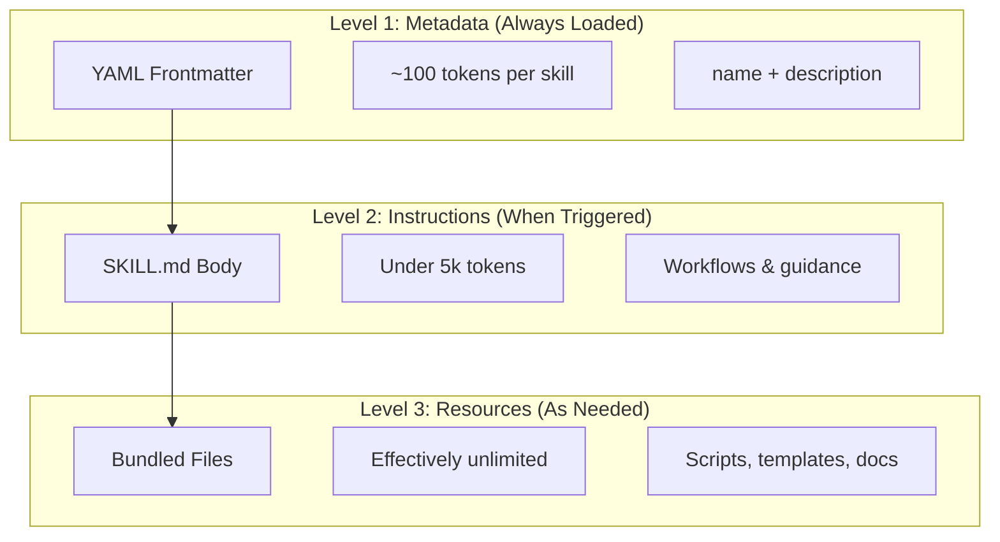
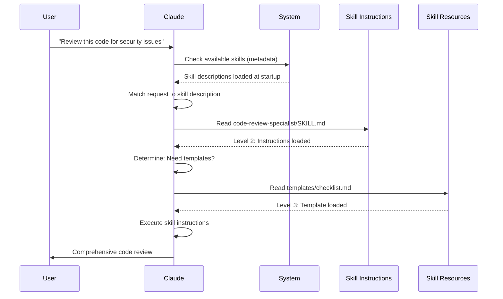

<picture>
  <source media="(prefers-color-scheme: dark)" srcset="../../resources/logos/claude-howto-logo-dark.svg">
  
</picture>

# Agent Skills 指南

Agent Skills 是可复用、基于文件系统的能力，用于扩展 Claude 的功能。它们把领域专业知识、工作流和最佳实践打包成可被发现的组件，Claude 会在相关场景下自动使用它们。

## 概览

**Agent Skills** 是模块化的能力，能把通用智能体转变为专家。与提示词（针对一次性任务的对话级指令）不同，Skill 按需加载，免去了在多个对话中反复提供相同指导的麻烦。

### 主要好处

- **让 Claude 专业化**：为特定领域的任务定制能力
- **减少重复**：创建一次，便能在多个对话中自动使用
- **组合能力**：组合多个 Skill 来构建复杂的工作流
- **扩展工作流**：在多个项目和团队之间复用 Skill
- **保持质量**：把最佳实践直接嵌入你的工作流

Skill 遵循 [Agent Skills](https://agentskills.io) 开放标准，该标准可在多种 AI 工具间通用。Claude Code 在该标准之上扩展了额外功能，例如调用控制、subagent 执行以及动态上下文注入。

> **注意**：自定义 slash command 已合并进 Skill。`.claude/commands/` 文件仍然有效，并支持相同的 frontmatter 字段。新开发推荐使用 Skill。当两者在同一路径同时存在时（例如 `.claude/commands/review.md` 和 `.claude/skills/review/SKILL.md`），Skill 优先。

## Skill 的工作方式：渐进式披露

Skill 利用了一种 **渐进式披露**（progressive disclosure）架构——Claude 按需分阶段加载信息，而不是一开始就占用上下文。这在保持无限扩展能力的同时，实现了高效的上下文管理。

### 三层加载



| 层级 | 何时加载 | Token 开销 | 内容 |
|-------|------------|------------|---------|
| **Level 1：元数据** | 始终（启动时） | 每个 Skill 约 100 tokens | YAML frontmatter 中的 `name` 与 `description` |
| **Level 2：指令** | Skill 被触发时 | 5k tokens 以内 | SKILL.md 正文，包含指令与指导 |
| **Level 3+：资源** | 按需 | 实际上无限制 | 通过 bash 执行的捆绑文件，不会把内容载入上下文 |

这意味着你可以安装许多 Skill 而不产生上下文负担——在实际触发之前，Claude 只知道每个 Skill 存在以及何时使用它。

## Skill 加载流程



## Skill 类型与位置

| 类型 | 位置 | 作用域 | 是否共享 | 最适合 |
|------|----------|-------|--------|----------|
| **Enterprise（企业级）** | 受管理的设置 | 组织全体用户 | 是 | 组织范围的标准 |
| **Personal（个人）** | `~/.claude/skills/<skill-name>/SKILL.md` | 个人 | 否 | 个人工作流 |
| **Project（项目）** | `.claude/skills/<skill-name>/SKILL.md` | 团队 | 是（通过 git） | 团队标准 |
| **Plugin（插件）** | `<plugin>/skills/<skill-name>/SKILL.md` | 启用之处 | 视情况而定 | 与插件一起捆绑 |

当 Skill 在不同层级使用相同名称时，优先级更高的位置获胜：**enterprise > personal > project**。Plugin Skill 使用 `plugin-name:skill-name` 命名空间，因此不会冲突。

> **Subagent 的 Skill 发现（v2.1.133+）**：Subagent 现在通过 Skill 工具发现项目、用户和插件 Skill，方式与主会话相同。早期版本将 subagent 限制在它们自身的内嵌集合中，这意味着 skill+subagent 工作流会悄悄退化；从 v2.1.133 起，主会话和 subagent 可见同一份 Skill 目录。

### 自动发现

**嵌套目录**：当你处理子目录中的文件时，Claude Code 会自动从嵌套的 `.claude/skills/` 目录中发现 Skill。例如，如果你正在编辑 `packages/frontend/` 中的文件，Claude Code 也会在 `packages/frontend/.claude/skills/` 中查找 Skill。这支持包各自拥有自己的 Skill 的 monorepo 设置。自 v2.1.178 起，当某个 Skill 名称在嵌套的 `.claude/skills/` 目录间冲突时，**离当前工作目录最近的目录获胜**——包级 Skill 会覆盖同名的仓库根级 Skill。

**`--add-dir` 目录**：通过 `--add-dir` 添加的目录中的 Skill 会自动加载，并带有实时变更检测。对这些目录中 Skill 文件的任何编辑会立即生效，无需重启 Claude Code。

**重新加载 Skill**：`/reload-skills` 命令（v2.1.152 新增）会重新扫描所有 Skill 目录而无需重启会话——在添加或编辑了未被实时检测捕获的 Skill 后很有用。`SessionStart` hook 可以通过返回 `reloadSkills: true` 触发同样的重新扫描（参见 [Hooks](../06-hooks/README.md)）。

**描述预算**：Skill 描述（Level 1 元数据）被限制在 **上下文窗口的 1%**（回退值：**8,000 字符**）。如果你安装了许多 Skill，描述可能会被缩短。所有 Skill 名称始终会被包含在内，但描述会被裁剪以适应预算。在描述中把关键用例前置。可通过 `SLASH_COMMAND_TOOL_CHAR_BUDGET` 环境变量覆盖该预算。

## 创建自定义 Skill

### 基本目录结构

```
my-skill/
├── SKILL.md           # Main instructions (required)
├── template.md        # Template for Claude to fill in
├── examples/
│   └── sample.md      # Example output showing expected format
└── scripts/
    └── validate.sh    # Script Claude can execute
```

### SKILL.md 格式

```yaml
---
name: your-skill-name
description: Brief description of what this Skill does and when to use it
---

# Your Skill Name

## Instructions
Provide clear, step-by-step guidance for Claude.

## Examples
Show concrete examples of using this Skill.
```

### 必填字段

- **name**：仅限小写字母、数字、连字符（最多 64 个字符）。不能包含 "anthropic" 或 "claude"。
- **description**：Skill 做什么 *以及* 何时使用它（最多 1024 个字符）。这对 Claude 判断何时激活该 Skill 至关重要。

### 可选 frontmatter 字段

```yaml
---
name: my-skill
description: What this skill does and when to use it
argument-hint: "[filename] [format]"        # Hint for autocomplete
disable-model-invocation: true              # Only user can invoke
user-invocable: false                       # Hide from slash menu
allowed-tools: Read, Grep, Glob             # Restrict tool access
disallowed-tools: Write, Edit               # Remove specific tools while active (v2.1.152)
model: opus                                 # Specific model to use
effort: high                                # Effort level override (low, medium, high, xhigh, max)
context: fork                               # Run in isolated subagent
agent: Explore                              # Which agent type (with context: fork)
shell: bash                                 # Shell for commands: bash (default) or powershell
hooks:                                      # Skill-scoped hooks
  PreToolUse:
    - matcher: "Bash"
      hooks:
        - type: command
          command: "./scripts/validate.sh"
paths: "src/api/**/*.ts"               # Glob patterns limiting when skill activates
---
```

| 字段 | 说明 |
|-------|-------------|
| `name` | 仅限小写字母、数字、连字符（最多 64 字符）。不能包含 "anthropic" 或 "claude"。 |
| `description` | Skill 做什么 *以及* 何时使用它（最多 1024 字符）。对自动调用匹配至关重要。 |
| `argument-hint` | 在 `/` 自动补全菜单中显示的提示（例如 `"[filename] [format]"`）。 |
| `disable-model-invocation` | `true` = 只有用户能通过 `/name` 调用。Claude 永远不会自动调用。 |
| `user-invocable` | `false` = 从 `/` 菜单中隐藏。只有 Claude 能自动调用它。 |
| `allowed-tools` | 逗号分隔的工具列表，Skill 可在无需权限提示的情况下使用这些工具。 |
| `disallowed-tools` | 逗号分隔的工具列表，在 Skill 激活期间移除这些工具（与 `allowed-tools` 互补）。v2.1.152 新增。 |
| `model` | Skill 激活期间的模型覆盖（例如 `opus`、`sonnet`）。 |
| `effort` | Skill 激活期间的努力级别覆盖：`low`、`medium`、`high`、`xhigh` 或 `max`。可用级别取决于模型——在 Opus 4.8 上默认努力级别为 `high`（在 Opus 4.7 上为 `xhigh`）。 |
| `context` | `fork` 表示在拥有独立上下文窗口的 forked subagent 上下文中运行该 Skill。 |
| `agent` | 当 `context: fork` 时使用的 subagent 类型（例如 `Explore`、`Plan`、`general-purpose`）。 |
| `shell` | 用于 `` !`command` `` 替换和脚本的 shell：`bash`（默认）或 `powershell`。 |
| `hooks` | 作用域限定在该 Skill 生命周期内的 hook（格式与全局 hook 相同）。 |
| `paths` | 限制 Skill 何时被自动激活的 glob 模式。可以是逗号分隔的字符串或 YAML 列表。格式与按路径生效的规则相同。 |

## Skill 内容类型

Skill 可以包含两类内容，各适合不同用途：

### 参考内容（Reference Content）

为你当前的工作添加 Claude 会应用的知识——约定、模式、风格指南、领域知识。它在你的对话上下文中内联运行。

```yaml
---
name: api-conventions
description: API design patterns for this codebase
---

When writing API endpoints:
- Use RESTful naming conventions
- Return consistent error formats
- Include request validation
```

### 任务内容（Task Content）

针对特定操作的分步指令。通常通过 `/skill-name` 直接调用。

```yaml
---
name: deploy
description: Deploy the application to production
context: fork
disable-model-invocation: true
---

Deploy the application:
1. Run the test suite
2. Build the application
3. Push to the deployment target
```

## 控制 Skill 调用

默认情况下，你和 Claude 都可以调用任何 Skill。两个 frontmatter 字段控制三种调用模式：

| Frontmatter | 你能调用 | Claude 能调用 |
|---|---|---|
| （默认） | 是 | 是 |
| `disable-model-invocation: true` | 是 | 否 |
| `user-invocable: false` | 否 | 是 |

**对有副作用的工作流使用 `disable-model-invocation: true`**：`/commit`、`/deploy`、`/send-slack-message`。你不会希望 Claude 因为代码看起来准备好了就决定去部署。

**对不可作为命令执行的背景知识使用 `user-invocable: false`**。一个 `legacy-system-context` Skill 解释某个旧系统如何工作——对 Claude 有用，但对用户来说不是一个有意义的操作。

## 字符串替换

Skill 支持动态值，这些值会在 Skill 内容到达 Claude 之前被解析：

| 变量 | 说明 |
|----------|-------------|
| `$ARGUMENTS` | 调用 Skill 时传入的所有参数 |
| `$ARGUMENTS[N]` 或 `$N` | 按索引访问特定参数（从 0 开始） |
| `${CLAUDE_SESSION_ID}` | 当前会话 ID |
| `${CLAUDE_SKILL_DIR}` | 包含该 Skill 的 SKILL.md 文件的目录 |
| `${CLAUDE_EFFORT}` | 当前努力级别（`low`、`medium`、`high`、`xhigh` 或 `max`）。可用于按努力级别分支 Skill 行为：例如 `[ "${CLAUDE_EFFORT}" = "max" ] && deep_analysis`（v2.1.120+） |
| `` !`command` `` | 动态上下文注入——运行一条 shell 命令并把输出内联进来 |

**示例：**

```yaml
---
name: fix-issue
description: Fix a GitHub issue
---

Fix GitHub issue $ARGUMENTS following our coding standards.
1. Read the issue description
2. Implement the fix
3. Write tests
4. Create a commit
```

运行 `/fix-issue 123` 会把 `$ARGUMENTS` 替换为 `123`。

## 注入动态上下文

`` !`command` `` 语法会在 Skill 内容发送给 Claude 之前运行 shell 命令：

```yaml
---
name: pr-summary
description: Summarize changes in a pull request
context: fork
agent: Explore
---

## Pull request context
- PR diff: !`gh pr diff`
- PR comments: !`gh pr view --comments`
- Changed files: !`gh pr diff --name-only`

## Your task
Summarize this pull request...
```

命令会立即执行；Claude 只看到最终输出。默认情况下，命令在 `bash` 中运行。在 frontmatter 中设置 `shell: powershell` 可改用 PowerShell。

## 在 Subagent 中运行 Skill

添加 `context: fork` 可让 Skill 在隔离的 subagent 上下文中运行。Skill 内容会成为一个专属 subagent 的任务，该 subagent 拥有自己的上下文窗口，从而让主对话保持整洁。

> **v2.1.145 修复**：使用 `context: fork` 的 Skill 此前在极少数情况下可能触发无限重复调用循环。如果你编写或依赖 forking Skill，请升级到 v2.1.145+。

`agent` 字段指定使用哪种 agent 类型：

| Agent 类型 | 最适合 |
|---|---|
| `Explore` | 只读研究、代码库分析 |
| `Plan` | 创建实现计划 |
| `general-purpose` | 需要所有工具的宽泛任务 |
| 自定义 agent | 在你的配置中定义的专用 agent |

**示例 frontmatter：**

```yaml
---
context: fork
agent: Explore
---
```

**完整 Skill 示例：**

```yaml
---
name: deep-research
description: Research a topic thoroughly
context: fork
agent: Explore
---

Research $ARGUMENTS thoroughly:
1. Find relevant files using Glob and Grep
2. Read and analyze the code
3. Summarize findings with specific file references
```

## 实战示例

### 示例 1：代码审查 Skill

**目录结构：**

```
~/.claude/skills/code-review-specialist/
├── SKILL.md
├── templates/
│   ├── review-checklist.md
│   └── finding-template.md
└── scripts/
    ├── analyze-metrics.py
    └── compare-complexity.py
```

**文件：** `~/.claude/skills/code-review-specialist/SKILL.md`

```yaml
---
name: code-review-specialist
description: Comprehensive code review with security, performance, and quality analysis. Use when users ask to review code, analyze code quality, evaluate pull requests, or mention code review, security analysis, or performance optimization.
---

# Code Review Skill

This skill provides comprehensive code review capabilities focusing on:

1. **Security Analysis**
   - Authentication/authorization issues
   - Data exposure risks
   - Injection vulnerabilities
   - Cryptographic weaknesses

2. **Performance Review**
   - Algorithm efficiency (Big O analysis)
   - Memory optimization
   - Database query optimization
   - Caching opportunities

3. **Code Quality**
   - SOLID principles
   - Design patterns
   - Naming conventions
   - Test coverage

4. **Maintainability**
   - Code readability
   - Function size (should be < 50 lines)
   - Cyclomatic complexity
   - Type safety

## Review Template

For each piece of code reviewed, provide:

### Summary
- Overall quality assessment (1-5)
- Key findings count
- Recommended priority areas

### Critical Issues (if any)
- **Issue**: Clear description
- **Location**: File and line number
- **Impact**: Why this matters
- **Severity**: Critical/High/Medium
- **Fix**: Code example

For detailed checklists, see [templates/review-checklist.md](templates/review-checklist.md).
```

### 示例 2：代码库可视化 Skill

一个生成交互式 HTML 可视化的 Skill：

**目录结构：**

```
~/.claude/skills/codebase-visualizer/
├── SKILL.md
└── scripts/
    └── visualize.py
```

**文件：** `~/.claude/skills/codebase-visualizer/SKILL.md`

````yaml
---
name: codebase-visualizer
description: Generate an interactive collapsible tree visualization of your codebase. Use when exploring a new repo, understanding project structure, or identifying large files.
allowed-tools: Bash(python *)
---

# Codebase Visualizer

Generate an interactive HTML tree view showing your project's file structure.

## Usage

Run the visualization script from your project root:

```bash
python ~/.claude/skills/codebase-visualizer/scripts/visualize.py .
```

This creates `codebase-map.html` and opens it in your default browser.

## What the visualization shows

- **Collapsible directories**: Click folders to expand/collapse
- **File sizes**: Displayed next to each file
- **Colors**: Different colors for different file types
- **Directory totals**: Shows aggregate size of each folder
````

捆绑的 Python 脚本承担繁重的工作，而 Claude 负责编排。

### 示例 3：部署 Skill（仅用户调用）

```yaml
---
name: deploy
description: Deploy the application to production
disable-model-invocation: true
allowed-tools: Bash(npm *), Bash(git *)
---

Deploy $ARGUMENTS to production:

1. Run the test suite: `npm test`
2. Build the application: `npm run build`
3. Push to the deployment target
4. Verify the deployment succeeded
5. Report deployment status
```

### 示例 4：品牌语气 Skill（背景知识）

```yaml
---
name: brand-voice
description: Ensure all communication matches brand voice and tone guidelines. Use when creating marketing copy, customer communications, or public-facing content.
user-invocable: false
---

## Tone of Voice
- **Friendly but professional** - approachable without being casual
- **Clear and concise** - avoid jargon
- **Confident** - we know what we're doing
- **Empathetic** - understand user needs

## Writing Guidelines
- Use "you" when addressing readers
- Use active voice
- Keep sentences under 20 words
- Start with value proposition

For templates, see [templates/](templates/).
```

### 示例 5：CLAUDE.md 生成 Skill

```yaml
---
name: claude-md
description: Create or update CLAUDE.md files following best practices for optimal AI agent onboarding. Use when users mention CLAUDE.md, project documentation, or AI onboarding.
---

## Core Principles

**LLMs are stateless**: CLAUDE.md is the only file automatically included in every conversation.

### The Golden Rules

1. **Less is More**: Keep under 300 lines (ideally under 100)
2. **Universal Applicability**: Only include information relevant to EVERY session
3. **Don't Use Claude as a Linter**: Use deterministic tools instead
4. **Never Auto-Generate**: Craft it manually with careful consideration

## Essential Sections

- **Project Name**: Brief one-line description
- **Tech Stack**: Primary language, frameworks, database
- **Development Commands**: Install, test, build commands
- **Critical Conventions**: Only non-obvious, high-impact conventions
- **Known Issues / Gotchas**: Things that trip up developers
```

### 示例 6：带脚本的重构 Skill

**目录结构：**

```
refactor/
├── SKILL.md
├── references/
│   ├── code-smells.md
│   └── refactoring-catalog.md
├── templates/
│   └── refactoring-plan.md
└── scripts/
    ├── analyze-complexity.py
    └── detect-smells.py
```

**文件：** `refactor/SKILL.md`

```yaml
---
name: code-refactor
description: Systematic code refactoring based on Martin Fowler's methodology. Use when users ask to refactor code, improve code structure, reduce technical debt, or eliminate code smells.
---

# Code Refactoring Skill

A phased approach emphasizing safe, incremental changes backed by tests.

## Workflow

Phase 1: Research & Analysis → Phase 2: Test Coverage Assessment →
Phase 3: Code Smell Identification → Phase 4: Refactoring Plan Creation →
Phase 5: Incremental Implementation → Phase 6: Review & Iteration

## Core Principles

1. **Behavior Preservation**: External behavior must remain unchanged
2. **Small Steps**: Make tiny, testable changes
3. **Test-Driven**: Tests are the safety net
4. **Continuous**: Refactoring is ongoing, not a one-time event

For code smell catalog, see [references/code-smells.md](references/code-smells.md).
For refactoring techniques, see [references/refactoring-catalog.md](references/refactoring-catalog.md).
```

## 支持文件

Skill 可以在其目录中包含除 `SKILL.md` 之外的多个文件。这些支持文件（模板、示例、脚本、参考文档）让你保持主 Skill 文件聚焦，同时为 Claude 提供它可以按需加载的额外资源。

```
my-skill/
├── SKILL.md              # Main instructions (required, keep under 500 lines)
├── templates/            # Templates for Claude to fill in
│   └── output-format.md
├── examples/             # Example outputs showing expected format
│   └── sample-output.md
├── references/           # Domain knowledge and specifications
│   └── api-spec.md
└── scripts/              # Scripts Claude can execute
    └── validate.sh
```

支持文件的准则：

- 把 `SKILL.md` 控制在 **500 行** 以内。把详细的参考资料、大型示例和规范移到单独的文件中。
- 在 `SKILL.md` 中使用 **相对路径** 引用额外文件（例如 `[API reference](references/api-spec.md)`）。
- 支持文件在 Level 3（按需）加载，因此在 Claude 实际读取它们之前不会消耗上下文。

## 管理 Skill

### 查看可用 Skill

直接询问 Claude：
```
What Skills are available?
```

或检查文件系统：
```bash
# List personal Skills
ls ~/.claude/skills/

# List project Skills
ls .claude/skills/
```

> **提示（v2.1.121+）：** 输入即可过滤 `/skills` 交互菜单——当安装了许多 Skill 时很有用。

### 测试一个 Skill

两种测试方式：

**让 Claude 自动调用它**，方法是提出与描述匹配的请求：
```
Can you help me review this code for security issues?
```

**或直接调用它**，使用 Skill 名称：
```
/code-review-specialist src/auth/login.ts
```

> **注意**：这个本地 Skill 被安装为 `code-review-specialist`，因此 **不会** 与内置的 `/code-review` 命令冲突（即 Claude Code v2.1.146 中随附的、由 `/simplify` 重命名而来的命令）。如果你把它复制到 `~/.claude/skills/code-review/`，它将遮蔽内置命令——保留 `-specialist` 后缀以避免这种情况。

### 更新 Skill

直接编辑 `SKILL.md` 文件。更改将在下次 Claude Code 启动时生效。

```bash
# Personal Skill
code ~/.claude/skills/my-skill/SKILL.md

# Project Skill
code .claude/skills/my-skill/SKILL.md
```

### 限制 Claude 对 Skill 的访问

控制 Claude 能调用哪些 Skill 的三种方式：

在 `/permissions` 中 **禁用所有 Skill**：
```
# Add to deny rules:
Skill
```

**允许或拒绝特定 Skill**：
```
# Allow only specific skills
Skill(commit)
Skill(review-pr *)

# Deny specific skills
Skill(deploy *)
```

通过在 frontmatter 中添加 `disable-model-invocation: true` 来 **隐藏单个 Skill**。

### 控制 Skill 覆盖行为（`skillOverrides`）

当项目 Skill 和用户 Skill 共用同一名称时，默认项目获胜。`skillOverrides` 设置（v2.1.129+）让你能调整这一行为。把它添加到 `~/.claude/settings.json` 或项目的 `.claude/settings.json`：

```json
{
  "skillOverrides": "name-only"
}
```

可接受的值：

| 值 | 行为 |
|-------|----------|
| `"on"`（默认） | 仓库 Skill 可以覆盖同名的用户 Skill。 |
| `"off"` | 完全禁用覆盖——用户 Skill 始终获胜。 |
| `"name-only"` | 仅按 Skill 名称匹配覆盖（忽略描述/来源）。 |
| `"user-invocable-only"` | 只有用户可调用的 Skill 才能被覆盖——模型调用的 Skill 始终来自其原始位置。 |

当团队策略要求"用户自定义的 Skill 必须始终优先"（`"off"`）或"只允许基于名称的窄范围覆盖"（`"name-only"`）时很有用。

## 最佳实践

### 1. 让描述具体

- **差（含糊）**："Helps with documents"
- **好（具体）**："Extract text and tables from PDF files, fill forms, merge documents. Use when working with PDF files or when the user mentions PDFs, forms, or document extraction."

### 2. 保持 Skill 聚焦

- 一个 Skill = 一项能力
- ✅ "PDF form filling"
- ❌ "Document processing"（太宽泛）

### 3. 包含触发词

在描述中加入与用户请求匹配的关键词：
```yaml
description: Analyze Excel spreadsheets, generate pivot tables, create charts. Use when working with Excel files, spreadsheets, or .xlsx files.
```

### 4. 把 SKILL.md 控制在 500 行以内

把详细的参考资料移到 Claude 按需加载的单独文件中。

### 5. 引用支持文件

```markdown
## Additional resources

- For complete API details, see [reference.md](reference.md)
- For usage examples, see [examples.md](examples.md)
```

### 应该做的

- 使用清晰、有描述性的名称
- 包含全面的指令
- 添加具体示例
- 把相关脚本和模板打包在一起
- 用真实场景测试
- 记录依赖项

### 不应该做的

- 不要为一次性任务创建 Skill
- 不要重复已有的功能
- 不要把 Skill 做得太宽泛
- 不要省略 description 字段
- 不要在未经审计的情况下从不可信来源安装 Skill

## 故障排查

### 快速参考

| 问题 | 解决方案 |
|-------|----------|
| Claude 不使用 Skill | 用触发词让描述更具体 |
| 找不到 Skill 文件 | 验证路径：`~/.claude/skills/name/SKILL.md` |
| YAML 错误 | 检查 `---` 标记、缩进、不要用 tab |
| Skill 冲突 | 在描述中使用独特的触发词 |
| 脚本无法运行 | 检查权限：`chmod +x scripts/*.py` |
| Claude 看不到全部 Skill | Skill 太多；检查 `/context` 是否有警告 |

### Skill 未触发

如果 Claude 在你期望时没有使用你的 Skill：

1. 检查描述是否包含用户会自然说出的关键词
2. 验证在询问"What skills are available?"时该 Skill 是否出现
3. 尝试重新表述你的请求以匹配描述
4. 用 `/skill-name` 直接调用以进行测试

### Skill 触发过于频繁

如果 Claude 在你不希望时使用了你的 Skill：

1. 让描述更具体
2. 添加 `disable-model-invocation: true` 以仅允许手动调用

### Claude 看不到全部 Skill

Skill 描述以 **上下文窗口的 1%** 加载（回退值：**8,000 字符**）。无论预算如何，每个条目上限为 250 字符。运行 `/context` 来检查关于被排除 Skill 的警告。可通过 `SLASH_COMMAND_TOOL_CHAR_BUDGET` 环境变量覆盖该预算。

## 安全注意事项

**只使用来自可信来源的 Skill。** Skill 通过指令和代码赋予 Claude 能力——恶意 Skill 可以指挥 Claude 以有害方式调用工具或执行代码。

**关键安全注意事项：**

- **彻底审计**：审查 Skill 目录中的所有文件
- **外部来源有风险**：从外部 URL 获取内容的 Skill 可能被篡改
- **工具滥用**：恶意 Skill 可能以有害方式调用工具
- **当作安装软件来对待**：只使用来自可信来源的 Skill

### 在 Skill 中禁用 shell 替换

Skill 支持 `` !`command` `` 语法，在 Claude 看到提示词之前注入 shell 命令的输出。在安全敏感的环境（共享的企业部署、受锁定的 CI runner）中，你可以通过 `disableSkillShellExecution` 设置（**v2.1.91** 新增）完全禁用这种替换：

```jsonc
// ~/.claude/settings.json or managed policy
{
  "disableSkillShellExecution": true
}
```

当 `disableSkillShellExecution` 为 `true` 时，Skill 中的任何 `` !`command` `` 标记都会被保留为字面文本而不被执行——在不禁用 Skill 本身的情况下消除了 Skill 级别的 shell 注入攻击面。可考虑将其与 `allowedTools` 允许列表结合使用，以实现纵深防御。

### 隐藏捆绑 Skill（`disableBundledSkills`）

`disableBundledSkills` 设置（**v2.1.169** 新增）会向模型隐藏随 Claude Code 一起发布的捆绑 Skill、工作流和命令。当内置 Skill 对某个项目而言是噪音，或为了减少模型的 Skill 接触面时使用它：

```jsonc
// ~/.claude/settings.json or project .claude/settings.json
{
  "disableBundledSkills": true
}
```

等效的环境变量形式为：

```bash
export CLAUDE_CODE_DISABLE_BUNDLED_SKILLS=1
```

## Skill 与其他功能对比

| 功能 | 调用方式 | 最适合 |
|---------|------------|----------|
| **Skill** | 自动或 `/name` | 可复用的专业知识、工作流 |
| **Slash Command** | 用户发起的 `/name` | 快捷方式（已合并进 Skill） |
| **Subagent** | 自动委派 | 隔离的任务执行 |
| **Memory（CLAUDE.md）** | 始终加载 | 持久的项目上下文 |
| **MCP** | 实时 | 访问外部数据/服务 |
| **Hook** | 事件驱动 | 自动化副作用 |

## 内置 Skill

Claude Code 随附九个内置 Skill，它们始终可用且无需安装：

| Skill | 说明 |
|-------|-------------|
| `/batch <instruction>` | 使用 git worktree 在代码库中编排大规模并行更改 |
| `/claude-api` | 加载 Claude API/SDK 参考；在 `anthropic`/`@anthropic-ai/sdk` 导入时自动激活 |
| `/debug [description]` | 通过读取调试日志排查当前会话的问题 |
| `/fewer-permission-prompts` | 扫描会话记录并为常见的只读工具提出按优先级排序的允许列表 |
| `/loop [interval] <prompt>` | 按间隔重复运行提示词（例如 `/loop 5m check the deploy`） |
| `/run` *(v2.1.145+)* | 启动本项目的应用以查看更改运行情况——会查找项目 Skill，否则按项目类型回退到内置模式 |
| `/run-skill-generator` *(v2.1.145+)* | 通过生成针对单个项目的 Skill，教 `/run`/`/verify` 如何处理特定项目 |
| `/code-review [effort]` | 在所选努力级别下审查当前 diff 的正确性 bug（例如 `/code-review high`）；传入 `--comment` 以将发现作为内联 PR 评论发布。v2.1.146 中从 `/simplify` 重命名而来 |
| `/verify` *(v2.1.145+)* | 构建、运行并观察应用以确认修复有效（而不仅仅是测试通过） |

这些 Skill 开箱即用，无需安装或配置。它们遵循与自定义 Skill 相同的 SKILL.md 格式。

## 共享 Skill

### 项目 Skill（团队共享）

1. 在 `.claude/skills/` 中创建 Skill
2. 提交到 git
3. 团队成员拉取更改——Skill 立即可用

### 个人 Skill

```bash
# Copy to personal directory
cp -r my-skill ~/.claude/skills/

# Make scripts executable
chmod +x ~/.claude/skills/my-skill/scripts/*.py
```

### 插件分发

把 Skill 打包到插件的 `skills/` 目录中以进行更广泛的分发。

## 更进一步：一个 Skill 集合与一个 Skill 管理器

一旦你开始认真地构建 Skill，两样东西会变得必不可少：一个经过验证的 Skill 库，以及一个用于管理它们的工具。

**[luongnv89/skills](https://github.com/luongnv89/skills)** —— 我几乎在所有项目中每天都会用到的一组 Skill。亮点包括 `logo-designer`（即时生成项目 logo）和 `ollama-optimizer`（针对你的硬件调优本地 LLM 性能）。如果你想要开箱即用的 Skill，这是一个很好的起点。

**[luongnv89/asm](https://github.com/luongnv89/asm)** —— Agent Skill Manager。负责 Skill 开发、重复检测和测试。`asm link` 命令让你能在任何项目中测试某个 Skill 而无需四处复制文件——一旦你拥有的 Skill 超过少数几个，它就必不可少。

## 更多资源

- [Official Skills Documentation](https://code.claude.com/docs/en/skills)
- [Agent Skills Architecture Blog](https://claude.com/blog/equipping-agents-for-the-real-world-with-agent-skills)
- [Skills Repository](https://github.com/luongnv89/skills) - 开箱即用的 Skill 集合
- [Slash Commands 指南](../01-slash-commands/) - 用户发起的快捷方式
- [Subagents 指南](../04-subagents/) - 委派的 AI 智能体
- [Memory 指南](../02-memory/) - 持久上下文
- [MCP（Model Context Protocol）](../05-mcp/) - 实时外部数据
- [Hooks 指南](../06-hooks/) - 事件驱动的自动化

---
**最后更新**：2026 年 6 月 17 日
**Claude Code 版本**：2.1.179
**来源**：
- https://code.claude.com/docs/en/skills
- https://code.claude.com/docs/en/settings
- https://code.claude.com/docs/en/changelog
- https://code.claude.com/docs/en/commands
- https://github.com/anthropics/claude-code/releases/tag/v2.1.152
- https://github.com/anthropics/claude-code/releases/tag/v2.1.154
**兼容模型**：Claude Sonnet 4.6、Claude Opus 4.8、Claude Haiku 4.5
