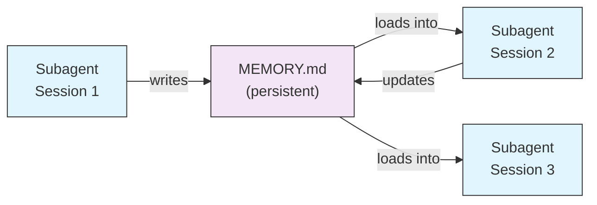
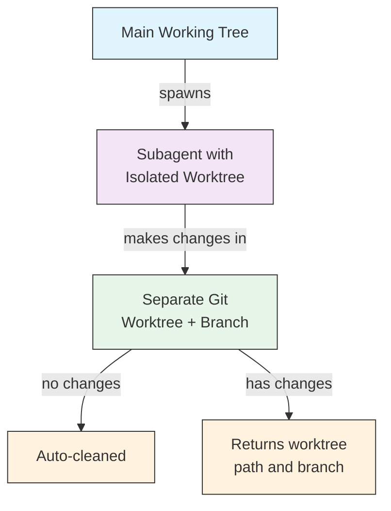
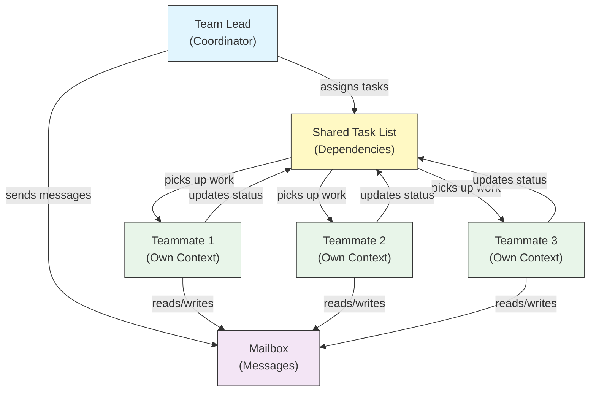
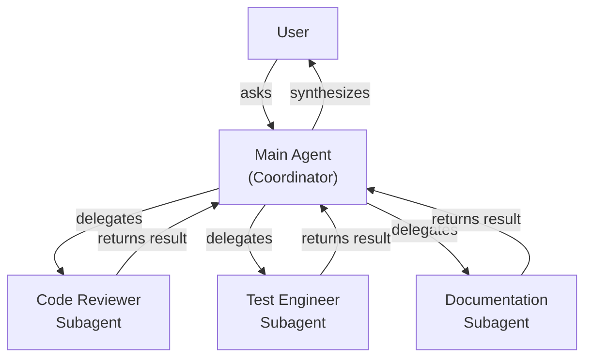
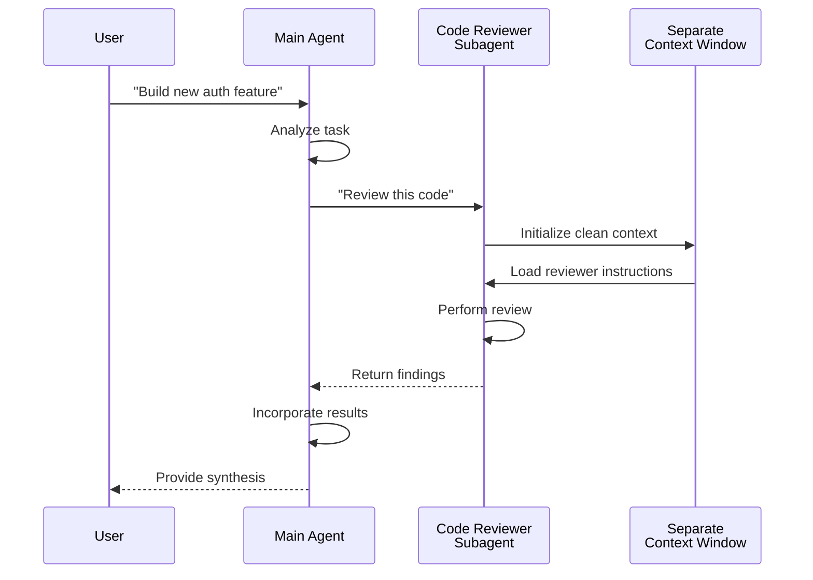
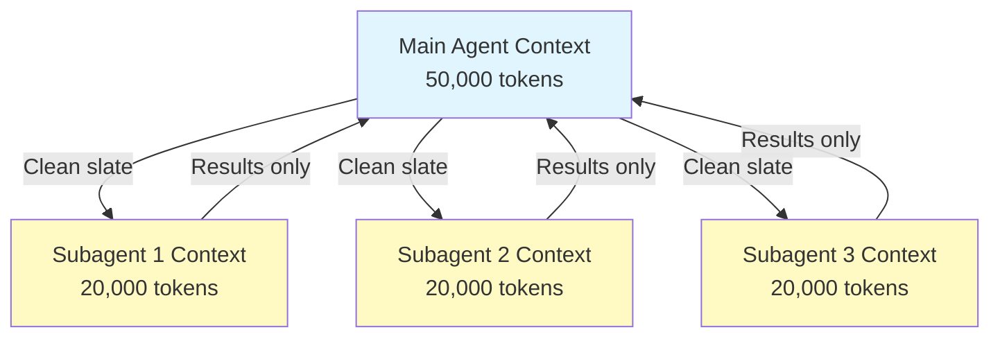
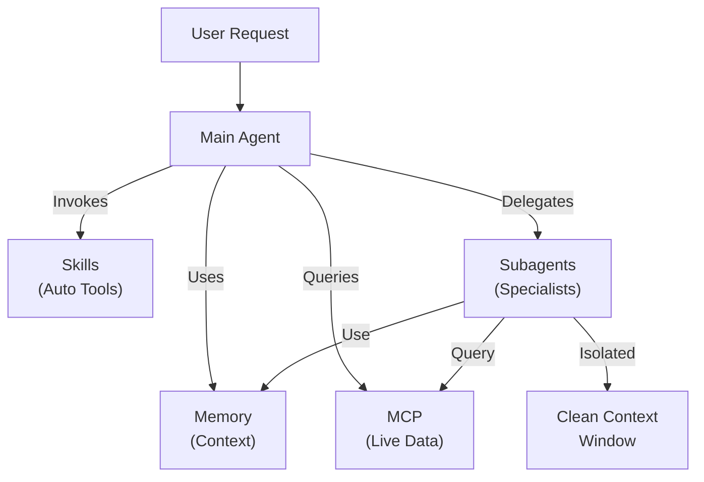

<picture>
  <source media="(prefers-color-scheme: dark)" srcset="../../resources/logos/claude-howto-logo-dark.svg">
  
</picture>

# Subagents - 完整参考指南

Subagent 是 Claude Code 可以将任务委派给它们的专门 AI 助手。每个 subagent 都有特定用途，使用与主对话相互隔离的独立上下文窗口，并且可以配置特定工具和自定义系统提示词。

## 目录

1. [概览](#概览)
2. [主要好处](#主要好处)
3. [文件位置](#文件位置)
4. [配置](#配置)
5. [内置 Subagents](#内置-subagents)
6. [管理 Subagents](#管理-subagents)
7. [使用 Subagents](#使用-subagents)
8. [可恢复的 Agents](#可恢复的-agents)
9. [串联 Subagents](#串联-subagents)
10. [Subagents 的持久记忆](#subagents-的持久记忆)
11. [后台 Subagents](#后台-subagents)
12. [Worktree 隔离](#worktree-隔离)
13. [限制可启动的 Subagents](#限制可启动的-subagents)
14. [`claude agents` CLI 命令](#claude-agents-cli-命令)
15. [Agent Teams（实验性）](#agent-teams实验性)
16. [Plugin Subagent 安全](#plugin-subagent-安全)
17. [架构](#架构)
18. [上下文管理](#上下文管理)
19. [何时使用 Subagents](#何时使用-subagents)
20. [最佳实践](#最佳实践)
21. [本目录中的示例 Subagents](#本目录中的示例-subagents)
22. [安装说明](#安装说明)
23. [相关概念](#相关概念)

---

## 概览

Subagents 通过以下方式在 Claude Code 中实现委派式任务执行：

- 创建拥有独立上下文窗口的**隔离 AI 助手**
- 提供**自定义系统提示词**以获得专门领域的专长
- 实施**工具访问控制**以限制能力
- 防止复杂任务造成的**上下文污染**
- 支持多个专门任务的**并行执行**

每个 subagent 都以干净的状态独立运行，仅接收完成其任务所需的特定上下文，然后将结果返回给主 agent 进行综合。

**快速开始**：使用 `/agents` 命令以交互方式创建、查看、编辑和管理你的 subagents。

---

## 主要好处

| 好处 | 说明 |
|---------|-------------|
| **上下文保护** | 在独立上下文中运行，防止污染主对话 |
| **专门领域专长** | 针对特定领域进行微调，成功率更高 |
| **可复用性** | 可跨不同项目使用并与团队共享 |
| **灵活的权限** | 为不同类型的 subagent 提供不同的工具访问级别 |
| **可扩展性** | 多个 agent 同时处理不同方面 |

---

## 文件位置

Subagent 文件可以存储在多个位置，具有不同的作用域：

| 优先级 | 类型 | 位置 | 作用域 |
|----------|------|----------|-------|
| 1（最高） | **CLI 定义** | 通过 `--agents` 标志（JSON） | 仅当前会话 |
| 2 | **项目 subagents** | `.claude/agents/` | 当前项目 |
| 3 | **用户 subagents** | `~/.claude/agents/` | 所有项目 |
| 4（最低） | **Plugin agents** | Plugin 的 `agents/` 目录 | 通过 plugins |

当存在重名时，优先级更高的来源会优先生效。

> **嵌套 `.claude/` 优先级（v2.1.178）**：当同一个 agent 名称在多个嵌套的 `.claude/agents/` 目录中定义时（例如带有包级 `.claude/` 文件夹的 monorepo），**最接近你当前工作目录的定义胜出**。同样的“最近者胜出”规则也适用于嵌套的 workflow 和 output-style 定义。

---

## 配置

### 文件格式

Subagents 由 YAML frontmatter 定义，后跟 markdown 格式的系统提示词：

```yaml
---
name: your-sub-agent-name
description: Description of when this subagent should be invoked
tools: tool1, tool2, tool3  # Optional - inherits all tools if omitted
disallowedTools: tool4  # Optional - explicitly disallowed tools
model: sonnet  # Optional - sonnet, opus, haiku, or inherit
permissionMode: default  # Optional - permission mode
maxTurns: 20  # Optional - limit agentic turns
skills: skill1, skill2  # Optional - skills to preload into context
mcpServers: server1  # Optional - MCP servers to make available
memory: user  # Optional - persistent memory scope (user, project, local)
background: false  # Optional - run as background task
effort: high  # Optional - reasoning effort (low, medium, high, max)
isolation: worktree  # Optional - git worktree isolation
initialPrompt: "Start by analyzing the codebase"  # Optional - auto-submitted first turn
hooks:  # Optional - component-scoped hooks
  PreToolUse:
    - matcher: "Bash"
      hooks:
        - type: command
          command: "./scripts/security-check.sh"
---

Your subagent's system prompt goes here. This can be multiple paragraphs
and should clearly define the subagent's role, capabilities, and approach
to solving problems.
```

### 配置字段

| 字段 | 是否必填 | 说明 |
|-------|----------|-------------|
| `name` | 是 | 唯一标识符（小写字母和连字符） |
| `description` | 是 | 用途的自然语言描述。包含 "use PROACTIVELY" 以鼓励自动调用 |
| `tools` | 否 | 以逗号分隔的特定工具列表。省略则继承所有工具。支持 `Agent(agent_name)` 语法以限制可启动的 subagents |
| `disallowedTools` | 否 | 以逗号分隔的 subagent 不得使用的工具列表 |
| `model` | 否 | 要使用的模型：`sonnet`、`opus`、`haiku`、完整模型 ID 或 `inherit`。默认为配置的 subagent 模型 |
| `permissionMode` | 否 | `default`、`acceptEdits`、`dontAsk`、`bypassPermissions`、`plan` |
| `maxTurns` | 否 | subagent 可执行的最大 agentic 轮数 |
| `skills` | 否 | 以逗号分隔的要预加载的 skills 列表。在启动时将完整的 skill 内容注入到 subagent 的上下文中。**v2.1.133+：** subagents 还能通过 Skill 工具发现 project、user 和 plugin skills——与主会话相同的目录，不再局限于它们自身内嵌的集合。 |
| `mcpServers` | 否 | 要提供给 subagent 的 MCP 服务器 |
| `hooks` | 否 | 组件级 hooks（PreToolUse、PostToolUse、Stop） |
| `memory` | 否 | 持久记忆目录作用域：`user`、`project` 或 `local` |
| `background` | 否 | 设为 `true` 以始终将此 subagent 作为后台任务运行 |
| `effort` | 否 | 推理努力级别：`low`、`medium`、`high` 或 `max` |
| `isolation` | 否 | 设为 `worktree` 以给 subagent 分配自己的 git worktree |
| `initialPrompt` | 否 | 当 subagent 作为主 agent 运行时自动提交的第一轮内容 |

### 主线程 Agent Frontmatter 生效（v2.1.117+/v2.1.119+）

当 agent 作为主线程 agent 被调用时（通过 `claude --agent <name>` 或 `--print` 模式），以下 frontmatter 字段会生效：

| 字段 | 版本 | 备注 |
|-------|---------|-------|
| `mcpServers` | v2.1.117+ | 当 agent 通过 `claude --agent <name>` 作为主线程 agent 被调用时加载 |
| `permissionMode` | v2.1.119+ | 通过 `--agent <name>` 对内置 agent 生效 |
| `tools` / `disallowedTools` | v2.1.119+ | 在 `--print` 模式（非交互式/脚本化用法）中生效 |

**示例——带有 `mcpServers` 和 `permissionMode` 的 agent：**

```yaml
---
name: secure-researcher
description: Research agent with scoped MCP access and restricted permissions
permissionMode: acceptEdits
mcpServers:
  notion:
    type: http
    url: https://mcp.notion.com/mcp
  github:
    type: http
    url: https://api.github.com/mcp
tools: Read, Grep, Glob
---

You are a research agent. You may query Notion and GitHub through the
configured MCP servers, and read local files, but you cannot write or
execute commands outside of accepted edits.
```

运行方式：

```bash
claude --agent secure-researcher
```

### 工具配置选项

**选项 1：继承所有工具（省略该字段）**
```yaml
---
name: full-access-agent
description: Agent with all available tools
---
```

**选项 2：指定单个工具**
```yaml
---
name: limited-agent
description: Agent with specific tools only
tools: Read, Grep, Glob, Bash
---
```

> **关于 Glob/Grep 的说明（v2.1.113+）：** 在原生 macOS/Linux 构建中，Glob 和 Grep 是通过 Bash 工具以 `bfs`/`ugrep` 形式提供的，而不是作为独立的工具。Windows 和 npm-JS 构建仍将它们作为独立工具暴露。作者仍可在 `allowedTools` 中引用 Glob/Grep；后端的替换是透明的。

**选项 3：条件化工具访问**
```yaml
---
name: conditional-agent
description: Agent with filtered tool access
tools: Read, Bash(npm:*), Bash(test:*)
---
```

### 基于 CLI 的配置

使用 `--agents` 标志以 JSON 格式为单个会话定义 subagents：

```bash
claude --agents '{
  "code-reviewer": {
    "description": "Expert code reviewer. Use proactively after code changes.",
    "prompt": "You are a senior code reviewer. Focus on code quality, security, and best practices.",
    "tools": ["Read", "Grep", "Glob", "Bash"],
    "model": "sonnet"
  }
}'
```

**`--agents` 标志的 JSON 格式：**

```json
{
  "agent-name": {
    "description": "Required: when to invoke this agent",
    "prompt": "Required: system prompt for the agent",
    "tools": ["Optional", "array", "of", "tools"],
    "model": "optional: sonnet|opus|haiku"
  }
}
```

**Agent 定义的优先级：**

Agent 定义按以下优先级顺序加载（首个匹配胜出）：
1. **CLI 定义** - `--agents` 标志（仅当前会话，JSON）
2. **项目级** - `.claude/agents/`（当前项目）
3. **用户级** - `~/.claude/agents/`（所有项目）
4. **Plugin 级** - Plugin 的 `agents/` 目录

这使得 CLI 定义可以在单个会话中覆盖所有其他来源。

---

## 内置 Subagents

Claude Code 包含若干始终可用的内置 subagents：

| Agent | 模型 | 用途 |
|-------|-------|---------|
| **general-purpose** | 继承 | 复杂的多步骤任务 |
| **Plan** | 继承 | 为 plan 模式做研究 |
| **Explore** | Haiku | 只读的代码库探索（quick/medium/very thorough） |
| **Bash** | 继承 | 在独立上下文中执行终端命令 |
| **statusline-setup** | Sonnet | 配置状态行 |
| **Claude Code Guide** | Haiku | 回答 Claude Code 功能相关问题 |

### General-Purpose Subagent

| 属性 | 值 |
|----------|-------|
| **模型** | 继承自父级 |
| **工具** | 所有工具 |
| **用途** | 复杂研究任务、多步骤操作、代码修改 |

**何时使用**：需要同时进行探索和修改且涉及复杂推理的任务。

### Plan Subagent

| 属性 | 值 |
|----------|-------|
| **模型** | 继承自父级 |
| **工具** | Read、Glob、Grep、Bash |
| **用途** | 在 plan 模式中自动用于研究代码库 |

**何时使用**：当 Claude 需要在给出计划前理解代码库时。

### Explore Subagent

| 属性 | 值 |
|----------|-------|
| **模型** | Haiku（快速、低延迟） |
| **模式** | 严格只读 |
| **工具** | Glob、Grep、Read、Bash（仅只读命令） |
| **用途** | 快速搜索和分析代码库 |

**何时使用**：当搜索/理解代码而不做修改时。

**彻底程度级别** - 指定探索的深度：
- **"quick"** - 快速搜索、最少探索，适合查找特定模式
- **"medium"** - 适度探索，速度与彻底程度平衡，默认方式
- **"very thorough"** - 跨多个位置和命名约定的全面分析，可能耗时更长

### Bash Subagent

| 属性 | 值 |
|----------|-------|
| **模型** | 继承自父级 |
| **工具** | Bash |
| **用途** | 在独立上下文窗口中执行终端命令 |

**何时使用**：当运行受益于隔离上下文的 shell 命令时。

### Statusline Setup Subagent

| 属性 | 值 |
|----------|-------|
| **模型** | Sonnet |
| **工具** | Read、Write、Bash |
| **用途** | 配置 Claude Code 状态行显示 |

**何时使用**：当设置或自定义状态行时。

### Claude Code Guide Subagent

| 属性 | 值 |
|----------|-------|
| **模型** | Haiku（快速、低延迟） |
| **工具** | 只读 |
| **用途** | 回答关于 Claude Code 功能和用法的问题 |

**何时使用**：当用户询问 Claude Code 的工作方式或如何使用特定功能时。

---

## 管理 Subagents

### 使用 `/agents` 命令（推荐）

```bash
/agents
```

这会提供一个交互式菜单，用于：
- 查看所有可用的 subagents（内置、用户和项目）
- 通过引导式设置创建新 subagents
- 编辑现有的自定义 subagents 及其工具访问
- 删除自定义 subagents
- 在存在重名时查看哪个 subagent 处于激活状态

### 直接管理文件

```bash
# Create a project subagent
mkdir -p .claude/agents
cat > .claude/agents/test-runner.md << 'EOF'
---
name: test-runner
description: Use proactively to run tests and fix failures
---

You are a test automation expert. When you see code changes, proactively
run the appropriate tests. If tests fail, analyze the failures and fix
them while preserving the original test intent.
EOF

# Create a user subagent (available in all projects)
mkdir -p ~/.claude/agents
```

---

## 使用 Subagents

### 自动委派

Claude 会基于以下因素主动委派任务：
- 你请求中的任务描述
- subagent 配置中的 `description` 字段
- 当前上下文和可用工具

为鼓励主动使用，在你的 `description` 字段中包含 "use PROACTIVELY" 或 "MUST BE USED"：

```yaml
---
name: code-reviewer
description: Expert code review specialist. Use PROACTIVELY after writing or modifying code.
---
```

### 显式调用

你可以显式请求特定的 subagent：

```
> Use the test-runner subagent to fix failing tests
> Have the code-reviewer subagent look at my recent changes
> Ask the debugger subagent to investigate this error
```

> **大小写与分隔符无关的 `subagent_type` 匹配（v2.1.140）**：`subagent_type`（在 `Agent` 工具调用或 `--agent` 标志中）以大小写无关的方式匹配，并忽略分隔符风格——`code-reviewer`、`Code Reviewer` 和 `code_reviewer` 都解析为同一个 agent。这消除了一个长期存在的隐患：细微的大小写差异曾会悄无声息地回退到默认 agent。

### @-提及调用

使用 `@` 前缀以保证调用特定的 subagent（绕过自动委派启发式）：

```
> @"code-reviewer (agent)" review the auth module
```

### 会话级 Agent

使用特定 agent 作为主 agent 运行整个会话：

```bash
# Via CLI flag
claude --agent code-reviewer

# Via settings.json
{
  "agent": "code-reviewer"
}
```

### 列出可用 Agents

使用 `claude agents` 命令列出来自所有来源的全部已配置 agent：

```bash
claude agents
```

---

## 可恢复的 Agents

Subagents 可以在完整保留上下文的情况下继续之前的对话：

```bash
# Initial invocation
> Use the code-analyzer agent to start reviewing the authentication module
# Returns agentId: "abc123"

# Resume the agent later
> Resume agent abc123 and now analyze the authorization logic as well
```

**使用场景**：
- 跨多个会话的长期研究
- 不丢失上下文的迭代式精炼
- 维持上下文的多步骤工作流

---

## 串联 Subagents

按顺序执行多个 subagents：

```bash
> First use the code-analyzer subagent to find performance issues,
  then use the optimizer subagent to fix them
```

这使得复杂的工作流成为可能，其中一个 subagent 的输出会馈送给另一个。

---

## Subagents 的持久记忆

`memory` 字段为 subagents 提供一个跨对话持久存在的目录。这使得 subagents 能够随时间积累知识，存储在会话之间持久保留的笔记、发现和上下文。

### Memory 作用域

| 作用域 | 目录 | 使用场景 |
|-------|-----------|----------|
| `user` | `~/.claude/agent-memory/<name>/` | 跨所有项目的个人笔记和偏好 |
| `project` | `.claude/agent-memory/<name>/` | 与团队共享的项目特定知识 |
| `local` | `.claude/agent-memory-local/<name>/` | 不提交到版本控制的本地项目知识 |

### 工作方式

- memory 目录中 `MEMORY.md` 的前 200 行会被自动加载到 subagent 的系统提示词中
- `Read`、`Write` 和 `Edit` 工具会被自动启用，供 subagent 管理其 memory 文件
- subagent 可以根据需要在其 memory 目录中创建额外文件

### 示例配置

```yaml
---
name: researcher
memory: user
---

You are a research assistant. Use your memory directory to store findings,
track progress across sessions, and build up knowledge over time.

Check your MEMORY.md file at the start of each session to recall previous context.
```



---

## 后台 Subagents

Subagents 可以在后台运行，从而腾出主对话来处理其他任务。

### 配置

在 frontmatter 中设置 `background: true` 以始终将该 subagent 作为后台任务运行：

```yaml
---
name: long-runner
background: true
description: Performs long-running analysis tasks in the background
---
```

### 键盘快捷键

| 快捷键 | 操作 |
|----------|--------|
| `Ctrl+B` | 将当前正在运行的 subagent 任务放到后台 |
| `Ctrl+F` | 终止所有后台 agent（按两次确认） |

### 禁用后台任务

设置环境变量以完全禁用后台任务支持：

```bash
export CLAUDE_CODE_DISABLE_BACKGROUND_TASKS=1
```

---

## Worktree 隔离

`isolation: worktree` 设置为 subagent 分配自己的 git worktree，使其能够独立做出更改而不影响主工作树。

### 配置

```yaml
---
name: feature-builder
isolation: worktree
description: Implements features in an isolated git worktree
tools: Read, Write, Edit, Bash, Grep, Glob
---
```

### 工作方式



- subagent 在自己的 git worktree 上的独立分支中运行
- 如果 subagent 没有做出任何更改，worktree 会被自动清理
- 如果存在更改，worktree 路径和分支名称会被返回给主 agent 以供审查或合并

---

## Forked Subagents

Forked subagents（`context: fork`）会在 fork 的那一刻继承父 agent 的完整对话上下文，而不是从干净的状态开始。这对于在不丢失迄今所做工作的情况下探索替代路径非常有用。

> **可用性**：在 v2.1.117 中正式可用（GA）。在外部构建（非第一方分发）上，设置 `CLAUDE_CODE_FORK_SUBAGENT=1` 以启用 fork。

### 配置

```yaml
---
name: alternative-explorer
description: Explore an alternative implementation path while preserving parent context
context: fork
tools: Read, Edit, Bash, Grep, Glob
---

You are a forked subagent. You inherit the parent's full conversation and
may explore an alternative approach. Return your findings and the parent
will decide whether to adopt them.
```

### 在外部构建上启用

```bash
export CLAUDE_CODE_FORK_SUBAGENT=1
claude
```

### 何时使用 Fork 与干净上下文

| 场景 | `context: fork` | 干净上下文（默认） |
|----------|-----------------|-------------------------|
| 探索替代实现 | 是 | 否（会丢失上下文） |
| 携带现有上下文的长期研究 | 是 | 否 |
| 独立的专门任务 | 否 | 是 |
| 避免上下文污染 | 否 | 是 |

---

## 限制可启动的 Subagents

你可以通过在 `tools` 字段中使用 `Agent(agent_type)` 语法来控制给定 subagent 被允许启动哪些 subagents。这提供了一种为委派列入白名单特定 subagents 的方式。

> **说明**：在 v2.1.63 中，`Task` 工具被重命名为 `Agent`。现有的 `Task(...)` 引用仍作为别名有效。

### 示例

```yaml
---
name: coordinator
description: Coordinates work between specialized agents
tools: Agent(worker, researcher), Read, Bash
---

You are a coordinator agent. You can delegate work to the "worker" and
"researcher" subagents only. Use Read and Bash for your own exploration.
```

在此示例中，`coordinator` subagent 只能启动 `worker` 和 `researcher` subagents。即使其他地方定义了其他 subagents，它也无法启动它们。

---

## `claude agents` CLI 命令

`claude agents` 命令列出按来源（内置、用户级、项目级）分组的所有已配置 agent：

```bash
claude agents
```

此命令：
- 显示来自所有来源的全部可用 agent
- 按来源位置对 agent 分组
- 当某个更高优先级的 agent 遮蔽了更低级别的同名 agent 时，指示出**覆盖**（例如，一个项目级 agent 与一个用户级 agent 同名）

---

## Agent Teams（实验性）

Agent Teams 协调多个 Claude Code 实例共同处理复杂任务。与 subagents（它们是被委派、返回结果的子任务）不同，teammates 拥有各自的上下文窗口独立工作，并能通过共享的 mailbox 系统直接相互发送消息。

> **官方文档**：[code.claude.com/docs/en/agent-teams](https://code.claude.com/docs/en/agent-teams)

> **说明**：Agent Teams 是实验性的，默认禁用。需要 Claude Code v2.1.32+。使用前请先启用。

### Subagents 与 Agent Teams 对比

| 方面 | Subagents | Agent Teams |
|--------|-----------|-------------|
| **委派模型** | 父级委派子任务，等待结果 | team lead 协调工作，teammates 独立执行 |
| **上下文** | 每个子任务全新上下文，结果蒸馏回传 | 每个 teammate 维护自己的持久上下文窗口 |
| **协调** | 顺序或并行，由父级管理 | 共享任务列表，自动依赖管理 |
| **通信** | 结果仅返回父级（无 agent 间消息传递） | teammates 可通过 mailbox 直接相互发消息 |
| **会话恢复** | 支持 | 在进程内 teammates 上不支持 |
| **最适合** | 聚焦、定义明确的子任务 | 需要 agent 间通信和并行执行的复杂工作 |

### 启用 Agent Teams

设置环境变量或将其添加到 `settings.json`：

```bash
export CLAUDE_CODE_EXPERIMENTAL_AGENT_TEAMS=1
```

或在 `settings.json` 中：

```json
{
  "env": {
    "CLAUDE_CODE_EXPERIMENTAL_AGENT_TEAMS": "1"
  }
}
```

### 启动团队

启用后，在你的提示词中要求 Claude 与 teammates 协作：

```
User: Build the authentication module. Use a team — one teammate for the API endpoints,
      one for the database schema, and one for the test suite.
```

Claude 会创建团队、分配任务并自动协调工作。

### 显示模式

控制 teammate 活动的显示方式：

| 模式 | 标志 | 说明 |
|------|------|-------------|
| **Auto** | `--teammate-mode auto` | 自动为你的终端选择最佳显示模式 |
| **In-process**（默认） | `--teammate-mode in-process` | 在当前终端内联显示 teammate 输出 |
| **Split-panes** | `--teammate-mode tmux` | 在单独的 tmux 或 iTerm2 窗格中打开每个 teammate |
| **iTerm2** | `--teammate-mode iterm2` | （v2.1.186+）在专用 iTerm2 窗格中生成 teammates。需要 `it2` CLI；当找不到它时 auto 模式会警告 |

```bash
claude --teammate-mode tmux
```

你也可以在 `settings.json` 中设置显示模式：

```json
{
  "teammateMode": "tmux"
}
```

> **说明**：分屏窗格模式需要 tmux 或 iTerm2。在 VS Code 终端、Windows Terminal 或 Ghostty 中不可用。

### 导航

在分屏窗格模式中使用 `Shift+Down` 在 teammates 之间导航。

### 团队配置

团队配置存储在 `~/.claude/teams/{team-name}/config.json`。

### 架构



**关键组件**：

- **Team Lead**：创建团队、分配任务并进行协调的主 Claude Code 会话
- **Shared Task List**：带有自动依赖跟踪的同步任务列表
- **Mailbox**：供 teammates 沟通状态和协调的 agent 间消息传递系统
- **Teammates**：独立的 Claude Code 实例，各自拥有自己的上下文窗口

### 任务分配与消息传递

team lead 将工作拆分为任务并分配给 teammates。共享任务列表负责处理：

- **自动依赖管理** — 任务会等待其依赖项完成
- **状态跟踪** — teammates 在工作时更新任务状态
- **agent 间消息传递** — teammates 通过 mailbox 发送消息以协调（例如，“Database schema is ready, you can start writing queries”）

### 计划审批工作流

对于复杂任务，team lead 会在 teammates 开始工作之前创建执行计划。用户审查并批准该计划，确保团队的方式在做出任何代码更改之前与预期保持一致。

### 团队的 Hook 事件

Agent Teams 引入了两个额外的 [hook 事件](../06-hooks/)：

| 事件 | 触发时机 | 使用场景 |
|-------|-----------|----------|
| `TeammateIdle` | 当 teammate 完成当前任务且没有待处理工作时 | 触发通知、分配后续任务 |
| `TaskCompleted` | 当共享任务列表中的某个任务被标记为完成时 | 运行验证、更新仪表盘、串联依赖工作 |

### 最佳实践

- **团队规模**：将团队保持在 3-5 名 teammates，以获得最佳协调效果
- **任务规模**：将工作拆分为每个耗时 5-15 分钟的任务——小到足以并行化，大到足以有意义
- **避免文件冲突**：将不同的文件或目录分配给不同的 teammates，以防止合并冲突
- **从简单开始**：你的第一个团队使用 in-process 模式；熟悉后再切换到分屏窗格
- **清晰的任务描述**：提供具体、可执行的任务描述，使 teammates 能够独立工作

### 局限

- **实验性**：功能行为可能在未来版本中变化
- **无会话恢复**：进程内 teammates 在会话结束后无法恢复
- **每个会话一个团队**：无法在单个会话中创建嵌套团队或多个团队
- **固定领导**：team lead 角色无法转移给 teammate
- **分屏窗格限制**：需要 tmux/iTerm2；在 VS Code 终端、Windows Terminal 或 Ghostty 中不可用
- **无跨会话团队**：teammates 仅存在于当前会话中

> **警告**：Agent Teams 是实验性的。请先用非关键工作进行测试，并监控 teammate 协调是否出现意外行为。

---

## Plugin Subagent 安全

Plugin 提供的 subagents 出于安全考虑具有受限的 frontmatter 能力。以下字段在 plugin subagent 定义中**不被允许**：

- `hooks` - 不能定义生命周期 hooks
- `mcpServers` - 不能配置 MCP 服务器
- `permissionMode` - 不能覆盖权限设置

这可以防止 plugins 通过 subagent hooks 提升权限或执行任意命令。

---

## 架构

### 高层架构



### Subagent 生命周期



---

## 上下文管理



### 关键点

- 每个 subagent 都获得一个**全新的上下文窗口**，不含主对话历史
- 只有**相关的上下文**会被传递给 subagent 用于其特定任务
- 结果会被**蒸馏**回主 agent
- 这可以防止长期项目中的**上下文 token 耗尽**

### 性能考虑

- **上下文效率** - Agents 保护主上下文，使会话更长
- **延迟** - Subagents 从干净的状态开始，可能在收集初始上下文时增加延迟

### 关键行为

- **嵌套生成（最多 5 层）** - 自 v2.1.172 起，subagents 可以生成自己的 subagents，嵌套深度最多 5 层。更早的版本不允许任何嵌套。使用 `Agent(agent_type)` 限制语法（见 [限制可启动的 Subagents](#限制可启动的-subagents)）来控制给定 subagent 可以生成哪些 subagents
- **后台权限** - 后台 subagents 会自动拒绝任何未预先批准的权限
- **后台化** - 按 `Ctrl+B` 将当前正在运行的任务放到后台
- **记录（Transcripts）** - Subagent 记录存储在 `~/.claude/projects/{project}/{sessionId}/subagents/agent-{agentId}.jsonl`
- **自动压缩（Auto-compaction）** - Subagent 上下文在约 95% 容量时自动压缩（用 `CLAUDE_AUTOCOMPACT_PCT_OVERRIDE` 环境变量覆盖）

---

## 何时使用 Subagents

| 场景 | 是否使用 Subagent | 原因 |
|----------|--------------|-----|
| 包含多个步骤的复杂功能 | 是 | 分离关注点，防止上下文污染 |
| 快速代码审查 | 否 | 不必要的开销 |
| 并行任务执行 | 是 | 每个 subagent 拥有自己的上下文 |
| 需要专门领域专长 | 是 | 自定义系统提示词 |
| 长期分析 | 是 | 防止主上下文耗尽 |
| 单个任务 | 否 | 不必要地增加延迟 |

---

## 最佳实践

### 设计原则

**应该做：**
- 从 Claude 生成的 agent 开始 - 用 Claude 生成初始 subagent，然后迭代定制
- 设计聚焦的 subagents - 单一、清晰的职责，而非一个 agent 包揽一切
- 编写详细的提示词 - 包含具体指令、示例和约束
- 限制工具访问 - 仅授予 subagent 用途所需的工具
- 版本控制 - 将项目 subagents 纳入版本控制以便团队协作

**不应该做：**
- 创建角色相同、彼此重叠的 subagents
- 给 subagents 不必要的工具访问
- 将 subagents 用于简单的单步骤任务
- 在一个 subagent 的提示词中混合多个关注点
- 忘记传递必要的上下文

### System Prompt 最佳实践

1. **明确角色**
   ```
   You are an expert code reviewer specializing in [specific areas]
   ```

2. **清晰定义优先级**
   ```
   Review priorities (in order):
   1. Security Issues
   2. Performance Problems
   3. Code Quality
   ```

3. **指定输出格式**
   ```
   For each issue provide: Severity, Category, Location, Description, Fix, Impact
   ```

4. **包含行动步骤**
   ```
   When invoked:
   1. Run git diff to see recent changes
   2. Focus on modified files
   3. Begin review immediately
   ```

### 工具访问策略

1. **从严格开始**：先仅提供必要工具
2. **仅在需要时扩展**：随需求增加工具
3. **尽可能只读**：分析型 agent 使用 Read/Grep
4. **沙盒化执行**：将 Bash 命令限制为特定模式

---

## 本目录中的示例 Subagents

本文件夹包含可直接使用的示例 subagents：

### 1. Code Reviewer（`code-reviewer.md`）

**用途**：全面的代码质量与可维护性分析

**工具**：Read、Grep、Glob、Bash

**专长**：
- 安全漏洞检测
- 性能优化识别
- 代码可维护性评估
- 测试覆盖率分析

**何时使用**：你需要侧重质量和安全的自动化代码审查时

---

### 2. Test Engineer（`test-engineer.md`）

**用途**：测试策略、覆盖率分析与自动化测试

**工具**：Read、Write、Bash、Grep

**专长**：
- 单元测试创建
- 集成测试设计
- 边界情况识别
- 覆盖率分析（目标 >80%）

**何时使用**：你需要全面的测试套件创建或覆盖率分析时

---

### 3. Documentation Writer（`documentation-writer.md`）

**用途**：技术文档、API 文档和用户指南

**工具**：Read、Write、Grep

**专长**：
- API 端点文档
- 用户指南创建
- 架构文档
- 代码注释改进

**何时使用**：你需要创建或更新项目文档时

---

### 4. Secure Reviewer（`secure-reviewer.md`）

**用途**：以最小权限进行的安全导向代码审查

**工具**：Read、Grep

**专长**：
- 安全漏洞检测
- 认证/授权问题
- 数据暴露风险
- 注入攻击识别

**何时使用**：你需要不具备修改能力的安全审计时

---

### 5. Implementation Agent（`implementation-agent.md`）

**用途**：用于功能开发的完整实现能力

**工具**：Read、Write、Edit、Bash、Grep、Glob

**专长**：
- 功能实现
- 代码生成
- 构建与测试执行
- 代码库修改

**何时使用**：你需要一个 subagent 端到端地实现功能时

---

### 6. Debugger（`debugger.md`）

**用途**：针对错误、测试失败和意外行为的调试专家

**工具**：Read、Edit、Bash、Grep、Glob

**专长**：
- 根本原因分析
- 错误调查
- 测试失败修复
- 最小化修复实现

**何时使用**：你遇到 bug、错误或意外行为时

---

### 7. Data Scientist（`data-scientist.md`）

**用途**：用于 SQL 查询和数据洞察的数据分析专家

**工具**：Bash、Read、Write

**专长**：
- SQL 查询优化
- BigQuery 操作
- 数据分析与可视化
- 统计洞察

**何时使用**：你需要数据分析、SQL 查询或 BigQuery 操作时

---

## 安装说明

### 方法 1：使用 /agents 命令（推荐）

```bash
/agents
```

然后：
1. 选择 'Create New Agent'
2. 选择项目级或用户级
3. 详细描述你的 subagent
4. 选择要授予访问权限的工具（或留空以继承所有工具）
5. 保存并使用

### 方法 2：复制到项目

将 agent 文件复制到你项目的 `.claude/agents/` 目录：

```bash
# Navigate to your project
cd /path/to/your/project

# Create agents directory if it doesn't exist
mkdir -p .claude/agents

# Copy all agent files from this folder
cp /path/to/04-subagents/*.md .claude/agents/

# Remove the README (not needed in .claude/agents)
rm .claude/agents/README.md
```

### 方法 3：复制到用户目录

对于在你所有项目中都可用的 agent：

```bash
# Create user agents directory
mkdir -p ~/.claude/agents

# Copy agents
cp /path/to/04-subagents/code-reviewer.md ~/.claude/agents/
cp /path/to/04-subagents/debugger.md ~/.claude/agents/
# ... copy others as needed
```

### 验证

安装后，验证 agent 是否被识别：

```bash
/agents
```

你应该会看到你安装的 agent 与内置 agent 一同列出。

---

## 文件结构

```
project/
├── .claude/
│   └── agents/
│       ├── code-reviewer.md
│       ├── test-engineer.md
│       ├── documentation-writer.md
│       ├── secure-reviewer.md
│       ├── implementation-agent.md
│       ├── debugger.md
│       └── data-scientist.md
└── ...
```

---

## 相关概念

### 相关功能

- **[Slash Commands](../01-slash-commands/)** - 用户调用的快捷方式
- **[Memory](../02-memory/)** - 持久的跨会话上下文
- **[Skills](../03-skills/)** - 可复用的自主能力
- **[MCP Protocol](../05-mcp/)** - 实时外部数据访问
- **[Hooks](../06-hooks/)** - 事件驱动的 shell 命令自动化
- **[Plugins](../07-plugins/)** - 打包的扩展包

### 与其他功能的对比

| 功能 | 用户调用 | 自动调用 | 持久 | 外部访问 | 隔离上下文 |
|---------|--------------|--------------|-----------|------------------|------------------|
| **Slash Commands** | 是 | 否 | 否 | 否 | 否 |
| **Subagents** | 是 | 是 | 否 | 否 | 是 |
| **Memory** | 自动 | 自动 | 是 | 否 | 否 |
| **MCP** | 自动 | 是 | 否 | 是 | 否 |
| **Skills** | 是 | 是 | 否 | 否 | 否 |

### 集成模式



---

## 可观测性

> **在 v2.1.139 中添加。**

源自 subagent 的 API 请求会携带两个额外的 HTTP 头，以便能将 trace 和日志关联回派发它的会话：

| Header | 说明 |
|--------|-------------|
| `x-claude-code-agent-id` | 发起请求的 subagent 的 UUID。 |
| `x-claude-code-parent-agent-id` | 派发此 subagent 的 agent 的 UUID（主 agent，或链中更高层的 subagent）。 |

相同的标识符会作为属性 `claude.code.agent.id` 和 `claude.code.agent.parent_id` 暴露在 `claude_code.llm_request` OpenTelemetry span 上。使用它们来：

- 将 API 花费归因到特定的 subagent 类型，而非父会话
- 事后重建 agent 调用链（parent_id 形成一棵树）
- 对失控的 subagents 告警（例如，某个 `agent.id` 占会话花费的 >50%）

端到端的 exporter 设置请参见 [Advanced Features → Telemetry](../09-advanced-features/README.md) 中的 OpenTelemetry 章节。

## 更多资源

- [Subagents 官方文档](https://code.claude.com/docs/en/sub-agents)
- [CLI 参考](https://code.claude.com/docs/en/cli-reference) - `--agents` 标志和其他 CLI 选项
- [Plugins 指南](../07-plugins/) - 用于将 agent 与其他功能打包
- [Skills 指南](../03-skills/) - 用于自动调用的能力
- [Memory 指南](../02-memory/) - 用于持久上下文
- [Hooks 指南](../06-hooks/) - 用于事件驱动的自动化

---

**最后更新**：2026 年 6 月 24 日
**Claude Code 版本**：2.1.187
**来源**：
- https://code.claude.com/docs/en/sub-agents
- https://github.com/anthropics/claude-code/blob/main/CHANGELOG.md
- https://code.claude.com/docs/en/agent-teams
- https://code.claude.com/docs/en/changelog#2-1-172
- https://code.claude.com/docs/en/changelog
- https://github.com/anthropics/claude-code/releases/tag/v2.1.117
- https://github.com/anthropics/claude-code/releases/tag/v2.1.131
- https://github.com/anthropics/claude-code/releases/tag/v2.1.138
- https://github.com/anthropics/claude-code/releases/tag/v2.1.139
- https://github.com/anthropics/claude-code/releases/tag/v2.1.140
**兼容模型**：Claude Sonnet 4.6、Claude Opus 4.8、Claude Haiku 4.5
