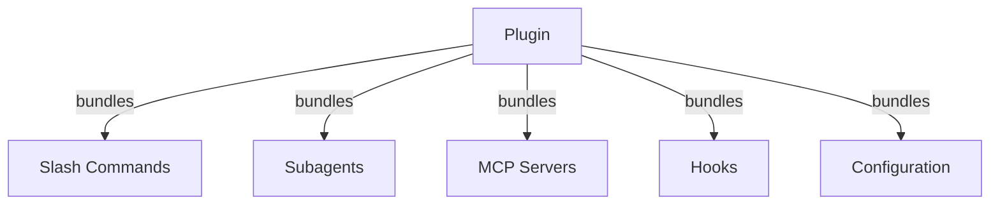
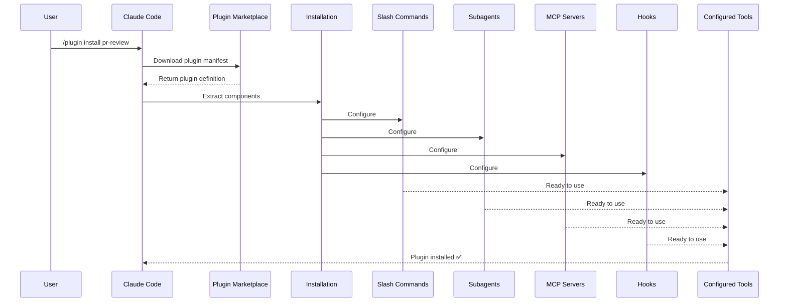
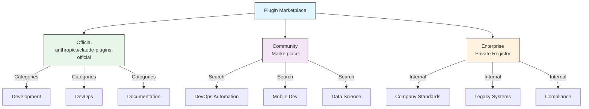
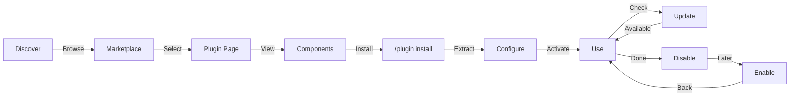
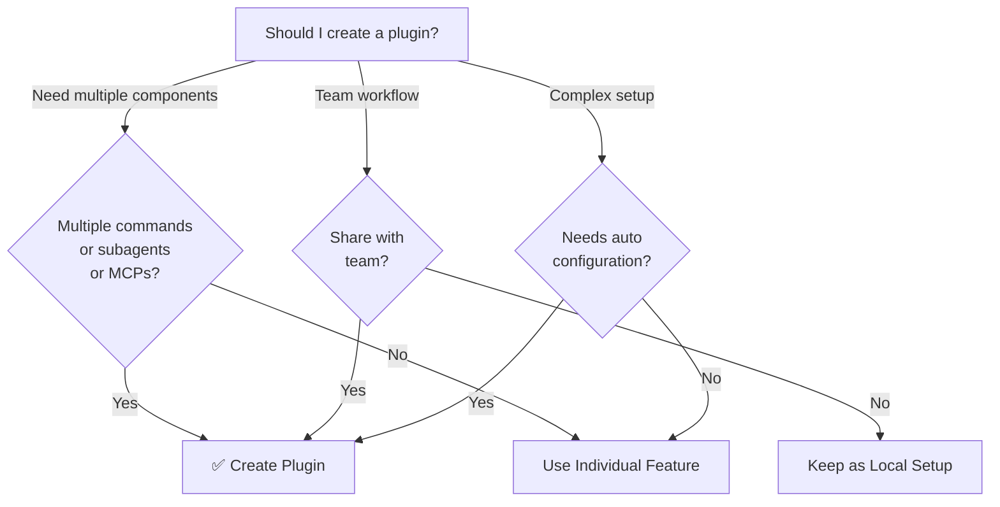

<picture>
  <source media="(prefers-color-scheme: dark)" srcset="../../resources/logos/claude-howto-logo-dark.svg">
  
</picture>

# Claude Code 插件

这个目录包含一组完整的插件示例，它们把多个 Claude Code 功能打包成一体化、可安装的软件包。

## 概览

Claude Code 插件是把多种自定义内容（slash command、subagent、MCP server 和 hook）打包在一起的集合，可以通过一条命令安装。它们代表了最高层级的扩展机制——把多个功能组合成一体化、可共享的软件包。

## 插件架构



## 插件加载流程



> **无需 marketplace（v2.1.157+）**：放置在 `.claude/skills` 目录中的插件现在无需 marketplace 即可自动加载。使用 `claude plugin init <name>` 来脚手架生成一个新插件。

## 插件类型与分发

| 类型 | 范围 | 共享对象 | 维护方 | 示例 |
|------|------|----------|--------|------|
| Official | Global | All users | Anthropic | PR Review, Security Guidance |
| Community | Public | All users | Community | DevOps, Data Science |
| Organization | Internal | Team members | Company | Internal standards, tools |
| Personal | Individual | Single user | Developer | Custom workflows |

## 插件定义结构

插件清单在 `.claude-plugin/plugin.json` 中使用 JSON 格式：

```json
{
  "name": "my-first-plugin",
  "description": "A greeting plugin",
  "version": "1.0.0",
  "author": {
    "name": "Your Name"
  },
  "homepage": "https://example.com",
  "repository": "https://github.com/user/repo",
  "license": "MIT"
}
```

## 插件结构示例

```
my-plugin/
├── .claude-plugin/
│   └── plugin.json       # Manifest (name, description, version, author)
├── commands/             # Skills as Markdown files
│   ├── task-1.md
│   ├── task-2.md
│   └── workflows/
├── agents/               # Custom agent definitions
│   ├── specialist-1.md
│   ├── specialist-2.md
│   └── configs/
├── skills/               # Agent Skills with SKILL.md files
│   ├── skill-1.md
│   └── skill-2.md
├── hooks/                # Event handlers in hooks.json
│   └── hooks.json
├── .mcp.json             # MCP server configurations
├── .lsp.json             # LSP server configurations for code intelligence
├── bin/                  # Executables added to Bash tool's PATH while plugin is enabled
├── settings.json         # Default settings applied when plugin is enabled (currently only `agent` key supported)
├── themes/               # Optional: ship custom Claude Code themes (v2.1.118+)
├── templates/
│   └── issue-template.md
├── scripts/
│   ├── helper-1.sh
│   └── helper-2.py
├── docs/
│   ├── README.md
│   └── USAGE.md
└── tests/
    └── plugin.test.js
```

### LSP server 配置

插件可以包含 Language Server Protocol（LSP）支持，以获得实时代码智能。LSP server 会在你编写代码时提供诊断、代码导航和符号信息。

**配置位置**：
- 插件根目录中的 `.lsp.json` 文件
- `plugin.json` 中的内联 `lsp` 键

#### 字段参考

| 字段 | 必填 | 说明 |
|------|------|------|
| `command` | Yes | LSP server 可执行文件（必须在 PATH 中） |
| `extensionToLanguage` | Yes | 将文件扩展名映射到语言 ID |
| `args` | No | server 的命令行参数 |
| `transport` | No | 通信方式：`stdio`（默认）或 `socket` |
| `env` | No | server 进程的环境变量 |
| `initializationOptions` | No | LSP 初始化期间发送的选项 |
| `settings` | No | 传递给 server 的工作区配置 |
| `workspaceFolder` | No | 覆盖工作区文件夹路径 |
| `startupTimeout` | No | 等待 server 启动的最长时间（毫秒） |
| `shutdownTimeout` | No | 优雅关闭的最长时间（毫秒） |
| `restartOnCrash` | No | server 崩溃时自动重启 |
| `maxRestarts` | No | 放弃前的最大重启次数 |

#### 示例配置

**Go (gopls)**：

```json
{
  "go": {
    "command": "gopls",
    "args": ["serve"],
    "extensionToLanguage": {
      ".go": "go"
    }
  }
}
```

**Python (pyright)**：

```json
{
  "python": {
    "command": "pyright-langserver",
    "args": ["--stdio"],
    "extensionToLanguage": {
      ".py": "python",
      ".pyi": "python"
    }
  }
}
```

**TypeScript**：

```json
{
  "typescript": {
    "command": "typescript-language-server",
    "args": ["--stdio"],
    "extensionToLanguage": {
      ".ts": "typescript",
      ".tsx": "typescriptreact",
      ".js": "javascript",
      ".jsx": "javascriptreact"
    }
  }
}
```

#### 可用的 LSP 插件

官方 marketplace 包含了预配置好的 LSP 插件：

| 插件 | 语言 | Server Binary | 安装命令 |
|--------|----------|---------------|----------------|
| `pyright-lsp` | Python | `pyright-langserver` | `pip install pyright` |
| `typescript-lsp` | TypeScript/JavaScript | `typescript-language-server` | `npm install -g typescript-language-server typescript` |
| `rust-lsp` | Rust | `rust-analyzer` | 使用 `rustup component add rust-analyzer` 安装 |

#### LSP 能力

配置完成后，LSP server 会提供：

- **即时诊断** — 编辑后立即显示错误和警告
- **代码导航** — 跳转到定义、查找引用和实现
- **悬浮信息** — 在悬停时查看类型签名和文档
- **符号列表** — 浏览当前文件或工作区中的符号

### `bin/` 目录加入 `PATH`

当插件被启用时，它的 `bin/` 目录会被前置到会话的 `PATH` 中。其中附带的任何可执行文件都可以直接通过名称从 Bash 工具中调用——无需限定路径。

```bash
# In a plugin layout:
my-plugin/
├── plugin.json
└── bin/
    └── my-tool          # executable file (chmod +x)

# Inside a Claude Code session with the plugin enabled:
$ my-tool --help
```

可以将其用于 CLI 辅助工具，让同一插件内的 hook、skill 或 command 通过 shell 调出它们。在插件仓库中将这些文件标记为可执行（`chmod +x`）——git 会保留这个权限位。

## 插件选项（v2.1.83+）

插件可以在清单中通过 `userConfig` 声明用户可配置的选项。标记为 `sensitive: true` 的值会存储在系统钥匙串中，而不是明文设置文件里：

```json
{
  "name": "my-plugin",
  "version": "1.0.0",
  "userConfig": {
    "apiKey": {
      "description": "API key for the service",
      "sensitive": true
    },
    "region": {
      "description": "Deployment region",
      "default": "us-east-1"
    }
  }
}
```

## 持久化插件数据（`${CLAUDE_PLUGIN_DATA}`）（v2.1.78+）

插件可以通过 `${CLAUDE_PLUGIN_DATA}` 环境变量访问一个持久化状态目录。这个目录对每个插件都是唯一的，并且会跨会话保留，适合缓存、数据库和其他持久化状态：

```json
{
  "hooks": {
    "PostToolUse": [
      {
        "command": "node ${CLAUDE_PLUGIN_DATA}/track-usage.js"
      }
    ]
  }
}
```

插件安装时会自动创建该目录。存放在这里的文件会一直保留，直到插件被卸载。

### 后台监控器（Background Monitors）（v2.1.105）

插件可以注册后台监控器，在会话启动时或插件的 skill 被调用时自动启用。在插件清单中添加顶层 `monitors` 键：

```json
{
  "name": "my-plugin",
  "version": "1.0.0",
  "monitors": [
    {
      "command": "tail -f /var/log/app.log",
      "trigger": "session_start"
    }
  ]
}
```

`trigger` 字段接受：
- `"session_start"` — 在会话开始时自动启用监控器
- `"skill_invoke"` — 在插件的 skill 被调用时启用监控器

监控器底层使用同一个 Monitor 工具，把 stdout 行作为事件流式输出，供 Claude 做出响应。

## 通过设置文件内联定义插件（`source: 'settings'`）（v2.1.80+）

插件可以在设置文件中以 marketplace 条目的方式内联定义，使用 `source: 'settings'` 字段即可。这允许你直接嵌入插件定义，而不必单独准备仓库或 marketplace：

```json
{
  "pluginMarketplaces": [
    {
      "name": "inline-tools",
      "source": "settings",
      "plugins": [
        {
          "name": "quick-lint",
          "source": "./local-plugins/quick-lint"
        }
      ]
    }
  ]
}
```

## 插件设置

插件可以附带一个 `settings.json` 文件来提供默认配置。目前支持 `agent` 键，用来为插件设置主线程 agent：

```json
{
  "agent": "agents/specialist-1.md"
}
```

当插件包含 `settings.json` 时，这些默认值会在安装时自动应用。用户可以在自己的项目或用户级配置中覆盖这些设置。

## 独立方式 vs 插件方式

| 方式 | 命令名称 | 配置 | 最适合 |
|----------|---------------|---|---|
| **独立（Standalone）** | `/hello` | 在 CLAUDE.md 中手动设置 | 个人、项目专用 |
| **插件（Plugins）** | `/plugin-name:hello` | 通过 plugin.json 自动配置 | 共享、分发、团队使用 |

对于快速的个人工作流，使用 **独立 slash command**。当你想打包多个功能、与团队共享或发布分发时，使用 **插件**。

> **带空格调用（v2.1.136+）**：插件 slash command 也可以用空格写——`/myplugin review` 会解析为规范形式 `/myplugin:review`。两种写法都可以；冒号形式是规范形式，在脚本中推荐使用。

> **`skills/` 发现机制（v2.1.136+）**：`plugin.json` 中的 `skills` 条目不再隐藏插件默认的 `skills/` 目录。两处声明的 skill 会被合并，因此你可以在 `plugin.json` 中列出少量重点 skill 而不丢失其余部分。

> **根级 `SKILL.md` 插件（v2.1.142+）**：一个带有顶层 `SKILL.md` 且 **没有 `skills/` 子目录** 的插件本身会作为单个 skill 呈现——插件 *就是* skill。这是一种额外的模式，并不是要取代 `skills/` 目录或 `plugin.json` 的 `skills` 条目；当目录布局没有意义时，可将其用于小型单 skill 插件。

## 实战示例

### 示例 1：PR Review 插件

**文件：** `.claude-plugin/plugin.json`

```json
{
  "name": "pr-review",
  "version": "1.0.0",
  "description": "Complete PR review workflow with security, testing, and docs",
  "author": {
    "name": "Anthropic"
  },
  "repository": "https://github.com/your-org/pr-review",
  "license": "MIT"
}
```

**文件：** `commands/review-pr.md`

```markdown
---
name: Review PR
description: Start comprehensive PR review with security and testing checks
---

# PR Review

This command initiates a complete pull request review including:

1. Security analysis
2. Test coverage verification
3. Documentation updates
4. Code quality checks
5. Performance impact assessment
```

**文件：** `agents/security-reviewer.md`

```yaml
---
name: security-reviewer
description: Security-focused code review
tools: read, grep, diff
---

# Security Reviewer

Specializes in finding security vulnerabilities:
- Authentication/authorization issues
- Data exposure
- Injection attacks
- Secure configuration
```

**安装：**

```bash
/plugin install pr-review

# Result:
# ✅ 3 slash commands installed
# ✅ 3 subagents configured
# ✅ 2 MCP servers connected
# ✅ 4 hooks registered
# ✅ Ready to use!
```

### 示例 2：DevOps 插件

**组件：**

```
devops-automation/
├── commands/
│   ├── deploy.md
│   ├── rollback.md
│   ├── status.md
│   └── incident.md
├── agents/
│   ├── deployment-specialist.md
│   ├── incident-commander.md
│   └── alert-analyzer.md
├── mcp/
│   ├── github-config.json
│   ├── kubernetes-config.json
│   └── prometheus-config.json
├── hooks/
│   ├── pre-deploy.js
│   ├── post-deploy.js
│   └── on-error.js
└── scripts/
    ├── deploy.sh
    ├── rollback.sh
    └── health-check.sh
```

### 示例 3：文档插件

**打包组件：**

```
documentation/
├── commands/
│   ├── generate-api-docs.md
│   ├── generate-readme.md
│   ├── sync-docs.md
│   └── validate-docs.md
├── agents/
│   ├── api-documenter.md
│   ├── code-commentator.md
│   └── example-generator.md
├── mcp/
│   ├── github-docs-config.json
│   └── slack-announce-config.json
└── templates/
    ├── api-endpoint.md
    ├── function-docs.md
    └── adr-template.md
```

## 插件市场（Marketplace）

Anthropic 官方维护的插件目录是 `anthropics/claude-plugins-official`。企业管理员也可以创建私有插件 marketplace 用于内部分发。



### Marketplace 配置

企业和高级用户可以通过设置来控制 marketplace 行为：

| 设置 | 说明 |
|---------|-------------|
| `extraKnownMarketplaces` | 在默认列表之外添加额外的 marketplace 源 |
| `strictKnownMarketplaces` | 控制允许用户添加哪些 marketplace（仅限托管配置） |
| `blockedMarketplaces` | 管理员维护的 marketplace 黑名单（自 v2.1.119 起支持 `hostPattern` / `pathPattern` 正则字段） |
| `deniedPlugins` | 管理员维护的黑名单，阻止特定插件被安装 |

> **强制执行**（v2.1.117+）：`blockedMarketplaces` 和 `strictKnownMarketplaces` 会在每个插件生命周期事件上强制执行——安装、更新、刷新和自动更新——而不仅仅是首次添加时。`strictKnownMarketplaces` 仅限托管配置。

带有 host/path 正则的 `blockedMarketplaces` 示例（v2.1.119）：

```json
{
  "blockedMarketplaces": [
    {
      "hostPattern": "^evil\\.example\\.com$",
      "pathPattern": "^/marketplaces/.*"
    }
  ]
}
```

### 额外的 Marketplace 特性

- **Marketplace 搜索栏（v2.1.172）**：在 `/plugin` 中浏览某个 marketplace 的插件时，搜索栏让你可以按名称或关键字过滤该 marketplace 的插件——对于滚动整个列表很慢的大型 marketplace 很方便。
- **默认 git 超时**：对大型插件仓库从 30 秒增加到 120 秒
- **自定义 npm registry**：插件可以指定自定义 npm registry URL 用于依赖解析
- **版本锁定**：将插件锁定到特定版本，以获得可复现的环境
- **浏览面板中的预估上下文成本（v2.1.143）**：`/plugin` marketplace 浏览器会显示每个插件预估的每轮上下文 token 成本——即始终加载的 skill、hook 和 MCP server 描述符之和。可以用它在安装前评估插件的体量。安装后也可以通过 [`claude plugin details <name>`](#claude-plugin-details-name-v21139) 获得相同的预估。

带成本列的浏览行示例：

```text
NAME              VERSION   AUTHOR     CTX/TURN   DESCRIPTION
code-reviewer     1.2.0     anthropic  +1,420     Multi-agent PR review
devops-toolkit    0.4.1     acme       +3,180     SRE playbooks, on-call helpers
docs-helper       0.9.0     community  +610       Doc-style guide enforcement
```

### Marketplace 定义 schema

插件 marketplace 定义在 `.claude-plugin/marketplace.json` 中：

```json
{
  "name": "my-team-plugins",
  "owner": "my-org",
  "plugins": [
    {
      "name": "code-standards",
      "source": "./plugins/code-standards",
      "description": "Enforce team coding standards",
      "version": "1.2.0",
      "author": "platform-team"
    },
    {
      "name": "deploy-helper",
      "source": {
        "source": "github",
        "repo": "my-org/deploy-helper",
        "ref": "v2.0.0"
      },
      "description": "Deployment automation workflows"
    }
  ]
}
```

| 字段 | 必填 | 说明 |
|-------|----------|-------------|
| `name` | Yes | 使用 kebab-case 的 marketplace 名称 |
| `owner` | Yes | 维护该 marketplace 的组织或用户 |
| `plugins` | Yes | 插件条目数组 |
| `plugins[].name` | Yes | 插件名称（kebab-case） |
| `plugins[].source` | Yes | 插件来源（路径字符串或来源对象） |
| `plugins[].description` | No | 插件的简要描述 |
| `plugins[].version` | No | 语义化版本字符串 |
| `plugins[].author` | No | 插件作者名称 |

### 插件来源类型

插件可以来自多个位置：

| 来源 | 语法 | 示例 |
|--------|--------|---------|
| **相对路径** | 字符串路径 | `"./plugins/my-plugin"` |
| **GitHub** | `{ "source": "github", "repo": "owner/repo" }` | `{ "source": "github", "repo": "acme/lint-plugin", "ref": "v1.0" }` |
| **Git URL** | `{ "source": "url", "url": "..." }` | `{ "source": "url", "url": "https://git.internal/plugin.git" }` |
| **Git 子目录** | `{ "source": "git-subdir", "url": "...", "path": "..." }` | `{ "source": "git-subdir", "url": "https://github.com/org/monorepo.git", "path": "packages/plugin" }` |
| **npm** | `{ "source": "npm", "package": "..." }` | `{ "source": "npm", "package": "@acme/claude-plugin", "version": "^2.0" }` |
| **pip** | `{ "source": "pip", "package": "..." }` | `{ "source": "pip", "package": "claude-data-plugin", "version": ">=1.0" }` |

GitHub 和 git 来源支持可选的 `ref`（分支/标签）和 `sha`（提交哈希）字段用于版本锁定。

### 分发方式

**GitHub（推荐）**：
```bash
# Users add your marketplace
/plugin marketplace add owner/repo-name
```

**其他 git 服务**（需要完整 URL）：
```bash
/plugin marketplace add https://gitlab.com/org/marketplace-repo.git
```

**私有仓库**：可以通过 git credential helper 或环境令牌支持。用户必须拥有该仓库的读取权限。

**官方 marketplace 提交**：可以通过 [claude.ai/settings/plugins/submit](https://claude.ai/settings/plugins/submit) 或 [platform.claude.com/plugins/submit](https://platform.claude.com/plugins/submit) 将插件提交到 Anthropic 审核维护的 marketplace，以便更广泛地分发。

### 管理 Marketplace

```bash
# Marketplace CLI commands
claude plugin marketplace add <source>       # Add marketplace (GitHub, URL, local)
claude plugin marketplace update [name]      # Refresh catalog index
claude plugin marketplace remove <name>      # Remove marketplace
claude plugin marketplace list               # List configured marketplaces
```

> **重要**：`marketplace update` 只会刷新插件目录（即可供安装的内容）。它 **不会** 更新已安装的插件。请使用 `plugin update <name>` 来更新特定的已安装插件。

### 严格模式（Strict mode）

控制 marketplace 定义与本地 `plugin.json` 文件的交互方式：

| 设置 | 行为 |
|---------|----------|
| `strict: true`（默认） | 本地 `plugin.json` 为权威来源；marketplace 条目会对其进行补充 |
| `strict: false` | marketplace 条目就是完整的插件定义 |

**配合 `strictKnownMarketplaces` 的组织限制**：

| 值 | 效果 |
|-------|--------|
| 未设置 | 无限制——用户可以添加任意 marketplace |
| 空数组 `[]` | 锁定模式——不允许任何 marketplace |
| 模式数组 | 白名单模式——只允许匹配的 marketplace 被添加 |

```json
{
  "strictKnownMarketplaces": [
    "my-org/*",
    "github.com/trusted-vendor/*"
  ]
}
```

> **警告**：在带有 `strictKnownMarketplaces` 的严格模式下，用户只能从白名单 marketplace 安装插件。这适用于需要受控插件分发的企业环境。

## 插件安装与生命周期



## 插件功能对比

| 功能 | Slash Command | Skill | Subagent | Plugin |
|---------|---------------|-------|----------|--------|
| **安装** | 手动复制 | 手动复制 | 手动配置 | 一条命令 |
| **设置时间** | 5 分钟 | 10 分钟 | 15 分钟 | 2 分钟 |
| **打包** | 单文件 | 单文件 | 单文件 | 多文件 |
| **版本管理** | 手动 | 手动 | 手动 | 自动 |
| **团队共享** | 复制文件 | 复制文件 | 复制文件 | 安装 ID |
| **更新** | 手动 | 手动 | 手动 | 自动可用 |
| **依赖** | 无 | 无 | 无 | 可能包含 |
| **Marketplace** | 否 | 否 | 否 | 是 |
| **分发** | 仓库 | 仓库 | 仓库 | Marketplace |

## 插件 CLI 命令

所有插件操作都可以通过 CLI 命令完成：

```bash
claude plugin install <name>@<marketplace>   # Install from a marketplace
claude plugin uninstall <name>               # Remove a plugin
claude plugin update <name>                  # Update installed plugin to latest version
claude plugin list                           # List installed plugins
claude plugin enable <name>                  # Enable a disabled plugin
claude plugin disable <name>                 # Disable a plugin
claude plugin validate                       # Validate plugin structure
claude plugin tag <version>                  # Create a release git tag with version validation (v2.1.118+)
claude plugin prune                          # Remove orphaned auto-installed plugin dependencies (v2.1.121+)
claude plugin uninstall <name> --prune       # Uninstall and cascade-clean orphaned dependencies (v2.1.121+)
claude plugin details <name>                 # Show inventory + projected per-turn token cost (v2.1.139+)
```

示例：`claude plugin tag v0.3.0` 会校验版本格式、创建匹配的 git 标签，是为分发而发布插件版本的推荐方式。

`claude plugin prune` 在安装或卸载那些拉入了自身依赖的 marketplace 插件后很有用——它会移除任何父插件已被删除的自动安装插件。`plugin uninstall --prune` 在一步内完成相同的级联清理。

> **依赖强制执行（v2.1.143）**：如果还有其他已启用插件依赖目标插件（依赖图会被破坏），`claude plugin disable <name>` 会 **拒绝执行**。`claude plugin enable <name>` 会在一次确认提示后 **强制启用传递依赖**，而不要求逐个启用每一项。使用 `claude plugin prune` 来清理那些依赖方后来被移除的依赖项。

### `claude plugin details <name>`（v2.1.139+）

`claude plugin details <name>` 会打印插件的完整组件清单——skill、hook、MCP server、LSP server、后台监控器、slash command——外加一个 **预估的每轮（及每次调用）token 成本**。可以用它在采用某个插件前评估其体量，尤其是在上下文受限的模型上。

示例输出（简化）：

```text
plugin: code-reviewer (1.2.0)
skills:        3      hooks: 2      mcp: 1      lsp: 0      monitors: 0
commands:      /review, /security-review
projected ctx: +1,420 tokens per turn  ·  +9,800 tokens per /review invocation
```

LSP server 在 v2.1.142 被加入到详情面板中。另请参阅 [插件市场（Marketplace）](#插件市场marketplace) 中介绍的 marketplace 浏览面板预估上下文成本（v2.1.143）。

## 安装方式

### 从 Marketplace 安装
```bash
/plugin install plugin-name
# or from CLI:
claude plugin install plugin-name@marketplace-name
```

### 启用 / 禁用（自动检测作用域）
```bash
/plugin enable plugin-name
/plugin disable plugin-name
```

### 列出已安装插件（v2.1.163）
确认当前会话中哪些插件处于活动状态：
```bash
/plugin list             # all installed plugins
/plugin list --enabled   # only enabled plugins
/plugin list --disabled  # only disabled plugins
```

### 本地插件（用于开发）
```bash
# CLI flag for local testing (repeatable for multiple plugins)
claude --plugin-dir ./path/to/plugin
claude --plugin-dir ./plugin-a --plugin-dir ./plugin-b

# --plugin-dir also accepts a .zip archive path (v2.1.128+)
claude --plugin-dir ./my-plugin.zip

# Fetch a plugin .zip archive from a URL for the current session (v2.1.129+, repeatable)
claude --plugin-url https://example.com/releases/my-plugin-0.3.0.zip
```

### 从 Git 仓库安装
```bash
/plugin install github:username/repo
```

## 自动更新（Auto-Update）

Claude Code 可以在启动时自动更新 marketplace 及其已安装的插件。

| Marketplace 类型 | 自动更新默认值 | 如何切换 |
|------------------|---------------------|---------------|
| 官方（`claude-plugins-official`） | ✅ 已启用 | `/plugin` → Marketplaces → Select |
| 第三方 / 本地 | ❌ 已禁用 | 相同的 UI 路径 |

当自动更新运行时，Claude Code 会：
1. 刷新 marketplace 目录
2. 将已安装插件更新到最新版本
3. 显示提示运行 `/reload-plugins` 的通知

### 环境变量

| 变量 | 效果 |
|----------|--------|
| `DISABLE_AUTOUPDATER=1` | 禁用所有自动更新（Claude Code + 插件） |
| `DISABLE_AUTOUPDATER=1` + `FORCE_AUTOUPDATE_PLUGINS=1` | 保留插件更新，禁用 Claude Code 更新 |
| `CLAUDE_CODE_PLUGIN_PREFER_HTTPS=1` | （v2.1.141+）强制 `claude plugin install` 通过 HTTPS 而非 SSH 克隆 GitHub 插件来源，即使存在可用的 SSH 远程也是如此。可用于没有 SSH 密钥的 CI runner 或容器中。 |

```bash
# Disable all auto-updates
export DISABLE_AUTOUPDATER=1

# Keep plugin auto-updates only
export DISABLE_AUTOUPDATER=1
export FORCE_AUTOUPDATE_PLUGINS=1

# CI runner without SSH keys — force HTTPS for plugin installs
export CLAUDE_CODE_PLUGIN_PREFER_HTTPS=1
claude plugin install code-reviewer@anthropic
```

> **远程会话插件加载（v2.1.179）**：v2.1.179 改进了远程会话中的插件加载性能，因此在你连接到远程会话时插件能更快可用。

## 何时创建插件



### 插件适用场景

| 场景 | 建议 | 原因 |
|----------|-----------------|-----|
| **团队入职** | ✅ 使用插件 | 即时安装，包含所有配置 |
| **框架初始化** | ✅ 使用插件 | 打包框架专属命令 |
| **企业规范** | ✅ 使用插件 | 集中分发，版本控制 |
| **快速任务自动化** | ❌ 使用命令 | 复杂度过高 |
| **单一领域能力** | ❌ 使用 Skill | 太重，改用 skill 更合适 |
| **专门化分析** | ❌ 使用 Subagent | 手动创建或使用 skill |
| **实时数据访问** | ❌ 使用 MCP | 独立使用，不要打包 |

## 测试插件

在发布前，使用 `--plugin-dir` CLI 参数在本地测试插件（可重复指定多个插件）：

```bash
claude --plugin-dir ./my-plugin
claude --plugin-dir ./my-plugin --plugin-dir ./another-plugin

# --plugin-dir accepts .zip archives in addition to directories (v2.1.128+)
claude --plugin-dir ./my-plugin.zip

# --plugin-url fetches a plugin .zip from a URL for this session (v2.1.129+, repeatable)
claude --plugin-url https://example.com/releases/my-plugin-0.3.0.zip
```

这会用已加载插件启动 Claude Code，让你可以：
- 验证所有 slash command 是否可用
- 测试 subagent 和 agent 是否正常工作
- 确认 MCP server 能正确连接
- 验证 hook 的执行
- 检查 LSP server 配置
- 检查是否有任何配置错误

## 热重载（Hot-Reload）

插件支持开发期间的热重载。当你修改插件文件时，Claude Code 可以自动检测变化。你也可以手动强制重载：

```bash
/reload-plugins
```

这会重新读取所有插件清单、command、agent、skill、hook 以及 MCP/LSP 配置，而无需重启会话。

## 插件托管设置（Managed Settings）

管理员可以使用托管设置在组织范围内控制插件行为：

| 设置 | 说明 |
|---------|-------------|
| `enabledPlugins` | 默认启用的插件白名单 |
| `deniedPlugins` | 不允许安装的插件黑名单 |
| `extraKnownMarketplaces` | 在默认列表之外添加额外的 marketplace 源 |
| `strictKnownMarketplaces` | 限制用户允许添加哪些 marketplace（仅限托管配置；自 v2.1.117 起在每个插件生命周期事件上强制执行） |
| `blockedMarketplaces` | marketplace 黑名单；自 v2.1.117 起在每个插件生命周期事件上强制执行；自 v2.1.119 起支持 `hostPattern` / `pathPattern` 正则字段 |
| `allowedChannelPlugins` | 控制每个发布渠道允许使用哪些插件 |

这些设置可以通过托管配置文件应用到组织级别，并且优先于用户级设置。

## 插件安全

插件 subagent 运行在受限沙箱中。以下 frontmatter 键在插件 subagent 定义中 **不允许** 使用：

- `hooks` —— subagent 不能注册事件处理器
- `mcpServers` —— subagent 不能配置 MCP server
- `permissionMode` —— subagent 不能覆盖权限模型

这可以确保插件不会越权提升权限，也不会在其声明的作用域之外修改主机环境。

## 发布插件

**发布步骤：**

1. 创建包含所有组件的插件结构
2. 编写 `.claude-plugin/plugin.json` 清单
3. 创建带文档的 `README.md`
4. 使用 `claude --plugin-dir ./my-plugin` 在本地测试
5. 使用 `claude plugin tag v0.3.0`（v2.1.118+）为版本打标签——校验版本字符串并创建匹配的 git 标签
6. 提交到插件 marketplace
7. 经过审查和批准
8. 发布到 marketplace
9. 用户即可一条命令安装

**示例提交：**

```markdown
# PR Review Plugin

## Description
Complete PR review workflow with security, testing, and documentation checks.

## What's Included
- 3 slash commands for different review types
- 3 specialized subagents
- GitHub and CodeQL MCP integration
- Automated security scanning hooks

## Installation
```bash
/plugin install pr-review
```

## Features
✅ Security analysis
✅ Test coverage checking
✅ Documentation verification
✅ Code quality assessment
✅ Performance impact analysis

## Usage
```bash
/review-pr
/check-security
/check-tests
```

## Requirements
- Claude Code 1.0+
- GitHub access
- CodeQL (optional)
```

## 插件 vs 手动配置

**手动设置（2+ 小时）：**
- 逐个安装 slash command
- 单独创建 subagent
- 分别配置 MCP
- 手动设置 hook
- 记录所有内容
- 与团队共享（希望他们能正确配置）

**使用插件（2 分钟）：**
```bash
/plugin install pr-review
# ✅ Everything installed and configured
# ✅ Ready to use immediately
# ✅ Team can reproduce exact setup
```

## 最佳实践

### 应该做的 ✅
- 使用清晰、描述性的插件名
- 提供完整的 README
- 正确为插件管理版本（semver）
- 一起测试所有组件
- 清楚记录要求
- 提供使用示例
- 包含错误处理
- 为发现性添加合适的标签
- 保持向后兼容
- 保持插件聚焦且一致
- 包含完整测试
- 记录所有依赖

### 不要做的 ❌
- 不要打包无关功能
- 不要硬编码凭据
- 不要跳过测试
- 不要忘记文档
- 不要创建冗余插件
- 不要忽略版本管理
- 不要把组件依赖搞得过于复杂
- 不要忘记优雅地处理错误

## 安装说明

### 从 Marketplace 安装

1. **浏览可用插件：**
   ```bash
   /plugin list
   ```

2. **查看插件详情：**
   ```bash
   /plugin info plugin-name
   ```

3. **安装插件：**
   ```bash
   /plugin install plugin-name
   ```

### 从本地路径安装

```bash
/plugin install ./path/to/plugin-directory
```

### 从 GitHub 安装

```bash
/plugin install github:username/repo
```

### 列出已安装插件

```bash
/plugin list --installed
```

### 更新插件

```bash
/plugin update plugin-name
```

### 禁用 / 启用插件

```bash
# Temporarily disable
/plugin disable plugin-name

# Re-enable
/plugin enable plugin-name
```

### 卸载插件

```bash
/plugin uninstall plugin-name
```

## 相关概念

以下 Claude Code 功能会与插件协同工作：

- **[Slash Commands](../01-slash-commands/README.md)** - 打包在插件中的单独命令
- **[Memory](../02-memory/README.md)** - 插件的持久上下文
- **[Skills](../03-skills/README.md)** - 可以包装进插件的领域能力
- **[Subagents](../04-subagents/README.md)** - 作为插件组件包含的专门化 agent
- **[MCP Servers](../05-mcp/README.md)** - 打包在插件中的 Model Context Protocol 集成
- **[Hooks](../06-hooks/README.md)** - 触发插件工作流的事件处理器

## 完整示例工作流

### PR Review 插件完整工作流

```
1. User: /review-pr

2. Plugin executes:
   ├── pre-review.js hook validates git repo
   ├── GitHub MCP fetches PR data
   ├── security-reviewer subagent analyzes security
   ├── test-checker subagent verifies coverage
   └── performance-analyzer subagent checks performance

3. Results synthesized and presented:
   ✅ Security: No critical issues
   ⚠️  Testing: Coverage 65% (recommend 80%+)
   ✅ Performance: No significant impact
   📝 12 recommendations provided
```

## 故障排查

### 插件无法安装
- 检查 Claude Code 版本兼容性：`/version`
- 用 JSON 校验器验证 `plugin.json` 语法
- 检查网络连接（远程插件）
- 检查权限：`ls -la plugin/`

### 组件没有加载
- 验证 `plugin.json` 中的路径与实际目录结构一致
- 检查文件权限：`chmod +x scripts/`
- 检查组件文件语法
- 查看日志：`/plugin debug plugin-name`

### MCP 连接失败
- 确认环境变量已正确设置
- 检查 MCP server 的安装和健康状态
- 使用 `/mcp test` 独立测试 MCP 连接
- 查看 `mcp/` 目录中的 MCP 配置

### 安装后命令不可用
- 确认插件已成功安装：`/plugin list --installed`
- 检查插件是否已启用：`/plugin status plugin-name`
- 重启 Claude Code：`exit` 后重新打开
- 检查是否与现有命令存在命名冲突

### Hook 执行问题
- 确认 hook 文件权限正确
- 检查 hook 语法和事件名
- 查看 hook 日志中的错误细节
- 如有可能，手动测试 hook

## 更多资源

- [官方插件文档](https://code.claude.com/docs/en/plugins)
- [发现插件](https://code.claude.com/docs/en/discover-plugins)
- [插件市场](https://code.claude.com/docs/en/plugin-marketplaces)
- [插件参考](https://code.claude.com/docs/en/plugins-reference)
- [MCP Server 参考](https://modelcontextprotocol.io/)
- [Subagent 配置指南](../04-subagents/README.md)
- [Hook 系统参考](../06-hooks/README.md)

---

**最后更新**：2026 年 6 月 17 日
**Claude Code 版本**：2.1.179
**来源**：
- https://code.claude.com/docs/en/plugins
- https://code.claude.com/docs/en/changelog#2-1-172
- https://code.claude.com/docs/en/changelog
- https://code.claude.com/docs/en/slash-commands
- https://code.claude.com/docs/en/plugin-marketplaces
- https://github.com/anthropics/claude-code/releases/tag/v2.1.117
- https://github.com/anthropics/claude-code/releases/tag/v2.1.118
- https://github.com/anthropics/claude-code/releases/tag/v2.1.131
- https://github.com/anthropics/claude-code/releases/tag/v2.1.138
- https://github.com/anthropics/claude-code/releases/tag/v2.1.139
- https://github.com/anthropics/claude-code/releases/tag/v2.1.141
- https://github.com/anthropics/claude-code/releases/tag/v2.1.142
- https://github.com/anthropics/claude-code/releases/tag/v2.1.143
- https://code.claude.com/docs/en/cli-reference
**兼容模型**：Claude Sonnet 4.6, Claude Opus 4.8, Claude Haiku 4.5
