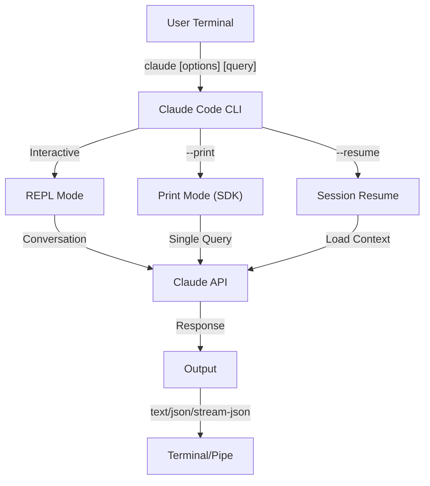
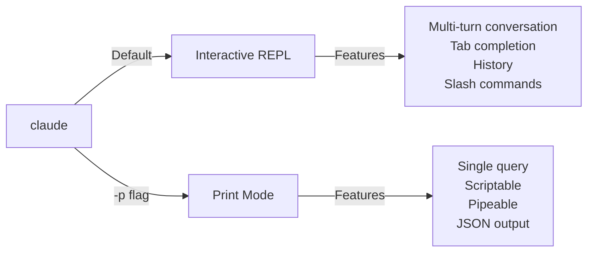

<picture>
  <source media="(prefers-color-scheme: dark)" srcset="../../resources/logos/claude-howto-logo-dark.svg">
  
</picture>

# CLI 参考

## 概览

Claude Code 的 CLI（命令行接口）是与 Claude Code 交互的主要方式。它提供了强大的选项，用于执行查询、管理会话、配置模型，并把 Claude 集成进你的开发工作流。

## 架构



## 运行时与打包

自 **v2.1.113** 起，Claude Code CLI 通过可选的 npm 依赖启动一个**按平台分发的原生二进制文件**（macOS、Linux、Windows）。该二进制文件在安装时会匹配你的操作系统和架构——较旧的捆绑 JavaScript 运行时在 macOS 或 Linux 上不再是默认方式。

**面向用户的安装方式没有变化**：`npm install -g @anthropic-ai/claude-code` 仍然可用，并且仍是推荐路径。在幕后，npm 会为你的平台获取正确的原生二进制文件。

**下载主机**（v2.1.116+）：原生二进制构件由 `https://downloads.claude.ai/claude-code-releases` 提供。

> **企业 / 代理用户**：如果你的网络要求显式白名单，请将 `downloads.claude.ai`（以及 `https://downloads.claude.ai/claude-code-releases`）加入代理的出站规则。此前仅将 `storage.googleapis.com` 或 npm registry 加入白名单的环境需要更新，否则 `claude update` 和初次安装都会失败。

较旧的 JavaScript 包仍会为 Windows 以及固定使用它的环境构建；这些安装继续将 Glob 和 Grep 作为一等工具提供（见 [Tools](#工具与权限管理) 下的 Glob/Grep 脚注）。

## CLI 命令

| 命令 | 说明 | 示例 |
|---------|-------------|---------|
| `claude` | 启动交互式 REPL | `claude` |
| `claude "query"` | 带初始提示启动 REPL | `claude "explain this project"` |
| `claude -p "query"` | 打印模式——查询后退出 | `claude -p "explain this function"` |
| `cat file \| claude -p "query"` | 处理通过管道传入的内容 | `cat logs.txt \| claude -p "explain"` |
| `claude -c` | 继续最近一次对话 | `claude -c` |
| `claude -c -p "query"` | 在打印模式下继续 | `claude -c -p "check for type errors"` |
| `claude -r "<session>" "query"` | 通过 ID 或名称恢复会话 | `claude -r "auth-refactor" "finish this PR"` |
| `claude update` | 更新到最新版本 | `claude update` |
| `/doctor`（slash command） | 诊断安装、配置和 plugin 健康状况。自 v2.1.116 起，它可以**在 Claude 正在响应时**打开，行内显示状态图标，并接受按下 `f` 键来自动修复检测到的问题。v2.1.178 将布局刷新为带有更清晰状态图标和高亮命令的扁平树 | 在 REPL 中运行 `/doctor` |
| `claude mcp` | 配置 MCP servers（含用于鉴权的 `login`/`logout`，v2.1.186+） | 见 [MCP 文档](../05-mcp/README.md) |
| `claude mcp serve` | 将 Claude Code 作为 MCP server 运行 | `claude mcp serve` |
| `claude agents` | 打开 **Agent View**（Research Preview，v2.1.139+）——一个列出每个 Claude Code 会话及其状态的多会话管理器。见下文 [Agent View](#agent-viewclaude-agentsv21139)。 | `claude agents` |
| `claude auto-mode defaults` | 以 JSON 打印 auto mode 默认规则 | `claude auto-mode defaults` |
| `claude remote-control` | 启动 Remote Control 服务 | `claude remote-control` |
| `claude plugin` | 管理 plugins（安装、启用、禁用） | `claude plugin install my-plugin` |
| `claude plugin init <name>` | 在 `.claude/skills` 中脚手架生成一个新 plugin——自动加载，无需 marketplace（v2.1.157+） | `claude plugin init my-plugin` |
| `claude plugin tag <version>` | 为 plugin 创建带版本校验的发布 git 标签（v2.1.118+） | `claude plugin tag v0.3.0` |
| `claude install [version]` | 安装指定的原生二进制版本。接受 `stable`、`latest` 或显式版本字符串 | `claude install 2.1.131` |
| `claude project purge [path]` | 删除某个项目的所有本地 Claude Code 状态（transcripts、tasks、debug 日志、文件编辑历史、prompt 历史，以及 `~/.claude.json` 条目）。省略 `[path]` 进入交互式选择器。参数：`--dry-run` 预览、`-y/--yes` 跳过确认、`-i/--interactive` 逐项确认、`--all` 处理每个项目（v2.1.126+） | `claude project purge ~/work/repo --dry-run` |
| `claude plugin prune` | 移除孤立的自动安装 plugin 依赖（父 plugin 已不在）。`plugin uninstall --prune` 在卸载目标后执行相同的级联清理（v2.1.121+） | `claude plugin prune` |
| `claude ultrareview [target]` | 非交互式运行 `/ultrareview`。将发现项打印到 stdout，成功退出 0 / 失败退出 1。使用 `--json` 获取原始负载，`--timeout <minutes>` 覆盖默认的 30 分钟（v2.1.120+） | `claude ultrareview 1234 --json` |
| `claude auth login` | 登录（支持 `--email`、`--sso`）。自 v2.1.126 起，当浏览器回调无法到达 localhost 时（WSL2、SSH、容器），接受粘贴到终端的 OAuth 代码作为回退方案 | `claude auth login --email user@example.com` |
| `claude auth logout` | 注销当前账号 | `claude auth logout` |
| `claude auth status` | 检查鉴权状态（已登录退出 0，未登录退出 1） | `claude auth status` |

## 核心标志

| 标志 | 说明 | 示例 |
|------|-------------|---------|
| `-p, --print` | 不进入交互式模式，直接打印响应 | `claude -p "query"` |
| `-c, --continue` | 加载最近一次对话 | `claude --continue` |
| `-r, --resume` | 按 ID 或名称恢复指定会话 | `claude --resume auth-refactor` |
| `-v, --version` | 输出版本号 | `claude -v` |
| `-w, --worktree` | 在隔离的 git worktree 中启动 | `claude -w` |
| `-n, --name` | 会话显示名称 | `claude -n "auth-refactor"` |
| `--from-pr <url-or-number>` | 恢复与某个 pull/merge request 关联的会话。自 v2.1.119 起接受 GitHub（云端 + Enterprise）、GitLab MR 和 Bitbucket PR 的 URL；此前仅支持 GitHub.com | `claude --from-pr 42` 或 `claude --from-pr https://gitlab.example.com/org/repo/-/merge_requests/17` |
| `--remote "task"` | 在 claude.ai 上创建 web session | `claude --remote "implement API"` |
| `--remote-control, --rc` | 使用 Remote Control 进入交互式会话 | `claude --rc` |
| `--teleport` | 将 web session 恢复到本地 | `claude --teleport` |
| `--teammate-mode` | agent team 显示模式 | `claude --teammate-mode tmux` |
| `--bare` | 极简模式（跳过 hooks、skills、plugins、MCP、自动记忆、CLAUDE.md） | `claude --bare` |
| `--safe-mode` | 启动时禁用所有自定义项（CLAUDE.md、plugins、skills、hooks、MCP），以隔离配置问题；也可用 `CLAUDE_CODE_SAFE_MODE=1`（v2.1.169） | `claude --safe-mode` |
| `--enable-auto-mode` | 解锁 auto permission mode（Opus 4.7 上的 Max 订阅者不再需要它） | `claude --enable-auto-mode` |
| `--channels` | 订阅 MCP channel plugins | `claude --channels discord,telegram` |
| `--chrome` / `--no-chrome` | 启用 / 禁用 Chrome 浏览器集成 | `claude --chrome` |
| `--effort` | 设置思考强度级别 | `claude --effort high` |
| `--init` / `--init-only` | 运行初始化 hooks | `claude --init` |
| `--maintenance` | 运行维护 hooks 后退出 | `claude --maintenance` |
| `--disable-slash-commands` | 禁用所有 skills 和 slash commands | `claude --disable-slash-commands` |
| `--no-session-persistence` | 禁用会话保存（打印模式） | `claude -p --no-session-persistence "query"` |
| `--exclude-dynamic-system-prompt-sections` | 从系统提示词中排除动态小节，以提升 prompt cache 命中率 | `claude -p --exclude-dynamic-system-prompt-sections "query"` |

### 交互模式 vs 打印模式



**交互模式**（默认）：
```bash
# Start interactive session
claude

# Start with initial prompt
claude "explain the authentication flow"
```

**打印模式**（非交互式）：
```bash
# Single query, then exit
claude -p "what does this function do?"

# Process file content
cat error.log | claude -p "explain this error"

# Chain with other tools
claude -p "list todos" | grep "URGENT"
```

## 模型与配置

| 标志 | 说明 | 示例 |
|------|-------------|---------|
| `--model` | 设置模型（sonnet、opus、haiku，或完整模型名） | `claude --model opus` |
| `--fallback-model` | 当主模型负载过高 / 不可用时自动切换模型；可通过 `fallbackModel` 设置最多配置三个。自 v2.1.166 起也适用于交互式会话（此前仅打印模式） | `claude -p --fallback-model sonnet "query"` |
| `--agent` | 为当前会话指定 agent | `claude --agent my-custom-agent` |
| `--agents` | 通过 JSON 定义自定义 subagents | 见 [Agents Configuration](#agents-配置) |
| `--effort` | 设置 effort 级别（low、medium、high、xhigh、max） | `claude --effort xhigh` |

### 模型选择示例

```bash
# Use Opus 4.8 for complex tasks
claude --model opus "design a caching strategy"

# Use Haiku 4.5 for quick tasks
claude --model haiku -p "format this JSON"

# Full model name
claude --model claude-sonnet-4-6-20250929 "review this code"

# With fallback for reliability
claude -p --model opus --fallback-model sonnet "analyze architecture"

# Use opusplan (Opus plans, Sonnet executes)
claude --model opusplan "design and implement the caching layer"
```

> **网关模型发现（v2.1.129+，需手动开启）**：当 `ANTHROPIC_BASE_URL` 指向一个兼容 Anthropic 的网关时，设置 `CLAUDE_CODE_ENABLE_GATEWAY_MODEL_DISCOVERY=1` 即可用网关的 `/v1/models` 端点填充 `/model`。如果不设置该环境变量，`/model` 会回退到内置的静态列表。该标志改为需手动开启（v2.1.129 的变更），因为发现调用可能呈现用户无权使用的模型；v2.1.126 曾使其隐式生效，但该行为已被回退。

## 系统提示词自定义

| 标志 | 说明 | 示例 |
|------|-------------|---------|
| `--system-prompt` | 替换整段默认提示词 | `claude --system-prompt "You are a Python expert"` |
| `--system-prompt-file` | 从文件加载提示词（打印模式） | `claude -p --system-prompt-file ./prompt.txt "query"` |
| `--append-system-prompt` | 在默认提示词后追加 | `claude --append-system-prompt "Always use TypeScript"` |

### 系统提示词示例

```bash
# Complete custom persona
claude --system-prompt "You are a senior security engineer. Focus on vulnerabilities."

# Append specific instructions
claude --append-system-prompt "Always include unit tests with code examples"

# Load complex prompt from file
claude -p --system-prompt-file ./prompts/code-reviewer.txt "review main.py"
```

### 系统提示词标志对比

| 标志 | 行为 | 交互模式 | 打印模式 |
|------|----------|-------------|-------|
| `--system-prompt` | 替换整段默认系统提示词 | ✅ | ✅ |
| `--system-prompt-file` | 用文件中的提示词替换 | ❌ | ✅ |
| `--append-system-prompt` | 追加到默认系统提示词后 | ✅ | ✅ |

**`--system-prompt-file` 仅在打印模式中使用。交互模式请使用 `--system-prompt` 或 `--append-system-prompt`。**

## 工具与权限管理

| 标志 | 说明 | 示例 |
|------|-------------|---------|
| `--tools` | 限制可用的内置工具 | `claude -p --tools "Bash,Edit,Read" "query"` |
| `--allowedTools` | 无需提示即可执行的工具 | `"Bash(git log:*)" "Read"` |
| `--disallowedTools` | 从上下文中移除的工具 | `"Bash(rm:*)" "Edit"` |
| `--dangerously-skip-permissions` | 跳过所有权限提示 | `claude --dangerously-skip-permissions` |
| `--permission-mode` | 以指定权限模式启动 | `claude --permission-mode auto` |
| `--permission-prompt-tool` | 用于权限处理的 MCP tool | `claude -p --permission-prompt-tool mcp_auth "query"` |
| `--enable-auto-mode` | 解锁 auto permission mode | `claude --enable-auto-mode` |

> **Glob / Grep 脚注（v2.1.113+）**：在原生 macOS/Linux 构建上，`Glob` 和 `Grep` 由嵌入的 `bfs` 和 `ugrep` 二进制文件通过 Bash 工具调用提供，而不再是独立的一等工具。Windows 和 npm 捆绑（JS）安装仍将它们作为独立工具暴露。对于 subagent 的 `allowedTools` / `disallowedTools` 列表，后端替换是透明的——你可以在所有平台上继续在配置中引用 `Glob` / `Grep`。

> **PowerShell 自动批准（v2.1.119）**：PowerShell 工具命令可以在权限模式下被自动批准，方式与 Bash 命令完全相同。使用你已经为 `Bash(...)` 规则使用的相同匹配器语法来限定 PowerShell 权限范围——例如 `PowerShell(Get-ChildItem:*)`。

> **恢复会话时遵守 `--permission-mode`（v2.1.132+）**：`claude -p --continue --permission-mode plan`（以及 `--resume`）现在会遵守该标志。早期版本在恢复会话时会静默丢弃 `--permission-mode`，因此一个 plan 模式的会话在恢复时若未重新传入该标志会被静默降级——此问题已修复。

### 权限示例

```bash
# Read-only mode for code review
claude --permission-mode plan "review this codebase"

# Restrict to safe tools only
claude --tools "Read,Grep,Glob" -p "find all TODO comments"

# Allow specific git commands without prompts
claude --allowedTools "Bash(git status:*)" "Bash(git log:*)"

# Block dangerous operations
claude --disallowedTools "Bash(rm -rf:*)" "Bash(git push --force:*)"
```

> **参数匹配 `Tool(param:value)`（v2.1.178）**：权限规则遵循 `Tool`（每次使用）或 `Tool(specifier)` 的格式。自 v2.1.178 起，specifier 可以匹配某个工具的输入**参数**，而不仅仅是命令或路径模式——使用支持通配符的 `Tool(param:value)` 形式。这把你已经在 `Bash(...)` 命令前缀（例如 `Bash(npm run test *)`）和 `Read(...)` 路径 glob（例如 `Read(./.env.*)`）上使用的匹配方式推广开来，使其他工具也可以按参数限定范围。在编写规则前，请查阅[权限参考](https://code.claude.com/docs/en/settings)中当前的逐工具示例字符串，因为不同工具的确切参数名各不相同。

## 输出与格式

| 标志 | 说明 | 选项 | 示例 |
|------|-------------|---------|---------|
| `--output-format` | 指定输出格式（打印模式） | `text`、`json`、`stream-json` | `claude -p --output-format json "query"` |
| `--input-format` | 指定输入格式（打印模式） | `text`、`stream-json` | `claude -p --input-format stream-json` |
| `--verbose` | 启用详细日志 | | `claude --verbose` |
| `--include-partial-messages` | 包含流式事件 | 需要 `stream-json` | `claude -p --output-format stream-json --include-partial-messages "query"` |
| `--json-schema` | 获取符合 schema 的、经校验的 JSON | | `claude -p --json-schema '{"type":"object"}' "query"` |
| `--max-budget-usd` | 打印模式的最大花费 | | `claude -p --max-budget-usd 5.00 "query"` |

### 输出格式示例

```bash
# Plain text (default)
claude -p "explain this code"

# JSON for programmatic use
claude -p --output-format json "list all functions in main.py"

# Streaming JSON for real-time processing
claude -p --output-format stream-json "generate a long report"

# Structured output with schema validation
claude -p --json-schema '{"type":"object","properties":{"bugs":{"type":"array"}}}' \
  "find bugs in this code and return as JSON"
```

## 工作区与目录

| 标志 | 说明 | 示例 |
|------|-------------|---------|
| `--add-dir` | 追加额外的工作目录 | `claude --add-dir ../apps ../lib` |
| `--setting-sources` | 逗号分隔的设置来源 | `claude --setting-sources user,project` |

> **`/config` 持久化（v2.1.119）**：通过 `/config` 命令交互式做出的更改现在会写入 `~/.claude/settings.json`，并参与正常的优先级链（policy → local → project → user）。在 v2.1.119 之前，部分 `/config` 更改仅在当前会话生效。完整的优先级顺序见 [Memory & Settings](../02-memory/README.md)。
| `--settings` | 从文件或 JSON 加载设置 | `claude --settings ./settings.json` |
| `--plugin-dir` | 从目录加载 plugins（可重复） | `claude --plugin-dir ./my-plugin` |

### 多目录示例

```bash
# Work across multiple project directories
claude --add-dir ../frontend ../backend ../shared "find all API endpoints"

# Load custom settings
claude --settings '{"model":"opus","verbose":true}' "complex task"
```

## MCP 配置

| 标志 | 说明 | 示例 |
|------|-------------|---------|
| `--mcp-config` | 从 JSON 加载 MCP servers | `claude --mcp-config ./mcp.json` |
| `--strict-mcp-config` | 只使用指定的 MCP 配置 | `claude --strict-mcp-config --mcp-config ./mcp.json` |
| `--channels` | 订阅 MCP channel plugins | `claude --channels discord,telegram` |

### MCP 示例

```bash
# Load GitHub MCP server
claude --mcp-config ./github-mcp.json "list open PRs"

# Strict mode - only specified servers
claude --strict-mcp-config --mcp-config ./production-mcp.json "deploy to staging"
```

## 会话管理

| 标志 | 说明 | 示例 |
|------|-------------|---------|
| `--session-id` | 使用指定的会话 ID（UUID） | `claude --session-id "550e8400-..."` |
| `--fork-session` | 恢复时创建新会话 | `claude --resume abc123 --fork-session` |

### 会话示例

```bash
# Continue last conversation
claude -c

# Resume named session
claude -r "feature-auth" "continue implementing login"

# Fork session for experimentation
claude --resume feature-auth --fork-session "try alternative approach"

# Use specific session ID
claude --session-id "550e8400-e29b-41d4-a716-446655440000" "continue"
```

### 会话分叉

从已有会话创建一个分支用于实验：

```bash
# Fork a session to try a different approach
claude --resume abc123 --fork-session "try alternative implementation"

# Fork with a custom message
claude -r "feature-auth" --fork-session "test with different architecture"
```

**使用场景：**
- 在不丢失原会话的情况下尝试其他实现
- 并行地尝试不同方案
- 从成功的工作中创建分支以做变体
- 在不影响主会话的情况下测试破坏性改动

原会话保持不变，分叉则成为一个新的、独立的会话。

### 项目状态清理（v2.1.126+）

`claude project purge` 删除某个项目的所有本地 Claude Code 状态——transcripts、任务列表、debug 日志、文件编辑历史、prompt 历史行，以及该项目的 `~/.claude.json` 条目。请先用 `--dry-run` 预览删除内容；`--all` 会遍历机器上的每个项目。

```bash
# Preview what would be deleted (safe)
claude project purge ~/work/repo --dry-run

# Delete state for a specific project, no prompts
claude project purge ~/work/repo --yes

# Walk every project interactively
claude project purge --all --interactive
```

## 高级特性

| 标志 | 说明 | 示例 |
|------|-------------|---------|
| `--chrome` | 启用 Chrome 浏览器集成 | `claude --chrome` |
| `--no-chrome` | 禁用 Chrome 浏览器集成 | `claude --no-chrome` |
| `--ide` | 如可用则自动连接到 IDE | `claude --ide` |
| `--max-turns` | 限制 agentic 轮数（非交互式） | `claude -p --max-turns 3 "query"` |
| `--debug` | 启用带过滤的 debug 模式 | `claude --debug "api,mcp"` |
| `--enable-lsp-logging` | 启用详细的 LSP 日志 | `claude --enable-lsp-logging` |
| `--betas` | API 请求的 Beta headers | `claude --betas interleaved-thinking` |
| `--plugin-dir` | 从目录加载 plugins（可重复） | `claude --plugin-dir ./my-plugin` |
| `--enable-auto-mode` | 解锁 auto permission mode | `claude --enable-auto-mode` |
| `--effort` | 设置思考强度级别 | `claude --effort high` |
| `--bare` | 极简模式（跳过 hooks、skills、plugins、MCP、自动记忆、CLAUDE.md） | `claude --bare` |
| `--channels` | 订阅 MCP channel plugins | `claude --channels discord` |
| `--tmux` | 为 worktree 创建 tmux 会话 | `claude --tmux` |
| `--fork-session` | 恢复时创建新的会话 ID | `claude --resume abc --fork-session` |
| `--max-budget-usd` | 最大花费（打印模式） | `claude -p --max-budget-usd 5.00 "query"` |
| `--json-schema` | 经校验的 JSON 输出 | `claude -p --json-schema '{"type":"object"}' "q"` |

### 平台与主题说明（v2.1.112）

- **Windows 上的 PowerShell 工具**：一个专用的 PowerShell 工具正在 Windows 上逐步推出，可通过环境变量控制。
- **Auto（匹配终端）主题**：新的 "Auto (match terminal)" 主题让 Claude Code 的明暗外观与你的终端同步。
- **更安静的权限提示**：只读的 `Bash` 调用和 `Glob` 模式不再触发权限提示。

### 高级示例

```bash
# Limit autonomous actions
claude -p --max-turns 5 "refactor this module"

# Debug API calls
claude --debug "api" "test query"

# Enable IDE integration
claude --ide "help me with this file"
```

## Agents 配置

`--agents` 标志接受一个 JSON 对象，为当前会话定义自定义 subagents。

### Agents JSON 格式

```json
{
  "agent-name": {
    "description": "Required: when to invoke this agent",
    "prompt": "Required: system prompt for the agent",
    "tools": ["Optional", "array", "of", "tools"],
    "model": "optional: sonnet|opus|haiku"
  }
}
```

**必填字段：**
- `description` - 何时使用这个 agent 的自然语言说明
- `prompt` - 定义 agent 角色和行为的系统提示词

**可选字段：**
- `tools` - 可用工具数组（如省略则继承全部）
  - 格式：`["Read", "Grep", "Glob", "Bash"]`
- `model` - 使用的模型：`sonnet`、`opus` 或 `haiku`

### 完整 Agents 示例

```json
{
  "code-reviewer": {
    "description": "Expert code reviewer. Use proactively after code changes.",
    "prompt": "You are a senior code reviewer. Focus on code quality, security, and best practices.",
    "tools": ["Read", "Grep", "Glob", "Bash"],
    "model": "sonnet"
  },
  "debugger": {
    "description": "Debugging specialist for errors and test failures.",
    "prompt": "You are an expert debugger. Analyze errors, identify root causes, and provide fixes.",
    "tools": ["Read", "Edit", "Bash", "Grep"],
    "model": "opus"
  },
  "documenter": {
    "description": "Documentation specialist for generating guides.",
    "prompt": "You are a technical writer. Create clear, comprehensive documentation.",
    "tools": ["Read", "Write"],
    "model": "haiku"
  }
}
```

### Agents 命令示例

```bash
# Define custom agents inline
claude --agents '{
  "security-auditor": {
    "description": "Security specialist for vulnerability analysis",
    "prompt": "You are a security expert. Find vulnerabilities and suggest fixes.",
    "tools": ["Read", "Grep", "Glob"],
    "model": "opus"
  }
}' "audit this codebase for security issues"

# Load agents from file
claude --agents "$(cat ~/.claude/agents.json)" "review the auth module"

# Combine with other flags
claude -p --agents "$(cat agents.json)" --model sonnet "analyze performance"
```

### Agent 优先级

当存在多份 agent 定义时，按以下优先级顺序加载：
1. **CLI 定义**（`--agents` 标志）- 当前会话专用
2. **项目级**（`.claude/agents/`）- 当前项目
3. **用户级**（`~/.claude/agents/`）- 所有项目

CLI 定义的 agents 在本次会话中会覆盖项目级和用户级 agents。当名称冲突时，项目级 agents 会覆盖用户级 agents。完整的优先级表（含 plugin 级 agents）见 [Lesson 04 — Subagents](../04-subagents/README.md#文件位置)。

### Agent View（`claude agents`，v2.1.139+）

> **Research Preview** —— 该功能已稳定到可日常使用，但仍可能变化。

`claude agents` 打开 **Agent View** —— 一个列出机器上每个 Claude Code 会话及其当前状态（`running`、`blocked on you`、`done`）的单一列表。当你运行后台 agents、scheduled tasks 或以 `--bg` 启动的会话时，它取代了在多个终端标签间来回切换的做法。

```bash
# Open the Agent View
claude agents
```

当你从该视图分派一个会话（或通过 `claude --bg <prompt>`）时，可以传入与传给 `claude` 本身相同的配置标志。为 Agent View 分派路径引入的标志：

| 标志 | 起始版本 | 说明 |
|------|-------|-------------|
| `--cwd <path>` | v2.1.141 | 将会话列表（或新会话）限定到特定工作目录 |
| `--add-dir <path>` | v2.1.142 | 向被分派会话的工作区添加目录 |
| `--settings <path>` | v2.1.142 | 为被分派会话使用特定的 `settings.json` |
| `--mcp-config <path>` | v2.1.142 | 为被分派会话使用特定的 MCP 配置 |
| `--plugin-dir <path>` | v2.1.142 | 为被分派会话使用特定的 plugin 目录 |
| `--permission-mode <mode>` | v2.1.142 | 为被分派会话设置权限模式（`plan`、`acceptEdits`、`auto` 等） |
| `--model <model>` | v2.1.142 | 为被分派会话固定一个模型 |
| `--effort <level>` | v2.1.142 | 固定一个 effort 级别（`low`/`medium`/`high`/`xhigh`/`max`） |
| `--dangerously-skip-permissions` | v2.1.142 | 运行被分派会话时不出现权限提示（仅在 sandbox 中使用） |
| `--json` | v2.1.145 | 以机器可读的 JSON 打印 agent 列表，便于脚本化（状态栏、会话选择器、tmux-resurrect 集成） |

那些完成了工作但留下后台 shell 打开的会话，会从 "Working" 移动到 "Completed"（v2.1.141 修复）。在已附加的 agent 会话内，`Shift+Tab` 可在各权限模式（包括 auto mode）间循环（v2.1.143）。

**固定一个会话** —— 在 `claude agents` 中对某个会话按 `Ctrl+T` 即可固定它（v2.1.147）。被固定的后台会话在空闲时保持存活，会就地重启以应用 Claude Code 更新，并且只有在非固定会话之后才会在内存压力下被释放。（此 `Ctrl+T` 仅作用于 Agent View；在主会话中它切换的是任务列表视图。）

---

## 高价值使用场景

### 1. CI/CD 集成

在 CI/CD 流水线中使用 Claude Code，实现自动化的代码审查、测试和文档生成。

**GitHub Actions 示例：**

```yaml
name: AI Code Review

on: [pull_request]

jobs:
  review:
    runs-on: ubuntu-latest
    steps:
      - uses: actions/checkout@v4

      - name: Install Claude Code
        run: npm install -g @anthropic-ai/claude-code

      - name: Run Code Review
        env:
          ANTHROPIC_API_KEY: ${{ secrets.ANTHROPIC_API_KEY }}
        run: |
          claude -p --output-format json \
            --max-turns 1 \
            "Review the changes in this PR for:
            - Security vulnerabilities
            - Performance issues
            - Code quality
            Output as JSON with 'issues' array" > review.json

      - name: Post Review Comment
        uses: actions/github-script@v7
        with:
          script: |
            const fs = require('fs');
            const review = JSON.parse(fs.readFileSync('review.json', 'utf8'));
            // Process and post review comments
```

**Jenkins Pipeline：**

```groovy
pipeline {
    agent any
    stages {
        stage('AI Review') {
            steps {
                sh '''
                    claude -p --output-format json \
                      --max-turns 3 \
                      "Analyze test coverage and suggest missing tests" \
                      > coverage-analysis.json
                '''
            }
        }
    }
}
```

**Headless `ultrareview`（v2.1.120+）：**

```yaml
# .github/workflows/ultrareview.yml
- name: Claude ultrareview
  run: claude ultrareview ${{ github.event.pull_request.number }} --json > review.json
```

`claude ultrareview` 在审查干净时退出 0，报告发现项时退出 1，因此它可以直接用作 PR 门禁。使用 `--timeout <minutes>` 覆盖默认的 30 分钟。

### 2. 脚本管道

通过 Claude 处理文件、日志和数据以进行分析。

**日志分析：**

```bash
# Analyze error logs
tail -1000 /var/log/app/error.log | claude -p "summarize these errors and suggest fixes"

# Find patterns in access logs
cat access.log | claude -p "identify suspicious access patterns"

# Analyze git history
git log --oneline -50 | claude -p "summarize recent development activity"
```

**代码处理：**

```bash
# Review a specific file
cat src/auth.ts | claude -p "review this authentication code for security issues"

# Generate documentation
cat src/api/*.ts | claude -p "generate API documentation in markdown"

# Find TODOs and prioritize
grep -r "TODO" src/ | claude -p "prioritize these TODOs by importance"
```

### 3. 多会话工作流

用多个对话线程管理复杂项目。

```bash
# Start a feature branch session
claude -r "feature-auth" "let's implement user authentication"

# Later, continue the session
claude -r "feature-auth" "add password reset functionality"

# Fork to try an alternative approach
claude --resume feature-auth --fork-session "try OAuth instead"

# Switch between different feature sessions
claude -r "feature-payments" "continue with Stripe integration"
```

### 4. 自定义 Agent 配置

为团队的工作流定义专用 agents。

```bash
# Save agents config to file
cat > ~/.claude/agents.json << 'EOF'
{
  "reviewer": {
    "description": "Code reviewer for PR reviews",
    "prompt": "Review code for quality, security, and maintainability.",
    "model": "opus"
  },
  "documenter": {
    "description": "Documentation specialist",
    "prompt": "Generate clear, comprehensive documentation.",
    "model": "sonnet"
  },
  "refactorer": {
    "description": "Code refactoring expert",
    "prompt": "Suggest and implement clean code refactoring.",
    "tools": ["Read", "Edit", "Glob"]
  }
}
EOF

# Use agents in session
claude --agents "$(cat ~/.claude/agents.json)" "review the auth module"
```

### 5. 批处理

以一致的设置处理多个查询。

```bash
# Process multiple files
for file in src/*.ts; do
  echo "Processing $file..."
  claude -p --model haiku "summarize this file: $(cat $file)" >> summaries.md
done

# Batch code review
find src -name "*.py" -exec sh -c '
  echo "## $1" >> review.md
  cat "$1" | claude -p "brief code review" >> review.md
' _ {} \;

# Generate tests for all modules
for module in $(ls src/modules/); do
  claude -p "generate unit tests for src/modules/$module" > "tests/$module.test.ts"
done
```

### 6. 安全敏感开发

使用权限控制实现安全操作。

```bash
# Read-only security audit
claude --permission-mode plan \
  --tools "Read,Grep,Glob" \
  "audit this codebase for security vulnerabilities"

# Block dangerous commands
claude --disallowedTools "Bash(rm:*)" "Bash(curl:*)" "Bash(wget:*)" \
  "help me clean up this project"

# Restricted automation
claude -p --max-turns 2 \
  --allowedTools "Read" "Glob" \
  "find all hardcoded credentials"
```

### 7. JSON API 集成

借助 `jq` 解析，把 Claude 当作工具的可编程 API 使用。

```bash
# Get structured analysis
claude -p --output-format json \
  --json-schema '{"type":"object","properties":{"functions":{"type":"array"},"complexity":{"type":"string"}}}' \
  "analyze main.py and return function list with complexity rating"

# Integrate with jq for processing
claude -p --output-format json "list all API endpoints" | jq '.endpoints[]'

# Use in scripts
RESULT=$(claude -p --output-format json "is this code secure? answer with {secure: boolean, issues: []}" < code.py)
if echo "$RESULT" | jq -e '.secure == false' > /dev/null; then
  echo "Security issues found!"
  echo "$RESULT" | jq '.issues[]'
fi
```

### jq 解析示例

使用 `jq` 解析和处理 Claude 的 JSON 输出：

```bash
# Extract specific fields
claude -p --output-format json "analyze this code" | jq '.result'

# Filter array elements
claude -p --output-format json "list issues" | jq -r '.issues[] | select(.severity=="high")'

# Extract multiple fields
claude -p --output-format json "describe the project" | jq -r '.{name, version, description}'

# Convert to CSV
claude -p --output-format json "list functions" | jq -r '.functions[] | [.name, .lineCount] | @csv'

# Conditional processing
claude -p --output-format json "check security" | jq 'if .vulnerabilities | length > 0 then "UNSAFE" else "SAFE" end'

# Extract nested values
claude -p --output-format json "analyze performance" | jq '.metrics.cpu.usage'

# Process entire array
claude -p --output-format json "find todos" | jq '.todos | length'

# Transform output
claude -p --output-format json "list improvements" | jq 'map({title: .title, priority: .priority})'
```

---

## 模型

Claude Code 支持多个具有不同能力的模型：

| 模型 | ID | 上下文窗口 | 备注 |
|-------|-----|----------------|-------|
| Opus 4.8 | `claude-opus-4-8` | 1M tokens | 能力最强；自适应 effort 级别 `low → max`；默认 effort 为 `high`（v2.1.154） |
| Sonnet 4.6 | `claude-sonnet-4-6` | 1M tokens | 速度与能力均衡；Pro/Max 订阅者的默认 effort 在 v2.1.117 中从 `medium` 提升到 `high` |
| Haiku 4.5 | `claude-haiku-4-5` | 200K tokens | 最快，最适合快速任务；无 effort 级别 |
| Fable 5 | `claude-fable-5` | — | Mythos 级模型，已做安全处理以供通用使用（v2.1.170） |

### 模型选择

```bash
# Use short names
claude --model opus "complex architectural review"
claude --model sonnet "implement this feature"
claude --model haiku -p "format this JSON"

# Use opusplan alias (Opus plans, Sonnet executes)
claude --model opusplan "design and implement the API"

# Toggle fast mode during session
/fast
```

> **Fast Mode 现在运行于 Opus 4.8（v2.1.154）**：自 v2.1.154 起，`/fast` 默认以 **Opus 4.8** 作为 research preview 运行——约为标准费率的 2 倍，换取约 2.5 倍的输出速度。它此前在 v2.1.142 中从 Opus 4.6 切换到 Opus 4.7。`CLAUDE_CODE_OPUS_4_6_FAST_MODE_OVERRIDE` 环境变量在 **v2.1.154 中弃用，并于 2026-06-01 移除**；如今要在 Opus 4.6 上使用 fast mode，请运行 `/model claude-opus-4-6[1m]` 然后 `/fast on`。

### Effort 级别（Opus 4.8 / Opus 4.7）

Opus 4.8 和 Opus 4.7 支持带 effort 级别的自适应推理，由轻到重排序为：`low`（○）、`medium`（◐）、`high`（●）、`xhigh` 和 `max`。**默认**在 Opus 4.8（自 v2.1.154）、Opus 4.6 和 Sonnet 4.6 上为 `high`，在 Opus 4.7 上为 `xhigh`。`xhigh` 在 Opus 4.8 和 Opus 4.7 上可用；`max` 在 Opus 4.8/4.7/4.6 和 Sonnet 4.6 上可用（仅当前会话）。Haiku 4.5 没有 effort 级别。在 Opus 4.6 / Sonnet 4.6 上，Pro/Max 订阅者的默认 effort 在 v2.1.117 中从 `medium` 提升到 `high`。

```bash
# Set effort level via CLI flag
claude --effort high "complex review"

# Set effort level via slash command
/effort high

# Set effort level via environment variable
export CLAUDE_CODE_EFFORT_LEVEL=high   # low, medium, high, xhigh (Opus 4.8/4.7), or max — default is high on Opus 4.8
```

prompt 中的 "ultrathink" 关键词会激活深度推理。`/effort` 菜单还提供 `ultracode`，它**不是**一个模型 effort 级别——它发送 `xhigh` 并让 Claude 编排动态工作流（仅当前会话）。

---

## 关键环境变量

| 变量 | 说明 |
|----------|-------------|
| `ANTHROPIC_API_KEY` | 用于鉴权的 API key |
| `ANTHROPIC_MODEL` | 覆盖默认模型 |
| `ANTHROPIC_CUSTOM_MODEL_OPTION` | API 的自定义模型选项 |
| `ANTHROPIC_DEFAULT_OPUS_MODEL` | 覆盖默认 Opus 模型 ID |
| `ANTHROPIC_DEFAULT_SONNET_MODEL` | 覆盖默认 Sonnet 模型 ID |
| `ANTHROPIC_DEFAULT_HAIKU_MODEL` | 覆盖默认 Haiku 模型 ID |
| `MAX_THINKING_TOKENS` | 设置扩展思考的 token 预算 |
| `CLAUDE_CODE_EFFORT_LEVEL` | 设置 effort 级别（`low`/`medium`/`high`/`xhigh`/`max`）——在 Opus 4.8 上默认为 `high`（Opus 4.7 上为 `xhigh`）；`xhigh` 需要 Opus 4.8/4.7；`max` 在 Opus 4.8/4.7/4.6 和 Sonnet 4.6 上可用 |
| `CLAUDE_CODE_SIMPLE` | 极简模式，由 `--bare` 标志设置 |
| `CLAUDE_CODE_SAFE_MODE` | 设为 `1` 时启动并禁用所有自定义项（CLAUDE.md、plugins、skills、hooks、MCP）——`--safe-mode` 的环境变量形式，用于隔离配置问题（v2.1.169） |
| `CLAUDE_CODE_DISABLE_BUNDLED_SKILLS` | 设为 `1` 时对模型隐藏捆绑的 skills、workflows 和 commands（v2.1.169） |
| `CLAUDE_CODE_DISABLE_AUTO_MEMORY` | 禁用自动 CLAUDE.md 更新 |
| `CLAUDE_CODE_DISABLE_BACKGROUND_TASKS` | 禁用后台任务执行 |
| `CLAUDE_CODE_DISABLE_CRON` | 禁用 scheduled/cron 任务 |
| `CLAUDE_CODE_DISABLE_GIT_INSTRUCTIONS` | 禁用 git 相关指令 |
| `CLAUDE_CODE_DISABLE_TERMINAL_TITLE` | 禁用终端标题更新 |
| `CLAUDE_CODE_DISABLE_1M_CONTEXT` | 禁用 1M token 上下文窗口 |
| `CLAUDE_CODE_DISABLE_NONSTREAMING_FALLBACK` | 禁用非流式回退 |
| `CLAUDE_CODE_ENABLE_TASKS` | 启用任务列表功能 |
| `CLAUDE_CODE_TASK_LIST_ID` | 跨会话共享的命名任务目录 |
| `CLAUDE_CODE_ENABLE_PROMPT_SUGGESTION` | 切换 prompt 建议（`true`/`false`） |
| `CLAUDE_CODE_EXPERIMENTAL_AGENT_TEAMS` | 启用实验性 agent teams |
| `CLAUDE_CODE_NEW_INIT` | 使用新的初始化流程 |
| `CLAUDE_CODE_SUBAGENT_MODEL` | subagent 执行所用的模型 |
| `CLAUDE_CODE_PLUGIN_SEED_DIR` | plugin seed 文件的目录 |
| `CLAUDE_CODE_SUBPROCESS_ENV_SCRUB` | 要从子进程中清除的环境变量 |
| `CLAUDE_AUTOCOMPACT_PCT_OVERRIDE` | 覆盖自动压缩百分比 |
| `CLAUDE_STREAM_IDLE_TIMEOUT_MS` | 流空闲超时（毫秒） |
| `SLASH_COMMAND_TOOL_CHAR_BUDGET` | slash command 工具的字符预算 |
| `ENABLE_TOOL_SEARCH` | 启用工具搜索能力 |
| `MAX_MCP_OUTPUT_TOKENS` | MCP tool 输出的最大 tokens |
| `CLAUDE_CODE_PERFORCE_MODE` | 设为 `1` 时启用 Perforce 模式——默认将文件视为只读（用于 Perforce/P4 版本控制工作流）（v2.1.98 新增） |
| `DISABLE_UPDATES` | 阻止所有更新路径，包括手动的 `claude update`。比仅阻止后台自动更新器的 `DISABLE_AUTOUPDATER` 更严格（v2.1.118+） |
| `CLAUDE_CODE_HIDE_CWD` | 设为 `1` 时在启动 logo 中隐藏当前工作目录（用于隐私 / 屏幕共享）（v2.1.119+） |
| `CLAUDE_CODE_FORK_SUBAGENT` | 设为 `1` 时在外部构建（Bedrock、Vertex、Foundry）上启用 forked subagents。在 forked subagents 已 GA 的 Anthropic API 上无效（v2.1.117+） |
| `CLAUDE_CODE_DISABLE_ALTERNATE_SCREEN` | 设为 `1` 时退出全屏 alternate-screen 渲染器；会话保留在普通终端回滚缓冲区中。在将 transcripts 输送到日志或与 `script(1)` 配合时很有用（v2.1.132+）。 |
| `CLAUDE_CODE_SESSION_ID` | 在 Claude Code 启动的每个 Bash 工具子进程中设置；等于 hook 输入 JSON 中的 `session_id`。用于将 bash 日志与 hook 遥测关联（v2.1.132+）。 |
| `CLAUDE_CODE_ENABLE_FEEDBACK_SURVEY_FOR_OTEL` | 设为 `1` 时为采集 OpenTelemetry 数据的组织重新启用 Anthropic 的会话质量调查。在 OTEL 部署中默认关闭（v2.1.136+）。 |
| `OTEL_LOG_TOOL_DETAILS` | 设为 `1` 时在 OpenTelemetry 事件中取消对自定义和 MCP 命令名称的脱敏（v2.1.117+）。脱敏仍为默认行为。 |
| `ANTHROPIC_BEDROCK_SERVICE_TIER` | 选择 Bedrock 服务层级：`default`、`flex` 或 `priority`（v2.1.122+） |
| `AI_AGENT` | 在子进程上自动设置，使外部 CLI（例如 `gh`）能将流量归因到 Claude Code（v2.1.120+） |
| `CLAUDE_CODE_FORCE_SYNC_OUTPUT` | 设为 `1` 时为自动检测漏判的终端强制同步输出（例如 Emacs `eat`）（v2.1.129+） |
| `CLAUDE_CODE_PACKAGE_MANAGER_AUTO_UPDATE` | 设为 `1` 时为 Homebrew/WinGet 安装（通常不自动更新）启用后台升级（v2.1.129+） |
| `CLAUDE_CODE_ENABLE_GATEWAY_MODEL_DISCOVERY` | 设为 `1` 时在设置了 `ANTHROPIC_BASE_URL` 的情况下选用网关 `/v1/models` 发现。否则 `/model` 显示内置静态列表（v2.1.129+） |
| `CLAUDE_CODE_ENABLE_AUTO_MODE` | 设为 `1` 时在 Bedrock、Vertex 和 Foundry 上为 Opus 4.7/4.8 选用 auto mode（v2.1.158+） |
| `CLAUDE_CLIENT_PRESENCE_FILE` | 指向一个标记文件，以在你身处机器旁时抑制移动端推送通知（v2.1.181+）。注意：名称是 `CLAUDE_CLIENT_PRESENCE_FILE`，而非 `CLAUDE_CODE_CLIENT_PRESENCE_FILE`。 |
| `CLAUDE_CODE_MAX_RETRIES` | API 重试的最大次数。自 v2.1.186 起上限为 15。 |
| `CLAUDE_CODE_RETRY_WATCHDOG` | 为无人值守会话推荐的重试控制方式，作为提高 `CLAUDE_CODE_MAX_RETRIES` 的替代（v2.1.186+）。 |
| `CLAUDE_CODE_MCP_TOOL_IDLE_TIMEOUT` | 覆盖远程 MCP tool 调用在无响应时挂起的 5 分钟空闲中止（v2.1.187+）。 |
| `CLAUDE_CODE_OPUS_4_6_FAST_MODE_OVERRIDE` | **已移除（自 v2.1.160 起为 no-op）。** 此前将 Fast Mode（`/fast`）固定到 Opus 4.6。如今要在 Opus 4.6 上使用 fast mode，请运行 `/model claude-opus-4-6[1m]` 然后 `/fast on`。 |

> **Vertex AI 上的 `ENABLE_TOOL_SEARCH`（v2.1.119+）**：工具搜索在 **Google Cloud Vertex AI 部署上默认禁用**。希望在 Vertex 上使用工具搜索能力的用户必须用 `export ENABLE_TOOL_SEARCH=true` 显式开启。在直连的 Anthropic API 上它仍默认启用。

---

## Settings.json 键

这些键存在于 `settings.json` 文件中（用户范围为 `~/.claude/settings.json`，项目范围为 `.claude/settings.json`），而不是作为标志或环境变量传入。下表涵盖一些最近新增的 UI/UX 键；关于受管的 `enforceAvailableModels` 键，见 [Advanced Features → Managed Settings](../09-advanced-features/README.md#available-managed-settings)。

| 键 | 说明 |
|-----|-------------|
| `respondToBashCommands` | （v2.1.186）自动响应 `!` bash 命令的输出。默认 `true`。设为 `false` 可获得仅作上下文（v2.1.186 之前）的行为。见 [Advanced Features → Bash Mode](../09-advanced-features/README.md#bash-mode)。 |
| `wheelScrollAccelerationEnabled` | （v2.1.174）设为 `false` 可在全屏渲染器中禁用鼠标滚轮滚动加速。在快速拨动滚轮导致过冲时很有用。 |
| `footerLinksRegexes` | （v2.1.176）一个正则数组，将匹配到的链接在页脚行渲染为徽章。可在用户或受管设置中配置。 |
| `language` | 设置 Claude 偏好的响应语言和语音听写语言（例如 `"french"`、`"japanese"`）。自 **v2.1.176** 起，它也固定用于自动生成会话标题的语言。 |

```json
{
  "wheelScrollAccelerationEnabled": false,
  "language": "french",
  "footerLinksRegexes": ["https://jira\\.example\\.com/.*"]
}
```

---

## 快速参考

### 最常用命令

```bash
# Interactive session
claude

# Quick question
claude -p "how do I..."

# Continue conversation
claude -c

# Process a file
cat file.py | claude -p "review this"

# JSON output for scripts
claude -p --output-format json "query"
```

### 标志组合

| 使用场景 | 命令 |
|----------|---------|
| 快速代码审查 | `cat file \| claude -p "review"` |
| 结构化输出 | `claude -p --output-format json "query"` |
| 安全探索 | `claude --permission-mode plan` |
| 自主但带安全保障 | `claude --enable-auto-mode --permission-mode auto` |
| CI/CD 集成 | `claude -p --max-turns 3 --output-format json` |
| 恢复工作 | `claude -r "session-name"` |
| 自定义模型 | `claude --model opus "complex task"` |
| 极简模式 | `claude --bare "quick query"` |
| 预算封顶运行 | `claude -p --max-budget-usd 2.00 "analyze code"` |

---

## 故障排查

### 找不到命令

**问题：** `claude: command not found`

**解决方案：**
- 安装 Claude Code：`npm install -g @anthropic-ai/claude-code`
- 检查 PATH 是否包含 npm 全局 bin 目录
- 尝试用完整路径运行：`npx claude`

### API Key 问题

**问题：** 鉴权失败

**解决方案：**
- 设置 API key：`export ANTHROPIC_API_KEY=your-key`
- 检查 key 是否有效且有足够额度
- 验证 key 对所请求模型的权限

### 找不到会话

**问题：** 无法恢复会话

**解决方案：**
- 列出可用会话以找到正确的名称/ID
- 会话可能在一段时间不活动后过期
- 使用 `-c` 继续最近一次会话

### 输出格式问题

**问题：** JSON 输出格式有误

**解决方案：**
- 使用 `--json-schema` 强制结构
- 在 prompt 中加入明确的 JSON 指令
- 使用 `--output-format json`（而不仅仅是在 prompt 中要求 JSON）

### 权限被拒绝

**问题：** 工具执行被阻止

**解决方案：**
- 检查 `--permission-mode` 设置
- 检查 `--allowedTools` 和 `--disallowedTools` 标志
- 为自动化使用 `--dangerously-skip-permissions`（请谨慎）

---

## 更多资源

- **[官方 CLI 参考](https://code.claude.com/docs/en/cli-reference)** - 完整的命令参考
- **[Headless 模式文档](https://code.claude.com/docs/en/headless)** - 自动化执行
- **[Slash Commands](../01-slash-commands/README.md)** - Claude 内的自定义快捷方式
- **[Memory 指南](../02-memory/README.md)** - 通过 CLAUDE.md 实现持久化上下文
- **[MCP 协议](../05-mcp/README.md)** - 外部工具集成
- **[高级特性](../09-advanced-features/README.md)** - 规划模式、扩展思考
- **[Subagents 指南](../04-subagents/README.md)** - 委派任务执行

---

*这是 [Claude How To](../README.md) 指南系列的一部分*

---

**最后更新**：2026 年 6 月 24 日
**Claude Code 版本**：2.1.187
**来源**：
- https://code.claude.com/docs/en/cli-reference
- https://code.claude.com/docs/en/changelog#2-1-174
- https://code.claude.com/docs/en/changelog#2-1-176
- https://code.claude.com/docs/en/changelog
- https://code.claude.com/docs/en/settings
- https://github.com/anthropics/claude-code/blob/main/CHANGELOG.md
- https://docs.anthropic.com/en/docs/claude-code/cli-reference
- https://code.claude.com/docs/en/troubleshooting
- https://code.claude.com/docs/en/slash-commands
- https://code.claude.com/docs/en/model-config
- https://platform.claude.com/docs/en/about-claude/models/overview
- https://www.anthropic.com/news/claude-opus-4-8
- https://github.com/anthropics/claude-code/releases/tag/v2.1.117
- https://github.com/anthropics/claude-code/releases/tag/v2.1.139
- https://github.com/anthropics/claude-code/releases/tag/v2.1.142
- https://github.com/anthropics/claude-code/releases/tag/v2.1.154
- https://code.claude.com/docs/en/plugins
- https://code.claude.com/docs/en/overview
**兼容模型**：Claude Sonnet 4.6、Claude Opus 4.8、Claude Haiku 4.5
</content>
</invoke>
